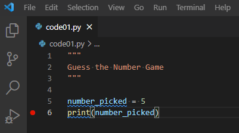

# Guess the Number: eine einzelne Runden Edition {#guess-the-number-single-round}

Das vorherige Kapitel deckte die Grundlagen von Python ab, sodass Du nun bereit bist, Dein erstes Spiel zu entwickeln! Wir werden es Schritt für Schritt aufbauen, da es viel zu lernen gibt über Eingaben, Bibliotheken, bedingte Aussagen und Einrückungen.

Bevor Du anfängst, erstelle einen neuen Ordner (innerhalb Deines [Kursordners](#files-folder)), benenne ihn zum Beispiel "guess-the-number", lade das [Übungsnotizbuch](notebooks/Guess the number - single round.ipynb) herunter, kopiere es in den neu erstellten Ordner und öffne es in [Jupyter Notebook](#jupyter-notebooks). Wie im vorherigen Kapitel wird es Übungen zum Lesen und Verstehen des Codes enthalten.

Wir werden jedoch [VS Code](#install-vs-code) verwenden, um Skripte mit dem eigentlichen Spiel zu programmieren. Du musst für jede Code-Praxis eine separate Datei erstellen^[Du kannst den vorherigen Code "Speichern unter..." um das Herumkopieren von Dingen per Hand zu vermeiden.] (z.B., _code01.py_^[Ich empfehle die Verwendung von `01` statt von `1`, da dies eine konsistente Dateisortierung in Deinem Dateimanager gewährleistet], _code02.py_, etc.) Dies ist nicht die effizienteste Implementierung einer Versionskontrolle und wird sicherlich den Ordner überladen. Aber es würde mir ermöglichen, Deine Lösungen für jeden Schritt zu sehen, was es mir leichter machen würde, Feedback zu geben. Zum Einreichen der Aufgabe, zippe einfach den Ordner und reiche die Zip-Datei ein.

## Konzepte des Kapitels

* [Dokumentation des Codes](#documenting-your-code).
* [Debuggen von Code](#debugging).
* Eingabe einer [Eingabe](#input-function) von einem Benutzer.
* Verwendung von [Vergleichen](#comparisons) in [bedingten Aussagen](#if-statement).
* Verwendung von [Einrückungen](#indentation), um Aussagen zu gruppieren.
* Verwendung von Python [Bibliotheken](#using-libraries).
* Generieren von [Zufallszahlen](#picking-a-number-randomly).

## Das Spiel
Wir werden ein Spiel programmieren, bei dem ein Teilnehmer (Computer) eine Zahl innerhalb eines bestimmten Bereichs auswählt (sagen wir, zwischen 1 und 10) und der andere Teilnehmer (menschlicher Spieler) versucht, diese zu erraten. Nach jedem Versuch des Menschen antwortet der Computer, ob die tatsächliche Zahl niedriger als die Vermutung ist, höher als die Vermutung ist oder mit ihr übereinstimmt. Das Spiel ist vorbei, wenn der Spieler die Zahl richtig errät oder (in der späteren Version des Spiels) keine Versuche mehr hat.

Unsere erste Version wird nur einen Versuch zulassen und der Gesamtspielalgorithmus wird folgendermaßen aussehen:

1. der Computer generiert eine Zufallszahl zwischen 1 und 10
2. druckt sie aus für Debugging-Zwecke
3. fordert den Benutzer auf, eine Vermutung einzugeben
4. vergleicht die beiden Zahlen und gibt das Ergebnis aus: "Meine Zahl ist niedriger", "Meine Zahl ist höher" oder "Genau richtig!"

## Lass uns eine Zahl auswählen
Beginnen wir damit, nur die ersten zwei Schritte des Programms zu implementieren. Erstelle zuerst eine Variable, die eine Zahl enthält, die der Computer "ausgesucht" hat. Wir nennen sie `number_picked` (Du kannst auch einen anderen aussagekräftigen Namen verwenden, aber es könnte einfacher sein, wenn wir alle den gleichen Namen verwenden). Um die Dinge am Anfang einfacher zu machen, codieren wir eine beliebige Zahl zwischen 1 und 10 hart (wähle die, die Dir gefällt). Dann lass uns diese ausdrucken, so dass wir die Zahl selbst kennen^[Natürlich wissen wir es, weil wir es hart kodiert haben, aber das wird nicht der Fall sein, wenn der Computer es zufällig generiert, also lassen wir uns für die Zukunft planen]. Verwende die Zeichenkettenformatierung, um die Dinge benutzerfreundlich zu gestalten, z. B. drucke etwas aus wie "Die Zahl, die ich ausgewählt habe, ist ...". Du solltest in der Lage sein, dies mit dem Wissen aus dem [vorherigen Kapitel](#string-formatting) zu tun. Dein Code sollte aus zwei Zeilen bestehen:
```python
# 1. erstelle Variable und setze ihren Wert
# 2. gebe den Wert aus
```

Probiere diesen Zweizeiler in einem Jupyter Notebook aus (erstelle ein leeres Notebook nur dafür). Wenn Du damit zufrieden bist, kopiere-den Code in `code01.py` und lies weiter, um zu erfahren, wie Du es dokumentieren und ausführen kannst.

::: {.program}
Füge Deinen Code in `code01.py` ein.
:::

## Dokumentiere Deinen Code
Jetzt, wo Du Deine erste Datei mit einem Python-Programm hast, solltest Du es dokumentieren. Die Dokumentation eines zwei Zeilen langen und einfachen Programms mag albern erscheinen, aber es sollte etwas Automatisches sein. Später wirst Du mehrere Zeilen Kommentare verwenden, um eine einzelne Zeilenfunktion zu dokumentieren. Noch einmal, es geht nicht um den Code, der funktioniert, es geht um den Code, den Du verstehen kannst. In gewisser Weise ist es besser, ein sauberes, gut dokumentiertes Programm zu haben, das momentan nicht korrekt funktioniert, als einen undokumentierten Spaghetti-Code, der funktioniert. Du kannst das Erstere korrigieren und aktualisieren, das Letztere zu warten oder zu aktualisieren...

In Python hast Du zwei Möglichkeiten, Kommentare zu schreiben: mehrzeilig und einzeilig

```python
'''Ein 
mehrzeiliger 
Kommentar
'''

#  Ein einzeiliger Kommentar.
```

Verwende mehrzeilige Kommentare, um die Dokumentation für einzelne Dateien, Funktionen, Klassen, Methoden usw. zu schreiben. Du wirst lernen, wie Du diese Dokumentation im Numpy-Docstring-Stil formatierst, sobald Du Funktionen kennst. In unserem Fall solltest Du Deine `code01.py`-Datei mit einem mehrzeiligen Kommentar beginnen, der kurz beschreibt, welches Programm sie enthält. Mindestens solltest Du schreiben, dass dies ein _Guess a Number_-Spiel ist. Wahrscheinlich ist es eine gute Idee, zu skizzieren, worum es in dem Spiel geht.

Verwende einzeilige Kommentare, um zu erklären, was in einem bestimmten Codeblock passiert. Du musst nicht jede Zeile kommentieren und Du solltest den Code nicht in menschlicher Sprache replizieren. Ein Kommentar sollte darüber sein, _was_ passiert, nicht _wie_. Du hast bereits einen Block Code, also dokumentiere ihn mit einem einzelnen Satz.

::: {.program}
Dokumentiere die `code01.py`.
:::

## Ausführen und Debuggen deines Spiels in VS Code {#debugging}
Jetzt, da wir ein zwei Zeilen langes Programm haben, können wir es ausführen und schon anfangen zu lernen, wie man es debuggt. Ja, unser aktuelles Programm ist wahrscheinlich zu einfach, um ein tatsächliches Debugging zu benötigen, aber es ist auch einfach genug, um das Verständnis des Debuggings zu erleichtern. Und das Debuggen ist eine entscheidende Fähigkeit, die ein laufendes Programm von einer Blackbox in etwas transparentes und leichtes^[Oder zumindest leichter.] zu verstehen verwandelt. Weiter unten werde ich beschreiben, wie man in VS Code debuggt, aber du könntest [ein offizielles Handbuch](https://code.visualstudio.com/docs/python/debugging) zu Rate ziehen, falls sich in der Zwischenzeit etwas geändert hat.

Es gibt zwei Möglichkeiten, ein Python-Programm in VS Code auszuführen. Zuerst kannst Du den _"Run Python File in Terminal"_ Abspielknopf auf der rechten Seite verwenden. Dies führt dein Programm _ohne_ Debugger aus, so dass Du es nur für die tatsächlichen Läufe des finalisierten Codes verwenden solltest. Trotzdem kannst Du versuchen, es auszuführen und zu sehen, ob es das ausgibt, was es sollte.


Die Alternative ist der Debugging-Reiter, der eine kleine Wanze auf dem Run-Knopf hat. Wenn Du ihn auswählst, wird _"Run and Debug"_ angezeigt. Klicke auf den Knopf und es werden verschiedene Optionen für verschiedene Arten von Python-Projekten und -Frameworks angeboten. Für unsere Absichten und Zwecke benötigen wir nur _"Python File: Debug the currently active Python file"_. Klicke darauf und es wird Deinen Code ausführen (sollte genau so laufen wie mit dem anderen Knopf).


Du willst wahrscheinlich nicht die ganze Zeit durch Debugging-Tab → Run and Debug-Knopf → Konfiguration auswählen klicken. Ein besserer Weg ist es, es einmal für alle zu konfigurieren und dann die **F5**-Taste zu verwenden, um Deinen Code auszuführen. Klicke zunächst auf _"Erstelle eine launch.json-Datei"_ und wähle erneut _"Python File: Debug the currently active Python file"_ aus. Du wirst sehen, dass eine neue _launch.json_ Datei im Editor erscheint, die so aussehen sollte:


Das war's! VS Code hat für Dich eine Konfiguration erstellt. Jetzt kannst Du die _launch.json_-Datei schließen und Dein Programm durch einfaches Drücken der **F5**-Taste ausführen. Versuch es! Wieder einmal sollte es genauso funktionieren wie zuvor, aber warum sind wir dann durch all diese Mühe gegangen? Weil der Debugger die Ausführung Deines Codes _pausiert_, wann immer er auf ein Problem trifft und Dir die Chance gibt, Variablen zu untersuchen, Code-Snippets auszuführen usw. Im Gegensatz dazu wird das Ausführen der Python-Datei im Terminal (die erste Option) nur eine Fehlermeldung ausgeben und das Programm beenden. Außerdem kannst Du _Breakpoints_ verwenden, um das Programm an jeder Zeile anzuhalten, was Dir die Möglichkeit gibt, Deinen Code an jeder Stelle, die Du benötigst, zu untersuchen.

Du aktivierst Breakpoints, indem Du links von der Zeilennummer, die Dich interessiert, klickst. Hier habe ich auf Zeile 6 geklickt und Du kannst einen roten Punkt sehen, der einen aktiven Breakpoint anzeigt



Wenn ich jetzt den Code über **F5** ausführe, hält das Programm an dieser Zeile _bevor_ es sie ausführt.


Das gibt mir die Möglichkeit zu sehen, welchen Wert meine Variable `number_picked` hat. Sie ist bereits in den lokalen Variablen aufgeführt (oben links). Aber ich habe sie auch zur Liste der beobachteten Variablen (_Watch_, links in der Mitte) hinzugefügt und mir ihren Wert in der _Debug Console_ (unten) angesehen, die es mir ermöglicht, _beliebigen_ Python-Code auszuführen, während mein Programm angehalten ist. Mach das Gleiche und erkunde selbst diese unterschiedlichen Möglichkeiten. Sieh zum Beispiel, wie du `number_picked + 1` oder `number_picked * number_picked` im _Watch_ Tab und in der _Debug Console_ berechnen kannst.

Sobald du fertig bist, den aktuellen Zustand des Programms zu untersuchen, hast du sechs Buttons oben zur Verfügung, um zu entscheiden, was als nächstes zu tun ist (fahre mit der Maus darüber, um Hinweise zu sehen). Sie sind, von links nach rechts

* Fortfahren (**F5**): Setze das Programm fort.
* Step Over (**F10**): Führt den Code aus, ohne in Funktionen zu gehen (diese und die beiden folgenden Optionen werden klarer, sobald du lernst, Funktionen zu schreiben).
* In den Code hineinsteigen (**F11**)
* Aus dem Code heraussteigen (**Shift+F11**).
* Das Programm neu starten (**Ctrl+Shift+F5**).
* Das Programm stoppen (**Shift+F5**).

Um besser zu verstehen, wie das funktioniert, stoppe das Programm (**Shift+F5**) und setze einen zusätzlichen Haltepunkt in die erste Zeile deines Codes (Zeile #5 in meinem Programm, die anderen Zeilen sind Kommentare oder leer). Führe das Programm wieder über **F5** aus und es wird an dieser ersten Zeile pausieren. Kannst du jetzt den Wert der Variable `number_picked` ermitteln?

Die Antwort lautet "nein", weil diese Variable noch nicht existiert. Denke daran, das Programm pausiert _vor_ dem Ausführen der Zeile. Benutze **F10**, um Schritt für Schritt durch den Code zu gehen und zu sehen, wie die Variable erscheint und die Information ausgegeben wird.

Diese Debugging-Übung war vielleicht nicht notwendig, um Probleme mit deinem aktuellen Code zu lösen, aber sie hat gezeigt, wie das in der Zukunft funktioniert. Zögere nicht, einen Haltepunkt zu setzen, um das Programm zu pausieren und zu überprüfen, ob die Realität (d.h. die tatsächlichen Werte der Variablen) deinen Erwartungen entspricht. Nutze das Durchlaufen des Codes, um die Dinge zu verlangsamen und zu beobachten und zu überlegen.

## Einen Spieler nach einer Vermutung fragen {#input-function}
Um das Spiel _Guess the Number_ zu spielen, braucht es zwei. Der Computer hat seinen Teil erledigt, indem er eine Zahl ausgewählt hat, jetzt müssen wir einen Spieler bitten, seine Vermutung einzugeben. Dafür verwenden wir die [input()](https://docs.python.org/3/library/functions.html#input) _Funktion_.

Eine Funktion ist ein isolierter Code, der (optionale) _Eingaben_ akzeptiert, eine _Aktion_ ausführt und optional einen Wert (_Ausgabe_) zurückgibt. Dies ermöglicht einerseits, den Code in kleinere Blöcke zu unterteilen, die einfacher zu warten sind und andererseits, den gleichen Code wiederzuverwenden. Du hast bereits die [print()](https://docs.python.org/3/library/functions.html#print) Funktion verwendet, um Dinge auszudrucken, und die [str()](https://docs.python.org/3/library/functions.html#func-str), [bool()](https://docs.python.org/3/library/functions.html#bool), [int()](https://docs.python.org/3/library/functions.html#int) und [float()](https://docs.python.org/3/library/functions.html#float) Funktionen, um Werte zu konvertieren. Bei der [print()](https://docs.python.org/3/library/functions.html#print) Funktion ist die _Eingabe_ eine beliebige Anzahl von Werten (sogar keine, probiere das in Jupiter Notebook aus!), ihre _Aktion_ ist es, Dinge auszudrucken, aber sie gibt nichts zurück (keine _Ausgabe_). Die [float()](https://docs.python.org/3/library/functions.html#float) Funktion nimmt (etwas überraschend) null oder einen Wert als _Eingabe_ (versuche, ihr keinen oder mehr als einen in Jupiter Notebook zu geben und sieh den Unterschied), versucht, den gegebenen Wert in float zu konvertieren (wirft einen Fehler, wenn sie das nicht kann), und gibt einen float-Wert als _Ausgabe_ zurück.

Ein ähnliches _Eingabe_ → _Aktion_ → _Ausgabe_ Schema gilt für die [input(prompt)](https://docs.python.org/3/library/functions.html#input) Funktion. Sie akzeptiert optional einen `prompt` String als Eingabe. Dann druckt sie die `prompt` Nachricht aus und wartet darauf, dass ein Benutzer einen _String_ eingibt, bis dieser **Enter** drückt. Dann gibt sie diesen _String_-Wert zurück. Dieser letzte Punkt über den _String_ ist wichtig, denn in unserem Spiel müssen die Spieler eine _ganze Zahl_ und keinen String eingeben. Gehen wir für einen Moment davon aus, dass die Eingabe immer eine gültige Ganzzahl ist, also gib nur gültige Ganzzahlen ein, wenn du das Programm testest! Auf diese Weise können wir sie ohne zusätzliche Prüfungen (die wir in der Zukunft hinzufügen werden) in eine Ganzzahl umwandeln und dieser Wert einer neuen Variable namens `guess` zuweisen. Du musst also eine einzelne Zuweisungsanweisung mit der `guess` Variablen auf der linken Seite und dem Aufruf der [input()](https://docs.python.org/3/library/functions.html#input) Funktion auf der rechten Seite hinzufügen (denke an eine schöne Aufforderungsnachricht), eingehüllt (innerhalb) der Typumwandlung in eine Ganzzahl über [int()](https://docs.python.org/3/library/functions.html#int). Teste diesen Code, aber gib wieder nur gültige Ganzzahlen ein, damit die Umwandlung ohne Fehler funktioniert.

::: {.program}
Aktualisiere deine `code01.py`
:::

## Bedingte _if_-Anweisung {#if-statement}
Jetzt haben wir zwei Zahlen: Eine, die der Computer ausgewählt hat (`number_picked`), und eine, die der Spieler eingegeben hat (`guess`). Wir müssen sie vergleichen, um die korrekte Ausgabemeldung zu liefern. Dafür verwenden wir die bedingte [if-Anweisung](https://docs.python.org/3/tutorial/controlflow.html#if-statements):
```python
if eine_Bedingung_ist_wahr:
    # Tu etwas
elif eine_andere_Bedingung_ist_wahr:
    # Tu etwas anderes
elif noch_eine_andere_Bedingung_ist_wahr:
    # Tu noch etwas anderes
else:
    # Tu etwas nur, wenn alle Bedingungen oben falsch sind.
```

Nur der `if`-Teil ist erforderlich, während `elif` (kurz für "else, if") und `else` optional sind. So kannst du etwas tun, nur wenn eine Bedingung wahr ist:
```python
if eine_Bedingung_ist_wahr:
    # Tu etwas, aber ANSONSTEN TU NICHTS 
    # und fahre mit der Codeausführung fort
  
# Einige Codezeilen, die nach der if-Anweisung ausgeführt werden,
# unabhängig davon, ob die Bedingung wahr war oder nicht.
```

Bevor wir bedingte Anweisungen in unserem Spiel verwenden können, musst du (1) die Bedingungen selbst und (2) die Verwendung von Einrückungen als Mittel zur Gruppierung von Anweisungen verstehen.

## Bedingungen und Vergleiche {#comparisons}
Eine Bedingung ist jeder Ausdruck, der überprüft werden kann, um zu sehen, ob er `True` oder `False` ist. Ein einfaches Beispiel für einen solchen Ausdruck sind Vergleiche, die in menschlicher Sprache ausgedrückt werden als: _Ist heute Donnerstag?_ _Ist die Antwort (gleich) 42?_ _Regnet es und habe ich einen Regenschirm?_ Wir werden uns für einen Moment auf solche Vergleiche konzentrieren, aber später wirst Du sehen, dass in Python _jeder_ Ausdruck entweder `True` oder `False` ist, auch wenn er nicht wie ein Vergleich aussieht^[Dies liegt daran, dass Du jeden Wert über die Funktion [bool()](https://docs.python.org/3/library/functions.html#bool), die Du letztes Mal kennengelernt hast, in einen logischen Wert umwandeln kannst und so jeder Wert (umgewandelt) entweder `True` oder `False` ist.].

Für den Vergleich kannst Du die folgenden Operatoren verwenden:

* _"A ist gleich B"_ wird geschrieben als `A == B`.
* _"A ist nicht gleich B"_ wird geschrieben als `A != B`.
* _"A ist größer als B"_ und _"A ist kleiner als B"_ sind entsprechend `A > B` und `A < B`.
* _"A ist größer als oder gleich B"_ und _"A ist kleiner als oder gleich B"_ sind entsprechend `A >= B` und `A <= B` (bitte beachte die Reihenfolge der Symbole, da `=>` und `=<` einen Fehler erzeugen werden).

::: {.practice}
Löse einige Vergleiche in Übung #1.
:::

Beachte, dass Python auch einen [is](https://docs.python.org/3/library/operator.html#operator.is_) Operator hat, der _identisch_ mit `==` _aussehen_ kann (z.B. sieht `x == 2` äquivalent zu `x is 2` aus). Darüber hinaus funktioniert er in _einigen_ Fällen auch auf die gleiche Weise. Es gibt jedoch einen subtilen Unterschied: `==` überprüft, ob _Werte_ identisch sind, während `is` überprüft, ob _Objekte_ (die "Werte halten") identisch sind. Du musst Klassen und Objekte verstehen, bevor Du diesen Unterschied schätzen kannst, also behalte vorerst im Hinterkopf, dass Du nur `==` verwenden solltest (ich werde explizit erwähnen, wann `is` benötigt wird).

Du kannst den logischen Wert mit dem Operator `not` _invertieren_, da `not True` `False` und `not False` `True` ist. Das bedeutet, dass `A != B` dasselbe ist wie `not A == B` und entsprechend ist `A == B` `not A != B`. Um zu sehen, wie das funktioniert, betrachte beide Fälle, wenn `A` tatsächlich gleich `B` ist und wenn es nicht so ist.

* Wenn A gleich B ist, dann ergibt `A == B` `True`. Das `A != B` ist dann `False`, also `not A != B` → `not False` → `True`.
* Wenn A nicht gleich B ist, dann ergibt `A == B` `False`. Das `A != B` ist dann `True`, also `not A != B` → `not True` → `False`.

::: {.practice}
Überprüfe diese Inversion selbst in Übung #2.
:::

Du kannst auch mehrere Vergleiche mit den Operatoren `and` und/oder^[Wortspiel beabsichtigt] `or` kombinieren. Wie in der menschlichen Sprache bedeutet `and`, dass beide Teile wahr sein müssen: `True and True` → `True`, aber `True and False` → `False`, `False and True` → `False`, und `False and False` → `False`. Dasselbe gilt, wenn Du mehr als zwei Bedingungen/Vergleiche über `and` verknüpfst: **Alle** müssen wahr sein. Im Fall von `or` muss nur eine der Aussagen wahr sein, z.B. `True or True` → `True`, `True or False` → `True`, `False or True` → `True`, aber `False or False` → `False`. Auch hier gilt für mehr als zwei Vergleiche/Bedingungen, dass mindestens eine von ihnen wahr sein sollte, damit der gesamte Ausdruck wahr ist.

::: {.practice}
Mache die Übungen #3 und #4.
:::

Ein subtiler, aber wichtiger Punkt: Bedingungen werden von links nach rechts ausgewertet, bis der gesamte Ausdruck auf die eine oder andere Weise aufgelöst ist. Das bedeutet, dass wenn der erste Ausdruck in einem `and` `False` ist, der zweite (der Rest von ihnen) **nie ausgewertet** wird. D.h., wenn sowohl `erster` als auch `zweiter` Ausdruck `True` sein müssen und Du weißt, dass `erster` Ausdruck bereits `False` ist, ist der gesamte Ausdruck in jedem Fall `False`. Das bedeutet, dass es im folgenden Code keinen Fehler geben wird, obwohl die Auswertung von `int("e123")` allein einen `ValueError` auslösen würde.
```{python gsr-comparison-order-01}
2 * 2 == 5 and int("e123") == 123
```

Umkehrst Du jedoch die Reihenfolge, so dass `int("e123") == 123` zuerst ausgewertet werden muss, erhältst Du eine Fehlermeldung
```{python gsr-comparison-order-02, error = TRUE}
int("e123") == 123 and 2 * 2 == 4
```

Ähnlich verhält es sich, wenn bei `or` _irgendein_ Ausdruck `True` ist, musst Du den Rest nicht überprüfen.
```{python gsr-comparison-order-03}
2 * 2 == 4 or int("e123") == 123
```

Ist die erste Bedingung jedoch `False`, müssen wir fortfahren (und stolpern dabei über einen Fehler):
```{python gsr-comparison-order-04, error=TRUE}
2 * 2 == 5 or int("e123") == 123
```

::: {.practice}
Mache Übung #5.
:::

Schließlich kannst Du, wie in der einfachen Arithmetik, Klammern `()` verwenden, um Bedingungen zu gruppieren. So kann die Aussage "Ich esse immer Schokolade, aber ich esse Spinat nur, wenn ich hungrig bin" wie folgt geschrieben werden: `food == "chocolate" or (food == "spinach" and hungry)`. Hier werden `food == "chocolate"` und `food == "spinach" and hungry` unabhängig voneinander ausgewertet, ihre Werte werden an ihrer Stelle eingesetzt und dann wird die `and`-Bedingung ausgewertet.

::: {.practice}
Mache Übung #6.
:::

Ein letzter Gedanke zu Vergleichen: Zögere nicht, sie in Jupyter Notebook mit verschiedenen Kombinationen von Werten zu testen oder das Programm an der Bedingung über einen Haltepunkt anzuhalten und einen Vergleich in _Watch_ oder _Debug Console_ auszuwerten.

## Gruppieren von Anweisungen über Einrückungen {#indentation}
Lass uns zu einer bedingten if-Anweisung zurückkehren. Sieh dir das folgende Codebeispiel an (und beachte ein `:` am Ende von `if some_condition_is_true:`), in dem _Anweisung #1_ nur ausgeführt wird, wenn _eine Bedingung_ wahr ist, während _Anweisung #2_ danach ausgeführt wird, _unabhängig_ von der Bedingung.
```python
if some_condition_is_true:
    Anweisung #1
Anweisung #2 
```

Beide Aussagen #1 und #2 folgen nach der if-Anweisung. Aber wie erkennt Python, dass die erste nur ausgeführt wird, wenn die Bedingung wahr ist, und die andere immer ausgeführt wird? Die Antwort ist Einrückung: Die **4 (vier!) Leerzeichen**, die automatisch hinzugefügt werden, wenn du in VS Code auf **Tab** drückst und entfernt werden, wenn du auf **Shift+Tab** drückst. Die Einrückung platziert Anweisung #1 _innerhalb_ der if-Anweisung. Daher zeigt die Einrückung an, ob Anweisungen zur gleichen Gruppe gehören und nacheinander ausgeführt werden müssen (gleiche Einrückungsebene für `if` und `Anweisung #2`) oder sich innerhalb einer bedingten Anweisung, Schleife, Funktion, Klasse usw. befinden (`Anweisung #1`). Für komplexeren Code, der zum Beispiel eine if-Anweisung innerhalb einer if-Anweisung innerhalb einer Schleife haben wird, drückst du dies aus, indem du weitere Ebenen der Einrückung hinzufügst. Zum Beispiel:
```python
# einige Anweisungen außerhalb der Schleife (0 Einrückung)
while Spiel_ist_nicht_vorbei: # (0 Einrückung)
    # Anweisungen innerhalb der Schleife
    if Taste_gedrückt: # (Einrückung von 4)
        # innerhalb der Schleife und if-Anweisung
        if Taste == "Space": # (Einrückung von 8)
            # innerhalb der Schleife, if-Anweisung und einer weiteren if-Anweisung
            springen() # (Einrückung von 12)
        else: # (Einrückung von 4)
            # innerhalb der Schleife, if-Anweisung und im sonst-Teil einer weiteren if-Anweisung
            stehen() # (Einrückung von 12)

    # Anweisungen innerhalb der Schleife, aber außerhalb der äußersten if-Anweisung
    drucke(Taste) # (Einrückung von 4)

# einige Anweisungen außerhalb der Schleife (0 Einrückung)
```
Achte sehr genau auf die Einrückung, denn sie bestimmt, welche Anweisungen zusammen ausgeführt werden! Ein falscher Einrückungsgrad ist leider ein sehr häufiger Fehler.

::: {.practice}
Mache Übung #7.
:::

Die `if` und `ifelse` Anweisungen werden so lange ausgewertet, bis eine von ihnen sich als `True` herausstellt. Danach werden alle folgenden `ifelse` und `else` Anweisungen einfach ignoriert.

::: {.practice}
Mache Übung #8.
:::

## Überprüfung der Antwort
Jetzt hast du alle notwendigen Werkzeuge, um die erste Version unseres Spiels zu beenden. Füge deinem `code01.py` bedingte Anweisungen hinzu, so dass

* wenn die Computerwahl kleiner als die Vermutung des Spielers ist, druckt es `"Meine Zahl ist niedriger!"`
* wenn die Computerwahl größer als die Vermutung des Spielers ist, druckt es `"Meine Zahl ist höher!"`
* wenn die beiden Zahlen identisch sind, druckt es `"Volltreffer!"`

Speichere zunächst eine Kopie deines ursprünglichen Codes in `code02.py` und füge dann den Vergleich und das Drucken hinzu.
::: {.program}
Erweitere dein Programm mit dem Vergleich in `code02.py`
:::

Teste, ob dein Code funktioniert. Nutze wieder Breakpoints, wenn du den Kontrollfluss besser verstehen und überprüfen möchtest, ob die Vergleiche so funktionieren, wie du es erwartest.

## Verwenden von Bibliotheken {#using-libraries}
Unser Spiel ist "funktionsvollständig": der Computer wählt eine Zahl, der Spieler macht eine Vermutung, der Computer reagiert entsprechend. Derzeit spielen wir jedoch für beide Seiten. Lass uns den Computer selbst eine zufällige Zahl auswählen. Dafür müssen wir die Funktion [randint(a, b)](https://docs.python.org/3/library/random.html#random.randint) verwenden. Sie ist Teil jeder Python-Distribution, so dass du sie auch hättest, wenn du eine einfache Python-Distribution installierst, anstatt eine von PsychoPy zu verwenden. Du kannst sie jedoch nicht sofort so verwenden, wie du es mit `print()` oder `input()` getan hast. Gib `randint(1, 3)` in dein Jupyter Notebook ein und beobachte den _NameError: name 'randint' is not defined_.

Der Grund dafür ist, dass Python unglaublich viele Funktionen hat und das Laden aller gleichzeitig den Speicher mit Dingen verstopfen würde, die du nie zu verwenden beabsichtigt hast. Stattdessen sind sie in _Bibliotheken_ verpackt, so dass du nur die Funktionen (oder Bibliotheken) importieren kannst, die du tatsächlich für dein Programm benötigst. Du importierst sie über eine `import`-Anweisung, die an den Anfang deiner Datei gehört (aber unter dem Kommentar zum Inhalt der Datei). Es gibt mehrere Möglichkeiten, wie du Bibliotheken importieren kannst. Erstens kannst du eine _gesamte_ Bibliothek importieren (wie zum Beispiel die _random_ Bibliothek, die die Funktion `randint()` hat, die wir benötigen) und dann ihre Funktionen als `<Bibliothek>.<Funktion>` verwenden. Für `randint` wäre das
```python
import random

computer_wahl = random.randint(1, 5)
```

Ich würde dies als bevorzugte Art der Verwendung von Bibliotheken empfehlen, da es dich zwingt, den Namen der Bibliothek explizit zu erwähnen, wenn du eine Funktion aufrufst, d.h. `random.randint()` statt nur `randint()`. Dies mag nicht wichtig erscheinen, wenn nur eine Bibliothek importiert wird, aber selbst in einem moderat großen Projekt wirst du viele Bibliotheken importieren, so dass es schwierig wird herauszufinden, zu welcher Bibliothek die Funktion gehört. Noch wichtiger ist, dass verschiedene Bibliotheken Funktionen mit _demselben Namen_ haben können. In diesem Fall stammt die Funktion, die du verwendest, aus der _letzten_ Bibliothek, die du importiert hast. Aber du wirst das vielleicht nicht bemerken und dies ist eine Art von Fehler, der wirklich schwer aufzuspüren ist. Importiere also immer die gesamte Bibliothek und verwende die `Bibliothek.` Notation, es sei denn, du hast einen sehr guten Grund, etwas anderes zu tun!

Eine weitere und weniger explizite Option besteht darin, nur _einige_ Funktionen zu importieren und sie _ohne_ den `library.` Präfix zu verwenden. Du kannst mehr als eine Funktion importieren, indem du sie alle auflistest.
```python
from random import randint, randrange

computer_wahl = randint(1, 5)
```

Du kannst auch eine Bibliothek oder eine Funktion beim Importieren über `as` _umbenennen_. Kurz gesagt, solltest du dies nicht tun, da die Verwendung eines anderen Namens für eine Bibliothek oder eine Funktion es anderen (und sogar dem zukünftigen Du) erschweren würde, deinen Code zu verstehen. Es gibt jedoch einige "standardmäßige" Umbenennungsmuster, die universell verwendet werden und auf die du wahrscheinlich stoßen wirst.
```python
# dies ist die übliche Art, diese zwei Bibliotheken zu importieren
import numpy as np
import pandas as pd

np.abs(-1)

# du kannst auch einzelne Funktionen umbenennen, wenn du unbedingt musst (aber bitte nicht!)
from random import randint as zufalls_zahl

computer_wahl = zufalls_zahl(1, 5)
```

Zum Schluss gibt es noch eine **sehr schlechte Möglichkeit**, Funktionen aus einer Bibliothek zu importieren: `from random import *`. Das Sternchen bedeutet, dass du _alle_ Funktionen aus der Bibliothek importieren möchtest und sie ohne `random.` Präfix aufrufen möchtest. Tu das niemals, niemals, niemals^[Habe ich schon niemals gesagt? Niemals!]! Dadurch wird deine Umgebung mit Funktionen gefüllt, von denen du vielleicht nichts weißt, die möglicherweise andere Funktionen überschreiben, Konflikte verursachen etc. Niemals! Ich zeige dir das nur, weil du irgendwann einen Code sehen wirst, der diesen Ansatz verwendet, und du könntest denken, dass das eine gute Idee ist. Es ist eine schreckliche Idee! Importiere die Bibliothek, nicht die Funktionen, damit du explizit zeigen kannst, auf welche Bibliothek du dich verlässt, wenn du eine Funktion aufrufst. Denke immer an den [Zen of Python](https://www.python.org/dev/peps/pep-0020/): "Explizit ist besser als implizit."

## Eine Zufallszahl auswählen
Jetzt wo du weißt, wie man eine Bibliothek importiert, können wir die Funktion [randint()](https://docs.python.org/3/library/random.html#random.randint) verwenden. Speichere dafür eine Kopie deines vorherigen Codes in `code03.py`. Importiere die Bibliothek und verwende [randint()](https://docs.python.org/3/library/random.html#random.randint), um eine Zufallszahl zwischen 1 und 10 zu generieren. Lese die Dokumentation zu [randint()](https://docs.python.org/3/library/random.html#random.randint), um zu verstehen, wie man es verwendet. Das Lesen von Handbüchern ist ein notwendiger Teil des Programmierens, also ist dies ein guter Zeitpunkt, um das Üben zu beginnen.

Sobald du dies in `code02.py` implementiert hast, führe es mehrmals aus, um zu überprüfen, dass der Computer tatsächlich unterschiedliche Zufallswerte auswählt. Verwende erneut Breakpoints, wenn du genau überprüfen möchtest, was passiert.

::: {.program}
Gib deinen Code in `code03.py` ein.
:::

Herzlichen Glückwunsch, du hast gerade dein erstes Computerspiel programmiert! Ja, es ist sehr einfach, aber es hat die Schlüsselzutaten: eine zufällige Entscheidung des Computers, Benutzereingabe und Feedback. Beim nächsten Mal wirst du über Schleifen lernen, um mehrere Versuche zu ermöglichen, und wirst damit beginnen, Funktionen zu schreiben, um deinen Code modular und zuverlässig zu machen. In der Zwischenzeit vertiefen wir dein Wissen, indem wir noch ein Spiel programmieren!

## Einarmiger Bandit (Einzelrundenedition)
Du weißt alles, was du brauchst, um eine einfache Version eines "Einarmigen Banditen"-Spiels zu programmieren. Hier ist die Spiellogik:

1. Importiere die Zufallsbibliothek, damit du die Funktion `randint` verwenden kannst.
2. Generiere drei zufällige Ganzzahlen (sagen wir, zwischen 1 und 5) und speichere sie in drei Variablen `slot1`, `slot2` und `slot3`.
3. Drucke die Zahlen aus, verwende die String-Formatierung, um sie schön aussehen zu lassen.
4. Zusätzlich,
    * wenn alle drei Werte gleich sind, drucke `"Dreierpasch!"`.
    * Wenn nur zwei Zahlen übereinstimmen, drucke `"Paar!"`. 
    * Drucke nichts, wenn alle Zahlen unterschiedlich sind.

Vergiss nicht, die neue Datei `code03.py` zu dokumentieren und verwende Breakpoints, um sie zu debuggen, wenn du möchtest.

::: {.program}
Gib deinen Code in `code04.py` ein.
:::

## Abgabe für das Seminar
Für das Seminar gib einen gezippten Ordner mit dem Übungs-Notebook und allen vier Programmen ab.
