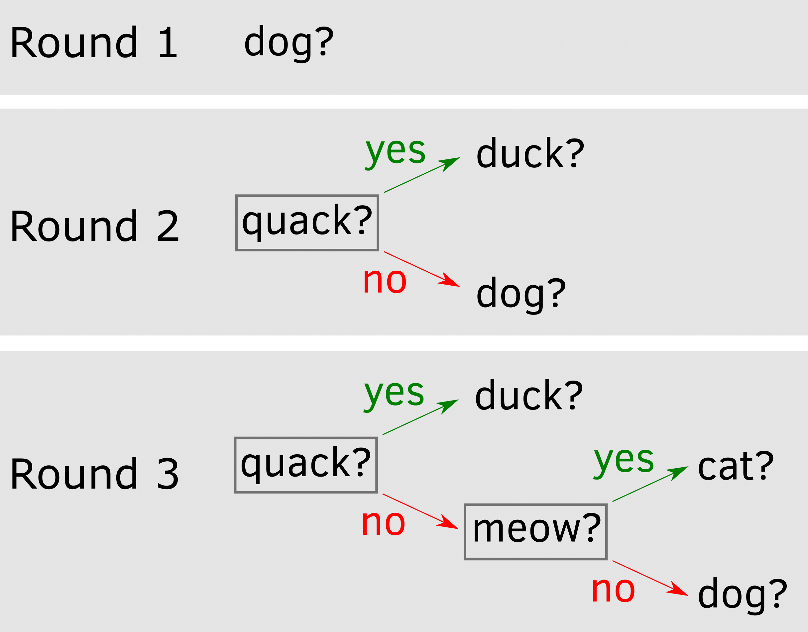
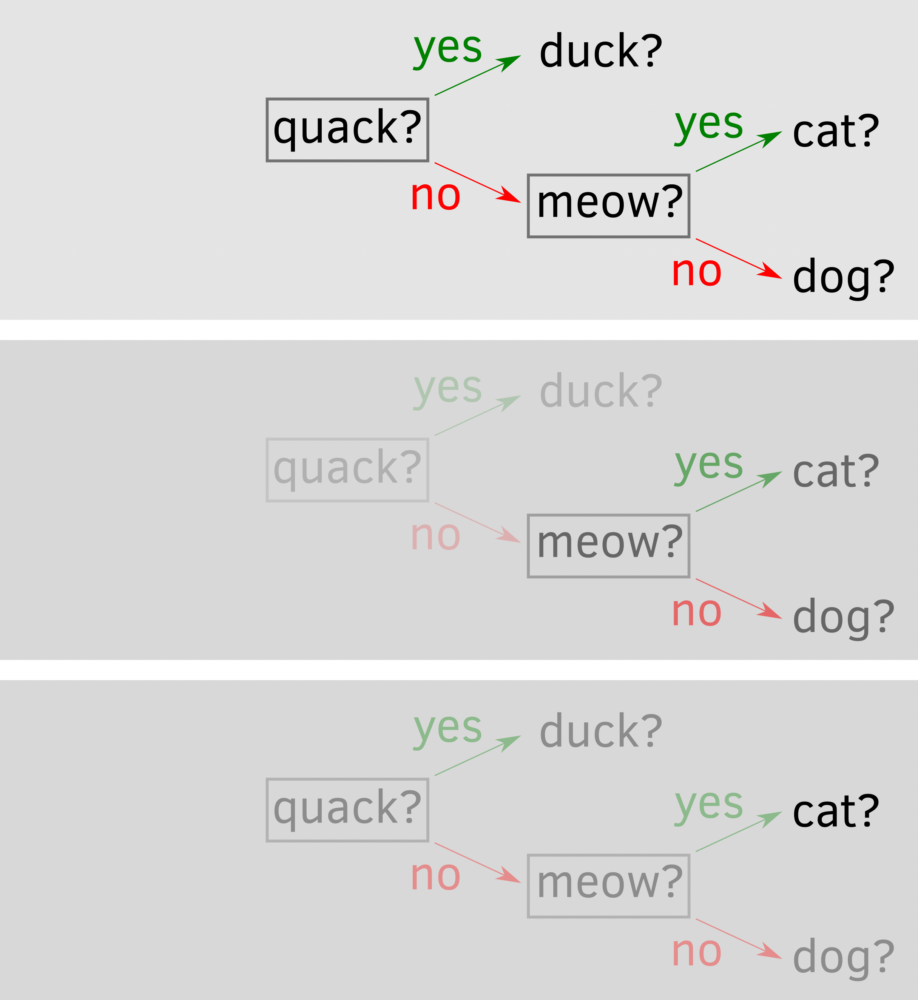

# Guess the animal {#guess-the-animal}

Today we will program a game in which computer tries to guess an animal that you thought of and learns from its mistake gradually building it vocabulary. Despite its simplisity, it will give us an opportunity to learn about dictionaries, critical differences between mutable and immutable objects, recursion, and file system. As per usual, grab the [exercise notebook]() before we start.

## Chapter concepts
* [Mutable](#mutable-objects) vs. [immutable](#variables-as-boxes-immutable-objects) objects
* [Dictionaries](#dictionaries)
* [Recursion](#recursion)
* Working with files via [os](#os-library) library.

## Variables as boxes (immutable objects)
In this game, you will use [dictionaries](#dictionaries). These are _mutable_, like [lists](#lists) in contrast to "normal" _immutable_ values (integers, floats, strings). You need to learn about this distinction as these two kinds of objects (values) behave very differently under some circumstances, which is both good (power!) and bad (weird unexpected behavior!) news.

You may remember the _variable-as-a-box_ metaphor that I used to introduce [variables](#variables). In short, a variable can be thought of as a "box" with a variable name written on it and a value being stored "inside". When you use this value or assign it to a different variable, you can assume that Python _makes a copy_ of it^[Not really, but this makes it easier to understand.] and puts that _copy_ into a different variable "box". When you _replace_ value of a variable, you take out the old value, destroy it (by throwing it into a nearest black hole, I assume), create a new one, and put it into the variable "box". When you _change_ a variable based on its current state, the same thing happens. You take out the value, create a new value (by adding to the original one or doing some other operation), destroy the old one, and put the new one back into the variable "box". The important point is that although a _variable_ can have different immutable values (we [changed](#random-mole) `imole` variable on every round), the immutable _value_ itself never changes. It gets _replaced_ with another immutable value but _never changes_^[A metaphor attempt: You can wear different shirts, so your _look_ (variable) changes but each individual shirt (potential values) remains the same (we ignore the wear and tear here) irrespective of whether your are wearing it (value is assigned to a variable) or not.].

The box metaphor explains why [scopes](#scopes-for-immutable-values) work the way they do. Each scope has its own set of boxes and whenever you pass information between scopes, e.g., from a global script to a function, a copy of a value (from a variable) is created and put into a new box (e.g., a parameter) inside the function. When a function returns a value, it is copied and put in one of the boxes in the global script (variable you assigned the returned value to), etc.

However, this is true only for _immutable_ objects (values) such as numbers, strings, logical values, etc. but also [tuples](https://docs.python.org/3/library/stdtypes.html?highlight=tuple#tuple) (see below for what these are). As you could have guessed from the name, this means that there are other _mutable_ objects and they behave very differently.

## Variables as post-it stickers (mutable objects){#mutable-objects}
Mutable objects are, for example, lists or dictionaries^[Coming up shortly!], i.e., things that can change. The key difference is that _immutable_ objects can be thought as fixed in their size. A number takes up that many bytes to store, same goes for a given string (although a different string would require more or fewer bytes). Still, they do not change, they are created and destroyed when unneeded but never truly updated.

_Mutable_ objects can be changed^[Building on the looks metaphor: You can change your look by using a different (immutable) shirt or by _changing_ your haircut. You hair is mutable, you do not wear a different one on different days to look different, you need to modify it to look different.]. For example, you can add elements to your list, or remove them, or shuffle them. Same goes for [dictionaries](https://docs.python.org/3/tutorial/datastructures.html?highlight=dictionary#dictionaries). Making such object _immutable_ would be computationally inefficient: Every time you add a value a (long) list is destroyed and recreated with just that one additional value. Which is why Python simply _updates_ the original object. For further computation efficiency, these objects are not copied when you assign them to a different variable or use as a parameter value but are _passed by reference_. This means that the variable is no longer a "box" you put values into but a "sticker" you put on an object (a list, a dictionary). And you can put as many stickers on an object as you want _and it still will be the same object_!

What on Earth do I mean? Keeping in mind that a variable is just a sticker (one of many) on a mutable object, try figuring out what will be the output below:

```python
x = [1, 2, 3]
y = x
y.append(4)
print(x)
```

::: {.rmdnote .practice}
Do exercise #1.
:::

Huh? That is precisely what I meant with "stickers on the same object". First, we create a list and put an `x` sticker on it. Then, we assign _the same list_ to `y`, in other words, we put a `y` sticker _on the same list_. Since both `x` and `y` are stickers on the _same_ object, they are, effectively, synonyms. In that specific situation, once you set `x = y`, it does not matter which variable name you use to change _the_ object, they are just two stickers hanging side-by-side on the _same_ list. Again, just a reminder, this is _not_ what would happen for _immutable_ values, like numbers, where things would behave the way you expect them to behave.

This variable-as-a-sticker, a.k.a. "passing value by reference", has very important implications for function calls, as it breaks your scope without ever giving you a warning. Look at the code below and try figuring out what the output will be.

```python 
def change_it(y):
    y.append(4)

x = [1, 2, 3]
change_it(x)
print(x)
```
::: {.rmdnote .practice}
Do exercise #2.
:::

How did we manage to modify a _global_ variable from inside the function? Didn't we change the _local_ parameter of the function? Yep, that is exactly the problem with passing by reference. Your function parameter is yet another sticker on the _same_ object, so even though it _looks_ like you do not need to worry about global variables (that's why you wrote the function and learned about scopes!), you still do. If you are perplexed by this, you are in a good company. This is one of the most unexpected and confusing bits in Python that routinely catches people^[Well, at least me!] by surprise. Let us do a few more exercises, before I show you how to solve the scope problem for mutable objects.

::: {.rmdnote .practice}
Do exercise #3.
:::

## Tuple: a frozen list {#tuple}
The wise people who created Python were acutely aware of the problem that the _variable-as-a-sticker_ creates. Which is why, they added an **immutable** version of a list, called a [tuple](https://docs.python.org/3/library/stdtypes.html?highlight=tuple#tuple). It is a "frozen" list of values, which you can loop over, access its items by index, or figure out how many items it has, but you _cannot modify it_. No appending, removing, replacing values, etc. For you this means that a variable with a frozen list is a box rather than a sticker and that it behaves just like any other "normal" **immutable** object. You can create a `tuple` by using round brackets.
```python
i_am_a_tuple = (1, 2, 3)
```
You can loop over it, e.g.,
```{python}
i_am_a_tuple = (1, 2, 3)
for number in i_am_a_tuple:
    print(number)
```

but, as I said, appending will throw a mistake
```{python error = TRUE}
i_am_a_tuple = (1, 2, 3)

# throws AttributeError: 'tuple' object has no attribute 'append'
i_am_a_tuple.append(4)
```

Same goes for trying to change it
```{python error=TRUE}
i_am_a_tuple = (1, 2, 3)

# throws TypeError: 'tuple' object does not support item assignment
i_am_a_tuple[1] = 1 
```

This means that when you need to pass a list of values to a function and you want them to have no link to the original variable, you should instead pass _a tuple of values_ to the function. The function still has a list of values but the link to the original list object is now broken. You can turn a list into a tuple using `tuple()`. Keeping in mind that `tuple()` creates a frozen copy of the list, what will happen below?
```python
x = [1, 2, 3]
y = tuple(x)
x.append(4)
print(y)
```
::: {.rmdnote .practice}
Do exercise #4.
:::

As you probably figured out, when `y = tuple(x)`, Python creates **a copy** of the list values, freezes them (they are immutable now), and puts them into the "y" box. Hence, whatever you do to the original list, has no effect on the immutable "y".

Conversely, you "unfreeze" a tuple by turning it into a list via `list()`. Please note that it creates **a new list**, which has no relation to any other existing list, even if values are the same or were originally taken from any of them!

::: {.rmdnote .practice}
Do exercise #5.
:::

Remember I just said that `list()` creates a new list? This means that you can use it to create a copy of a list directly, without an intermediate tuple step. This way you can two _different_ lists with _identical_ values. You can also achieve the same results by slicing an entire list, e.g. `list(x)`, is the same as `x[:]`.

::: {.rmdnote .practice}
Do exercise #6.
:::

Here, `y = list(x)` created a new list (which was a carbon copy of the one with the "x" sticker on it) and the "y" sticker was put on that new list, while the "x" remained hanging on the original.

If you feel your head spinning then, unfortunately, I have to tell that it gets even worse. The following paragraph covers fairly advanced scenario but I want you to know about it, as things work extremely counterintuitively and I personally have been caught by this issue a few times and it always took me _forever_ to figure out the problem. Thus, I want you to be at least aware of it. What if you have a tuple (immutable!) that contains a list (mutable) inside? As I told you before, you cannot modify the item itself but that item is merely a reference to list (a sticker on a _mutable_ object!), so even though tuple is immutable, you can still fiddle with the list itself. Moreover, making a copy of a tuple will merely make a copy of a reference that still points to the same list! So, you could be thinking that since it is all tuples everything is immutatable and well-behaving and be caught out by that^[If this makes you want to scream, tell me and will do it together.]. Here is an example of such a mess:
```{python error = TRUE}
tuple_1 = tuple([1, ["A", "B"], 2])
tuple_2 = tuple_1

# This (correctly) does not work
tuple_1[0] = ["C", "D"]

# But we can change first element of the list to "C" and second to "D"
# Reference to the list is frozen, but the list itself is mutable!
tuple_1[1][0] = "C"
tuple_2[1][1] = "D"

print(tuple_1)
print(tuple_2)
```

Confusing? You bet! If you feel overwhelmed by this whole immutable/mutable, tuple/list, copy/reference confusion, you are just being a normal human being. I understand the (computational) reasons for doing things this way, I am aware of this difference and how useful this can be but it still catches me by surprise from time to time! So, the word of advice, be careful and double-check your code using debugger whenever you are assigning list or dictionaries, passing them to functions, making copies, having lists inside lists, etc. Be aware that things may not work as you think they should!


## Game structure
The way the game is played is very simple: On each turn computer asks you whether an animal has a certain property or if it is a specific animal. It starts knowing only about one animal, say, "dog". So, it asks you "Is the animal you are thinking of is a dog?". If it is, game is over and you can do it again. However, if it is not a dog then the computer asks "Who is it?", let say you answer "Duck" and then computer also asks you "What does duck do?" and you answer "quack". The important bit here is that computer uses this information the next time you play the game. It starts by asking "does the animal quack?", if yes, it guess "Duck", if not it falls back on the only animal it has left and guess "Dog". If it is not a dog, it asks you again "Who is it?", you say "Cat". "What does cat do?", "meow". Below you can see the decision tree that the computer can use on each round and how it adds the information it learned from it failures.


 

## Dictionaries {#dictionaries}
In the decision tree, we have two kinds nodes: 1) the action decision node ("quack?") that has two edges (_yes_ and _no_) that lead to other nodes, and 2) the leaf animal nodes ("duck", "dog", "cat", etc.). Thus each node has a one or two subtrees that in turn include their own decision trees, etc. Thus, each node has following properties: 

* `kind`: node _kind_ either `"action"` or `"animal"`
* `text`: node _text_ which holds either an action or the name of the animal
* `yes` : subtree for answer "yes" (relevant only for _action_ nodes)
* `no` : subtree for answer "no" (also relevant only for _action_ nodes)

This calls for a container and we _could_ put each node with its subtrees into a list and use numerical indexes to access individual elements (e.g., `node[0]` would be the node kind, whereas `node[2]` would hold the yes-subtree) but indexes do not have meaning per se, so figuring out how `node[0]` is different from `node[2]` would be tricky. Python has a solution for cases like this: [dictionaries](https://docs.python.org/3/library/stdtypes.html#dict).

A dictionary is a container that stores information using _key : value_ pairs. This is similar to how you look up a meaning or a translation (value) of a word (key) in a real dictionary, hence the name. To create a dictionary, you use _curly_ brackets `{<key1> : <value1>}, {<key2> : <value2>, ...}` or create it via `dict(<key1>=<value1>, <key2>=<value2>, ...)`. Note that the second version is more restrictive as keys must follow rules for variable names, whereas in curly-brackets version keys can be arbitrary strings.
```python
book = {"Author" : "Walter Moers",
        "Title": "Die 13½ Leben des Käpt'n Blaubär"}
        
# or, equivalently
book = dict(Author="Walter Moers",
            Title="Die 13½ Leben des Käpt'n Blaubär")
```

Once you created a dictionary, you can access or modify each field using its key, e.g. `print(book["Author"])` or `book["Author"] = "Moers, W."`. You can also add new fields by assigning values to them, e.g., `book["Publication year"] = 1999`. In short, you can use a combination of `<dictionary-variable>[<key>]` just like you would use a normal variable. This is similar to using the `list[index]` combination, the only difference is that `index` must be an integer, whereas `key` can be any hashable^[Immutable values are [hashable](https://docs.python.org/3/glossary.html#term-hashable), whereas mutable ones, like dictionaries and lists, are not. This is because mutable objects can _change_ while the program is running and therefore are unusable as a key. I.e., it is hard to match by a key, if the key can be different by the time you need to access the dictionary.] value.

## Yes/no input
In our game, we will be asking yes/no question _a lot_, so let us start by programming a `input_yes_no` function that takes a prompt as a single argument and keeps asking for the response until it receives the valid one. It should return `True` if response was "yes" and `False` otherwise. For convenience, it should prepend the prompt with a message `'Type "y" for yes and "n" for no.", e.g., if prompt parameter was `"Is it a pony?" the actual input prompt should be `'Type "y" for yes and "n" for no. Is it a pony?'`. This should be easy for you by now as you implemented several similar functions during the game. Document(!), test it in exercise 7, and put the code in `utils.py`.

::: {.program}
Put `input_yes_no` into _utils.py_.<br/>Test it in exercise 7.
:::

## One-trick pony
Let us start at the beginning by creating a dictionary with a single animal that can be used to ask a question "Is it <animal>?". Create a dictionary following the structure layed out above and think about which field you need (hint, not all four) and what values they should have. In the future, we will modify this tree, so even though you hard code it, it is still a variable, not a constant, so use the appropriate naming style.

Next, you need a simple code that checks if the node `"kind"` is `"animal"`, it asks "Is it <animal>?" (which field you need to use for that?) using the `input_yes_no` function you implemented before. For the moment, congratulate yourself if the answer was "yes" (computer guess it correctly!) but perform no action otherwise.

::: {.program}
Put your code into _code01.py_.
:::

## Learning a new trick
In the final implementation, our decision tree will grow through trial-and-error but initially, let us hard code a small decision tree by hand. Create a dictionary of dictionaries for the _Round 2_ decision tree. It has just three nodes, the top one is an action tree with two subtrees, each subtree is an animal leaf node. Since subtrees a dictionaries, it means that you put a dictionary into a corresponding field, so `decision_tree['yes']` will yield `{"kind" : "animal", "text" : "duck"} and, therefore, `decision_tree['yes']['animal']` will be `"duck"`. Once you defined it, explore it by hand in a jupiter notebook, trying different field and different levels, as in the example I've shown above.

Now that we have two kinds of nodes, we need to update the query code, so that is asks  "Is it <animal>?" for _animal_ node (you have this code already) but "Does it <action>?" for the _action_ node. Implement it but take no action for the response to the action node question yet. Test that it works by changing node kind.

::: {.program}
Put your code into _code02.py_.
:::

## Recursion
Our two kinds of nodes differ in what happens next. _Animal_ nodes are easy, they are the final leaf nodes, so the tree exploration stop where. We either got it right or not. In contrast, the _action_ nodes just tell us which subtree we need to work on next, asking the node-appropriate question. The important thing here is that although we go one level deeper, nothing really changes in terms of what we are actually doing. E.g., look at the figure below for a full and trunkated decision trees. Once we are at the node "meow?", it makes no difference whether we arrived to it from some upper-level node or it was the top node itself, the question we ask and the decision we make is the same. Similarly, once we are at the node `"cat"`, it makes no difference to us whether we ended up where after a long exploration or it was the only node that we have.



This means that we need just one function that will act on the node and that the _same_ function will be applied to a relevant subtree (for the _action_ node). I.e., the function will call itself! This is called a recursion and a classic^[Actually, it is somewhat misleading, as you do not need recursion for factorial, a for loop will suffice, but this a nice and simple toy example, so we'll walk with the crowd on this one.] example to illustrate the concept is computation of a [factorial](https://en.wikipedia.org/wiki/Factorial) $!n = n \times (n - 1) \times (n - 2) \times ...\times3\times2\times1$.
