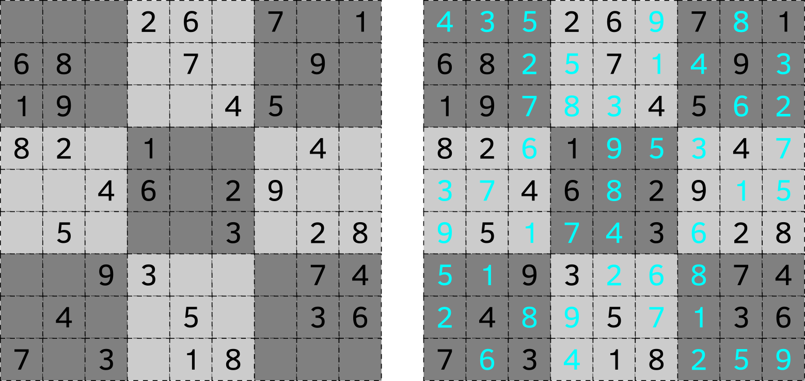
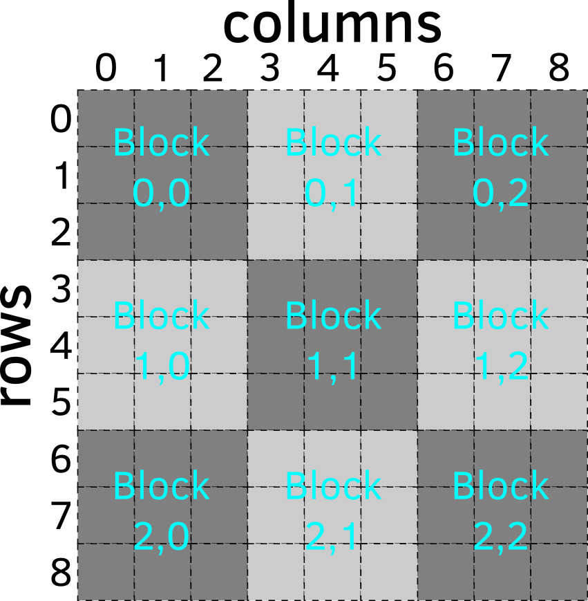

# Sudoku: Brute-Force-Algorithmus {#sudoku-brute-force}

In diesem Kapitel werden wir ein Programm schreiben, das ein [Sudoku-Rätsel](https://de.wikipedia.org/wiki/Sudoku) generiert. In einem typischen Sudoku-Rätsel musst du ein $9\times9$ Gitter mit den Zahlen 1 bis 9 so vervollständigen, dass sich die Zahlen in jeder Reihe, jeder Spalte und jedem $3\times3$ Quadratblock nicht wiederholen. Wenn du das Spiel spielst, hast du ein unvollständiges Puzzle und je mehr Lücken es hat, desto schwieriger tendiert das Rätsel zu sein. Aber bevor du das Spiel spielen kannst, muss jemand (das bist du heute) 1) ein komplettes Rätsel generieren (woran wir uns heute konzentrieren werden), 2) einige Zahlen entfernen, während sichergestellt wird, dass die Lösung des Rätsels eindeutig bleibt. Heute werden wir uns auf die erste Aufgabe konzentrieren: Das Generieren eines vollständigen Bretts.

{width=100% style="display: block; margin: 0 auto"}

<br/>
Das Rätsel basiert auf einem 2D-Gitter und prinzipiell könntest du [Listen](#lists) von Zeilen (die selbst Listen sind) verwenden, um dieses Gitter zu erstellen. Das wäre ähnlich der Liste von Listen, die Informationen über verbundene Höhlen im Spiel [Hunt the Wumpus](#hunt-the-wumpus) enthielten. Allerdings macht eine geschachtelte Listenstruktur das Arbeiten mit Spalten und Blöcken schwierig, da ihre Elemente verschiedenen Listen angehören und du anstelle von einfacherem Listen-Slicing (was nur für Zeilen funktioniert) Schleifen verwenden musst.

Stattdessen werden wir es als Gelegenheit nutzen, um etwas über die [NumPy](https://numpy.org/) Bibliothek zu lernen, die eines der Schlüsselpakete für wissenschaftliches Rechnen in Python ist und die Grundlage für viele Bibliotheken zur Datenanalyse bildet. Beachte, dass das untenstehende Material keinesfalls vollständig ist. Es kratzt, wenn überhaupt, nur an der Oberfläche von NumPy. Wenn du NumPy für deine Projekte benötigst, empfehle ich dringend, einen Blick in den offiziellen [Getting Started für absolute Anfänger](https://numpy.org/doc/stable/user/absolute_beginners.html) Leitfaden und das offizielle [Benutzerhandbuch](https://numpy.org/doc/stable/user/index.html) zu werfen.

Nimm dir das [Übungs-Notebook](notebooks/sudoku-brute-force.ipynb) und lass uns loslegen.

## NumPy importieren
NumPy ist keine Standardbibliothek von Python, daher musst du sie eventuell [installieren](https://numpy.org/install/). Wie bei allen Bibliotheken, musst du NumPy importieren, bevor du es in deinem Skript verwenden kannst. Dies ist jedoch einer der seltenen Fälle, bei denen das Umbenennen der Bibliothek beim Importieren der Standard und der empfohlene Weg ist:
```{python eval = FALSE}
import numpy as np
```

## 1D-NumPy-Arrays versus Python-Listen
Die Schlüsseldatenstruktur, die NumPy einführt, ist ein NumPy-Array, das beliebig viele Dimensionen haben kann. Ein eindimensionales Array, typischerweise "Vektor" genannt, ist am direktsten mit einer Python-[Liste](#lists) verwandt, hat aber sowohl einige Einschränkungen als auch zusätzliche Funktionalität. Im Gegensatz zu Python-Listen, die alles enthalten können, einschließlich anderer Listen, müssen alle Elemente eines Arrays vom gleichen Typ sein. Der Vorteil dieser Einschränkung besteht darin, dass, da alle Elemente vom gleichen Typ sind, du eine Funktion auf alle Elemente anwenden kannst. Beachte, dass dies keine Garantie dafür bietet, dass es bei intrinsisch heterogenen Python-Listen funktioniert, was der Grund ist, warum du Operationen auf jedes Element einzeln ausführen musst.

Du kannst aus einer Liste ein NumPy-Array über die [array](https://numpy.org/doc/stable/reference/generated/numpy.array.html)-Funktion erstellen:
```{python}
import numpy as np

# Eine Python-Liste von Zahlen
a_list = [1, 5, 7]
print(a_list)

# Ein aus der Liste erstelltes NumPy-Array
an_array = np.array(a_list)
print(an_array)
```

Beachte, dass aufgrund der Einschränkung "alle Werte müssen vom gleichen Typ sein", wenn die ursprüngliche Python-Liste Daten verschiedener Typen enthielt, alle Werte in den flexibelsten Typ umgewandelt werden. Zum Beispiel wird eine Mischung aus logischen Werten und Ganzzahlen dir Ganzzahlen geben, eine Mischung aus Ganzzahlen und Fließkommazahlen wird dir Fließkommazahlen geben, eine Mischung aus irgendetwas mit Zeichenketten wird dir Zeichenketten geben usw.

```{python}
# Logische Werte und Ganzzahlen -> alle Ganzzahlen
print(np.array([True, 2, 3, False]))

# Ganzzahlen und Fließkommazahlen -> alle Fließkommazahlen
print(np.array([1.0, 2, 3, 0.0]))

# Logische Werte, Ganzzahlen, Fließkommazahlen und Zeichenketten -> alle Zeichenketten
print(np.array([False, 1, 2.0, "a"]))
```

Der Typ eines Arrays wird bei der Erstellung festgelegt, und wenn du einen Wert eines anderen Typs einfügst, wird dieser entweder in diesen Typ umgewandelt oder, falls eine Umwandlung nicht möglich ist, wird NumPy einen Fehler ausgeben.
```{python error = TRUE}
# Array von Booleschen Werten
array_of_bool = np.array([True, False, True])

# Ein Fließkommawert wird automatisch in einen logischen Wert umgewandelt.
# es ergibt 'True', weil nur 0.0 'False' ist
array_of_bool[1] = 2.0
print(array_of_bool)

# Ein beliebiger Zeichenkettenwert, der nicht automatisch in eine Ganzzahl umgewandelt werden kann
array_of_int = np.array([1, 2, 3])
array_of_int[1] = "A text"
```

::: {.practice}
Mache Übung #1.
:::

Im Allgemeinen kannst du mit einem 1D-NumPy-Array das Gleiche tun wie mit einer Liste. Zum Beispiel funktioniert das Slicing auf die gleiche Weise, du kannst genauso über Elemente eines Arrays iterieren usw.
```{python}
a_list = [1, 5, 7]
an_array = np.array(a_list)

# Slicing (Teilauswahl)
print(a_list[:2])
print(an_array[1:])

# for-Schleife
for value in an_array:
  print(value)
```

Allerdings wird bestimmte Funktionalität anders implementiert, wie das [Anhängen](https://numpy.org/doc/stable/reference/generated/numpy.append.html#numpy-append) im folgenden Beispiel. Andere Funktionalitäten, wie ein [Entfernen](https://docs.python.org/3/tutorial/datastructures.html#more-on-lists) (pop), fehlen, können aber durch Slicing emuliert werden.

```{python}
# Werte anhängen
an_array = np.append(an_array, 4)
print(an_array)
```

Der wichtigste praktische Unterschied zwischen Listen und NumPy-Arrays liegt darin, dass Letztere homogen sind und Operationen an ihnen vektorisiert werden. Das bedeutet, dass du eine Funktion auf das gesamte Array auf einmal anwenden kannst, was es sowohl einfacher in der Handhabung macht als auch schneller, da die meisten Operationen an Arrays stark optimiert sind. Hier ist ein Beispiel dafür, wie du den gleichen Wert mit jedem Element eines Arrays multiplizierst und dann diesen Wert zu jedem Element hinzufügst, etwas, das bei einer normalen Liste eine for-Schleife erfordert.
```{python}
a_list = [1, 2, 3]
an_array = np.array(a_list)
2 * an_array + 1
```

Du kannst auch elementweise Operationen auf zwei (oder mehr) Arrays gleichzeitig ausführen. Zum Beispiel, hier ist ein Beispiel für elementweises Addieren von zwei Arrays.
```{python}
array1 = np.array([1, 2, 4])
array2 = np.array([-1, -3, 5])
array1 + array2
```

Beachte, dass dies nur funktioniert, wenn die [Formen](https://numpy.org/doc/stable/reference/generated/numpy.shape.html) (shapes) der Arrays gleich sind. Im Falle von 1D-Arrays (auch Vektoren genannt), bedeutet das, dass ihre Länge gleich sein muss.
```{python error = TRUE} 
array1 = np.array([1, 2, 4])
array2 = np.array([-1, -3, 5, 7])
array1 + array2
```

Gleichzeitig kannst du immer Vektoren mit einem einzelnen Element verwenden, die "Skalare" genannt werden, und dieser einzelne Wert wird für jedes Element im anderen Vektor verwendet.
```{python error = TRUE} 
a_vector = np.array([1, 2, -4])
a_scalar = np.array([-1])
a_vector * a_scalar
```

::: {.practice}
Mache Übung #2.
:::

Vektorisierung bedeutet auch, dass du aggregierende Funktionen -- [Mittelwert](https://numpy.org/doc/stable/reference/generated/numpy.mean.html) (mean), [Median](https://numpy.org/doc/stable/reference/generated/numpy.median.html), [Minimum](https://numpy.org/doc/stable/reference/generated/numpy.min.html) (min) usw. -- auf das Array anwenden kannst, anstatt diese von Hand zu berechnen.

::: {.practice}
Mache Übung #3.
:::


## 2D-NumPy-Arrays, auch Matrizen genannt
Die wahre Stärke von NumPy entfaltet sich, sobald dein Array zwei oder mehr Dimensionen hat. 2D-Arrays werden als Matrizen bezeichnet, während Arrays mit drei oder mehr Dimensionen als Tensoren bekannt sind. Erstere spielen eine Schlüsselrolle in der klassischen linearen Algebra in Python, während letztere für künstliche neuronale Netzwerke erforderlich sind (deshalb auch "Tensor" in [TensorFlow](https://www.tensorflow.org/)).

Wie bei Vektoren (1D-Arrays) im Vergleich zu Python-Listen, ergibt sich der Vorteil aus Einschränkungen. Matrizen sind rechteckig, d.h., sie bestehen aus mehreren Reihen, aber jede Reihe hat die gleiche Anzahl von Elementen. Im Gegensatz dazu _kannst_ du eine rechteckige Matrix als Liste von Listen erstellen (auch hier war unser `CONNECTED_CAVES` eine $20\times3$ rechteckige Matrix), aber dies ist nicht garantiert. Darüber hinaus bedeutet die Homogenität der Matrix (alle Werte müssen vom gleichen Typ sein), dass du einen rechteckigen Teil der Matrix extrahieren kannst und es garantiert eine weitere Matrix des gleichen Typs ist. Und Slicing macht das Arbeiten mit 2D-Arrays viel einfacher. Zum Beispiel, hier ist der Code, um eine Spalte aus einer Liste von Listen im Vergleich zu einer NumPy-Matrix zu extrahieren.

```{python}
matrix_as_list = [[1, 2, 3],
                  [4, 5, 6],
                  [7, 8, 9]]
matrix_as_array = np.array(matrix_as_list)

icolumn = 1 # der Spaltenindex, den wir extrahieren möchten

# Extrahieren einer Spalte mittels List Comprehension
column_as_list = [row[icolumn] for row in matrix_as_list]
print(column_as_list)

# Extrahieren einer Spalte aus einer Matrix
print(matrix_as_array[:, 1])
```

Das Extrahieren von Zeilen, Spalten und quadratischen Blöcken aus einer Matrix wird entscheidend sein, um den Code für Sudoku zu schreiben, also lass uns üben!

::: {.practice}
Mache Übung #4.
:::

## Arrays einer bestimmten Form erstellen
Es gibt verschiedene Möglichkeiten, NumPy-Arrays zu erstellen. Oben haben wir Listen oder Listen von Listen verwendet, um sie zu erstellen. Aber manchmal musst du ein Array einer bestimmten [Form](https://numpy.org/doc/stable/reference/generated/numpy.shape.html) anlegen, das mit [Nullen](https://numpy.org/doc/stable/reference/generated/numpy.zeros.html) oder [Einsen](https://numpy.org/doc/stable/reference/generated/numpy.ones.html) gefüllt ist. Der Schlüsselparameter in diesen Funktionen ist die _Form_ des Arrays: eine Liste mit den Dimensionen des Arrays. Für ein 1D-Array kann dies entweder `<Anzahl der Elemente>` oder `(<Anzahl der Elemente>, )` sein. Für ein 2D-Array bedeutet dies `(<Anzahl der Zeilen>, <Anzahl der Spalten>)`.

```{python}
zeros_matrix_3_by_2 = np.zeros((3, 2))
print(zeros_matrix_3_by_2)
```

::: {.practice}
Mache Übung #5.
:::

## Zufällige Arrays einer bestimmten Größe erstellen
NumPy hat ein Modul zur Generierung von Zufallszahlen --- [numpy.random](https://numpy.org/doc/stable/reference/random/index.html#module-numpy.random) --- das konzeptuell ähnlich zur Python-standardmäßigen [random](https://docs.python.org/3/library/random.html) Bibliothek ist, aber es ermöglicht dir die Erstellung von Arrays von Werten anstatt eines einzigen Wertes. Aus Bequemlichkeit sind die Namen gleich geblieben. Zum Beispiel hat die Funktion [random.randint](https://docs.python.org/3/library/random.html#random.randint), die eine einzige zufällige Ganzzahl generiert, einen Zwillingsbruder [numpy.random.randint](https://numpy.org/doc/stable/reference/random/generated/numpy.random.randint.html), der dieselben Parameter akzeptiert und standardmäßig ebenfalls einen einzigen Wert generiert. Du kannst jedoch das ganze Vektor-/Matrix-/Tensor-Array von Zufallszahlen auf einen Schlag generieren, indem du seine `Größe` angibst. Verwirrenderweise wird der Parameter `size` genannt, obwohl er sich auf die "Ausgabeform" bezieht (nicht sicher, warum sie es nicht "Form" genannt haben).

::: {.practice}
Mache Übung #6.
:::

## Erstellen von Arrays mit Sequenzen
Ähnlich wie man eine Folge von Ganzzahlen mit [range](https://docs.python.org/3/library/functions.html#func-range) erstellen kann, kann man einen Vektor von Ganzzahlen mit [arange](https://numpy.org/doc/stable/reference/generated/numpy.arange.html)^[Der Name ist verwirrend, aber anscheinend steht dies als Abkürzung für "array range"] erstellen und dies ist gleichwertig mit `np.array(range(...))`:

```{python}
print(np.arange(5))
print(np.array(range(5)))
```

NumPy hat auch eine praktische Funktion namens [linspace](https://numpy.org/doc/stable/reference/generated/numpy.linspace.html), mit der du eine Sequenz von _Fließkommazahlen_ mit einer beliebigen Fließkommazahl-Schrittweite erzeugen kannst.

::: {.practice}
Mache Übung #7.
:::

## Arrays zu einer Matrix stapeln {#stack}
Die Funktion [arange](https://numpy.org/doc/stable/reference/generated/numpy.arange.html) wird für uns nützlich sein, um eine Sequenz von Ganzzahlen von 1 bis 9 (oder 1 bis 4, wenn wir an einer kleineren Version von Sudoku arbeiten) zu erzeugen. Beachte jedoch, dass du in beiden Fällen nur einen Vektor, aber nicht die Matrix erzeugen kannst, die wir brauchen! Die Lösung in diesem Fall ist, einzelne Vektoren zu [stapeln](https://numpy.org/doc/stable/reference/generated/numpy.stack.html) (stack). Beim Stapeln spielen die [Formen](https://numpy.org/doc/stable/reference/generated/numpy.ndarray.shape.html) (shapes) der einzelnen Vektoren eine wichtige Rolle, da sie kompatibel sein müssen. Dies ist ein Schlüsselpunkt im Unterschied zu Python-Listen, die nur eine [Länge](https://docs.python.org/3/library/functions.html#len) haben.

Für wirklich eindimensionale Arrays ist es einfach. Dies sind Arrays, die aus Listen oder über Funktionen wie [zeros](https://numpy.org/doc/stable/reference/generated/numpy.zeros.html) oder [linspace](https://numpy.org/doc/stable/reference/generated/numpy.linspace.html) erstellt wurden. Wenn du dir ihre [Form](https://numpy.org/doc/stable/reference/generated/numpy.ndarray.shape.html) ansiehst, wirst du nur eine Dimension sehen.

```{python}
print(np.array([10, 20, 30]).shape)
print(np.zeros(5).shape)
```

Diese Vektoren haben keine "Orientierung" (wenn du dich mit linearer Algebra auskennst, würdest du entweder Spalten- oder Zeilenvektoren erwarten), daher kannst du beim Kombinieren dieser Arrays zu einer Matrix sie als Zeilen verwenden (stapeln entlang `axis=0`, das ist der Standard, siehe auch [vstack](https://numpy.org/doc/stable/reference/generated/numpy.vstack.html)) oder als Spalten (stapeln entlang `axis=1`, siehe auch [hstack](https://numpy.org/doc/stable/reference/generated/numpy.hstack.html)).
```{python}
one_d_vector = np.arange(5)

# Vertikal stapeln: Vektoren werden als Zeilen verwendet
print(np.stack([one_d_vector, one_d_vector]))
print(np.stack([one_d_vector, one_d_vector]).shape)

# Horizontal stapeln: Vektoren werden als Spalten verwendet
print(np.stack([one_d_vector, one_d_vector], axis=1))
print(np.stack([one_d_vector, one_d_vector], axis=1).shape)
```

Übe das Stapeln. Das Ergebnis für eine durch Zeilen gestapelte Matrix sieht so aus:
```{python echo = FALSE}
a_row = np.arange(1, 5)
np.stack([a_row, a_row, a_row, a_row], axis=0)
```

und für eine durch Spalten gestapelte Matrix sieht es so aus:
```{python echo = FALSE}
a_column = np.arange(1, 5)
np.stack([a_column, a_column, a_column, a_column], axis=1)
```

::: {.practice}
Mache Übung #8.
:::

## Zeilen- und Spaltenvektoren versus 1D-Arrays (#row-col-vectors)
Wie oben erwähnt, sind 1D-Arrays wirklich eindimensional, da ihre Form `(N, )` ist (beachte die leere Stelle nach dem Komma). Jedoch benötigst du oft denselben Vektor in einer 2D-Form entweder als Zeilenvektor `(1, N)` oder als Spaltenvektor `(N, 1)`. Der Unterschied zwischen einem 1D-Array und einem 2D-Zeilen-/Spaltenvektor ist, dass Letztere eine "Orientierung" haben^[Dies ist besonders wichtig für die lineare Algebra.] und trotz der gleichen Anzahl von Elementen unterschiedlich gestapelte Arrays erzeugen werden.

Du kannst ein 1D-Array `(N, )` in einen Zeilenvektor `(1, N)` umwandeln, indem du es in eine weitere Liste packst: `np.array([<original Liste oder 1D-Array>])`. Wie du unten sehen kannst, obwohl die [Formen](https://numpy.org/doc/stable/reference/generated/numpy.ndarray.shape.html) der beiden Arrays unterschiedlich sind, ist ihre [Größe](https://numpy.org/doc/stable/reference/generated/numpy.ndarray.size.html) (Gesamtanzahl der Elemente) gleich.

```{python}
# Ein 1D-Array
oned_array = np.array([1, 2, 3])
(oned_array.shape, oned_array.size)

# Ein 2D-Array, jedoch mit der gleichen Anzahl von Elementen und der gleichen größten Dimension
row_vector = np.array([[1, 2, 3]])
(row_vector.shape, row_vector.size)
```

Es gibt zwei Möglichkeiten, einen Spaltenvektor mit der Form `(N, 1)` zu erstellen. Erstens kannst du ihn als Liste von Listen mit einem Wert pro Zeile (innere Liste) angeben. Alternativ kannst du einen Zeilenvektor erstellen und dann [transponieren](https://numpy.org/doc/stable/reference/generated/numpy.transpose.html).

```{python}
# Spaltenvektor aus Liste von Listen
np.array([[1], [2], [3]])

# Spaltenvektor durch Transposition eines Zeilenvektors
np.transpose(np.array([[1, 2, 3]]))
```

Wie oben erwähnt, macht die "Orientierung" von Vektoren einen Unterschied beim Stapeln. Erkunde diese Unterschiede in der Übung 9.

::: {.practice}
Mache Übung #9.
:::

## Wiederholen und Kacheln
In der oben genannten Übung hast du vier Zeilen- oder Spaltenvektoren gestapelt, aber sie waren alle identisch. NumPy kann solche wiederholten Sequenzen über die Funktionen [repeat](https://numpy.org/doc/stable/reference/generated/numpy.repeat.html) und [tile](https://numpy.org/doc/stable/reference/generated/numpy.tile.html) generieren. Beide wiederholen die angeforderten Werte eine bestimmte Anzahl von Malen, aber es gibt ein paar wichtige Unterschiede. Erstens wiederholt [repeat](https://numpy.org/doc/stable/reference/generated/numpy.repeat.html) jeden Wert N Mal, bevor es zum nächsten Wert übergeht, während [tile](https://numpy.org/doc/stable/reference/generated/numpy.tile.html) die gesamte Sequenz in Reihenfolge N Mal wiederholt.

```{python}
print(np.repeat(np.arange(5), 2))
print(np.tile(np.arange(5), 2))
```

Der zweite Unterschied besteht darin, wie du die Wiederholung beim Erstellen von 2D-Matrizen spezifizierst. Im Falle von [repeat](https://numpy.org/doc/stable/reference/generated/numpy.repeat.html) gibst du an, entlang welcher `Achse` (axis) du die Sequenz wiederholst (gleich wie der `Achse`-Parameter beim [Stapeln](#stack)). 

::: {.practice}
Mache Übung #10.
:::

Für [tile](https://numpy.org/doc/stable/reference/generated/numpy.tile.html) gibt man die Wiederholungen (`reps`-Parameter) an, und man kann die Wiederholungen _pro Achse_ spezifizieren. 

```{python}
# Ein Array zweimal zeilenweise und dreimal spaltenweise kacheln (tile)
np.tile(np.array([1, 2, 3]), (2, 3))
```

::: {.practice}
Mache Übung #11.
:::

## Generating Sudoku via brute force: order and chaos
Our take on generating Sudoku will be conceptually simple but very inefficient: We will create an ordered matrix (by row or by column, not a valid initial solution), shuffle it (by row or by column), and then check if, accidentally, we ended up with a valid Sudoku matrix. If not, keep shuffling until we have one.

You already know how to create an ordered matrix that has four or nine rows and columns. To randomize it, use [np.random.shuffle](https://numpy.org/doc/stable/reference/random/generated/numpy.random.shuffle.html) that shuffles an array or a _part of_ an array _in place_. The latter part means that the function does not return any value and the array you supplied (it is passed by reference, recall [mutable objects and functions](#mutable-objects)).

```{python}
# shuffle the entire array
an_array = np.arange(5)
np.random.shuffle(an_array)
print(an_array)

# shuffle part of an array
an_array = np.arange(5)
np.random.shuffle(an_array[:3])
print(an_array)
```

Write the code that creates a $4\times4$ matrix (define matrix size via `SUDOKU_SIZE` constant) ordered by row 
(so, each row goes from 1 till `SUDOKU_SIZE` but each column has a the same number in it) and write the code that shuffles just one row (put its index in `irow` variable). Change `irow` value to test that your code works. For example, your output for a randomly shuffle row #2 could look like this.

```{python echo = FALSE}
SUDOKU_SIZE = 4
np.random.seed(42)
grid = np.tile(np.arange(1, SUDOKU_SIZE + 1), (SUDOKU_SIZE, 1))
np.random.shuffle(grid[1, ])
grid
```

::: {.program}
Write code for creating matrix<br/>
and shuffling one row in exercise #12.
:::

Once a single row code works, modify it to shuffle all rows but one at a time (you can shuffle the entire matrix but then even rows will most likely be invalid). Once the shuffling code works, turn it into a function `shuffle_by_row`. Just like [np.random.shuffle](https://numpy.org/doc/stable/reference/random/generated/numpy.random.shuffle.html) it does not need to return anything, as shuffling occurs in place. Write the code that generates an ordered-by-row matrix of `SUDOKU_SIZE`, shuffles it by row, and prints it out. You definitely need to know matrix [shape](https://numpy.org/doc/stable/reference/generated/numpy.ndarray.shape.html) and loop over the [range](https://docs.python.org/3/library/functions.html#func-range) of rows.

::: {.program}
Put `shuffle_by_row` into _utils.py_<br/>
Write program in _code01.py_
:::

We are here to learn, so to solidify your skills program the same routine by both stacking and shuffling the matrix _by column_ (create a separate function `shuffle_by_column` for this).

::: {.program}
Put `shuffle_by_column` into _utils.py_<br/>
Write program in _code02.py_
:::

## Validation examples
In the following section, you will write functions that check validity of row, columns, and blocks. For this, we need examples that are valid for all or some checks. Use the cell below to run the check later.
```{python eval = FALSE}
all_valid = np.array([[4, 1, 3, 2],
                      [3, 2, 4, 1],
                      [2, 4, 1, 3],
                      [1, 3, 2, 4]])

invalid_row = np.array([[4, 1, 3, 1],
                        [3, 2, 4, 2],
                        [2, 4, 1, 3],
                        [1, 3, 2, 4]])

invalid_column = np.array([[4, 1, 3, 2],
                           [3, 2, 1, 4],
                           [2, 4, 1, 3],
                           [1, 3, 2, 4]])

invalid_block_and_column = np.array([[4, 3, 1, 2],
                                     [3, 2, 4, 1],
                                     [2, 4, 1, 3],
                                     [1, 2, 3, 4]])

invalid_block_and_row = np.array([[4, 1, 3, 2],
                                  [3, 4, 4, 1],
                                  [2, 2, 1, 3],
                                  [1, 3, 2, 4]])

all_invalid = np.array([[4, 1, 3, 2],
                        [3, 4, 1, 4],
                        [2, 2, 1, 3],
                        [1, 3, 2, 4]])
```

## Is this row even valid?
For a matrix to be a Sudoku, it must adhere to "only unique numbers in each row, column, and block" rule. Let us implement code for checking the rows (turning it into a column-check will be trivial).

For the row to be valid, it must contain `SUDOKU_SIZE` different, i.e., [unique](https://numpy.org/doc/stable/reference/generated/numpy.unique.html) numbers. Use [unique](https://numpy.org/doc/stable/reference/generated/numpy.unique.html) function to write a comparison for row `irow` (set it to some valid index by hand) that it indeed has `SUDOKU_SIZE` unique numbers, i.e., the array [size](https://numpy.org/doc/stable/reference/generated/numpy.ndarray.size.htm) of unique numbers is equal to `SUDOKU_SIZE`. However, do not pass the `SUDOKU_SIZE` constant to the function, instead infer the number of necessary unique element from the [shape](https://numpy.org/doc/stable/reference/generated/numpy.shape.html) of the matrix itself.

Use example matrices (see above) to check that it works correctly.

::: {.program}
Write and test single row validation<br/>
in exercise #12.
:::

Once, we have the code working for a single row, we can use [list comprehension](#list-comprehension) to generate a list of validity values, one for each row. Matrix is valid (at least with respect to rows) only if _all_ rows are valid. Handily, NumPy has a function [all](https://numpy.org/doc/stable/reference/generated/numpy.all.html) that tests whether _all_ elements of the array or list are `True`. Package this code into function `validate_rows`, think about its inputs and outputs, document.

::: {.program}
Put `validate_rows` into _utils.py_<br/>
Extend program from _code01.py_ in _code03.py_<br/>
Test code using example matrices.
:::

Now, do the same for columns and use both checks to see if the matrix is a valid Sudoku (rows should be fine but columns should fail the check).
::: {.program}
Put `validate_columns` into _utils.py_<br/>
Extend program from in _code03.py_ in _code04.py_<br/>
Test code using example matrices.
:::

## Blocks
Blocks are a touch trickier to work with as we do not have simple single axis to use for slicing. However, we can think about each as having a row and column index, which both go from 0 to 2 for $9\times9$ Sudoku as we have $3\times3$ blocks, or from 0 to 1 for $4\times4$ Sudoku where we have $2\times2$ blocks. 

{width=50% style="display: block; margin: 0 auto"}

<br/><br/>
Write the code that uses [slicing](https://numpy.org/doc/stable/user/basics.indexing.html#slicing-and-striding) to extract a single block defined by `i_block_row` and `i_block_col`. Compute matrix row for the block top left corner and then get a vertical slice relative to it. Same for the horizontal slice relative to the top-left block column in the matrix. To make debugging easier, generate a $9\times9$ matrix of integers stacked either by row or by columns, so that it is easier to see whether you code works. Test it for all combinations for `i_block_row` and `i_block_col`. You will also need to compute or define the block size. Do the former as it is very straightforward to compute from matrix [shape](https://numpy.org/doc/stable/reference/generated/numpy.shape.html). In a square Sudoku, block size is a [square root](https://docs.python.org/3/library/math.html#math.sqrt) of the board size ($4\times4$ boards have $2\times2$ blocks, $9\times9$ boards have $3\times3$ blocks, etc.). However, you size should be an integer, so you must take care of the [type conversion](https://docs.python.org/3/library/functions.html#int) yourself.

This is how the output should look like if `i_block_row = 1` and `i_block_col = 0` when you stack matrix by row
```{python echo = FALSE}
SUDOKU_SIZE = 9
BLOCK_SIZE = 3

# matrix generated by row
grid = np.tile(np.arange(1, SUDOKU_SIZE + 1), (SUDOKU_SIZE, 1))

i_block_row = 1
i_block_col = 0
grid[(i_block_row * BLOCK_SIZE):(i_block_row * BLOCK_SIZE + BLOCK_SIZE),
     (i_block_col * BLOCK_SIZE):(i_block_col * BLOCK_SIZE + BLOCK_SIZE)]
```

and when stacked by column
```{python echo = FALSE}
SUDOKU_SIZE = 9
BLOCK_SIZE = 3

# matrix generated by column
row_vector = np.array([np.arange(1, SUDOKU_SIZE + 1)])
col_vector = np.transpose(row_vector)
grid = np.repeat(col_vector, SUDOKU_SIZE, axis=1)


grid[(i_block_row * BLOCK_SIZE):(i_block_row * BLOCK_SIZE + BLOCK_SIZE),
     (i_block_col * BLOCK_SIZE):(i_block_col * BLOCK_SIZE + BLOCK_SIZE)]
```

::: {.program}
Write and test single block extraction code<br/>
in exercise #13.
:::

Once you have the code to extract block values, the validation logic is very similar to that of the row / column validation. Note that you can use [unique](https://numpy.org/doc/stable/reference/generated/numpy.unique.html) directly on the 2D array you extracted or, optionally, you can  [flatten](https://numpy.org/doc/stable/reference/generated/numpy.ndarray.flatten.html) it to a 1D array first. Once you have a list of nine logical values (one per block), you can check whether they are (all)[https://numpy.org/doc/stable/reference/generated/numpy.all.html] `True`. The main difference here is that you need nested loops to go over 2D grid of blocks. My solution is to create an empty list for validation values and then loop of block row and block column [appending](https://docs.python.org/3/tutorial/datastructures.html#more-on-lists) values to the list.


::: {.program}
Put `validate_blocks` into _utils.py_<br/>
Test all three validation functions using <br/>
example matrices in _code05.py_</br>
:::

## Brute force in action
We have all the building blocks to try to generate Sudoku via brute force. Package three validation functions that you created into a single `validate_matrix` function that returns `True` only if all rows, all columns, and blocks are valid. Then, generate an ordered matrix by row and in a for loop (I would use a for loop and limit it to say 1000 iterations) shuffle this matrix by row and check whether it is valid. If it is, break our of the loop and print out the Sudoku. Write a sad message (without a matrix print out) once you run out of trials (but no sad message otherwise!). Alternatively, you can generate matrix ordered by columns and then shuffle by columns as well (why generating by row and shuffling by columns won't work?). Set matrix size to 4 but note that our code will work with any correct matrix size ($9\times9$, $16\times16$, etc.)

::: {.program}
Put `validate_matrix` into _utils.py_<br/>
Write program in _code06.py_
:::

## Wrap up
Excellent, we have a working program that (very rarely) generates a complete Sudoku matrix. Zip and submit and next time we will write a different, more efficient implementation of the algorithm.

