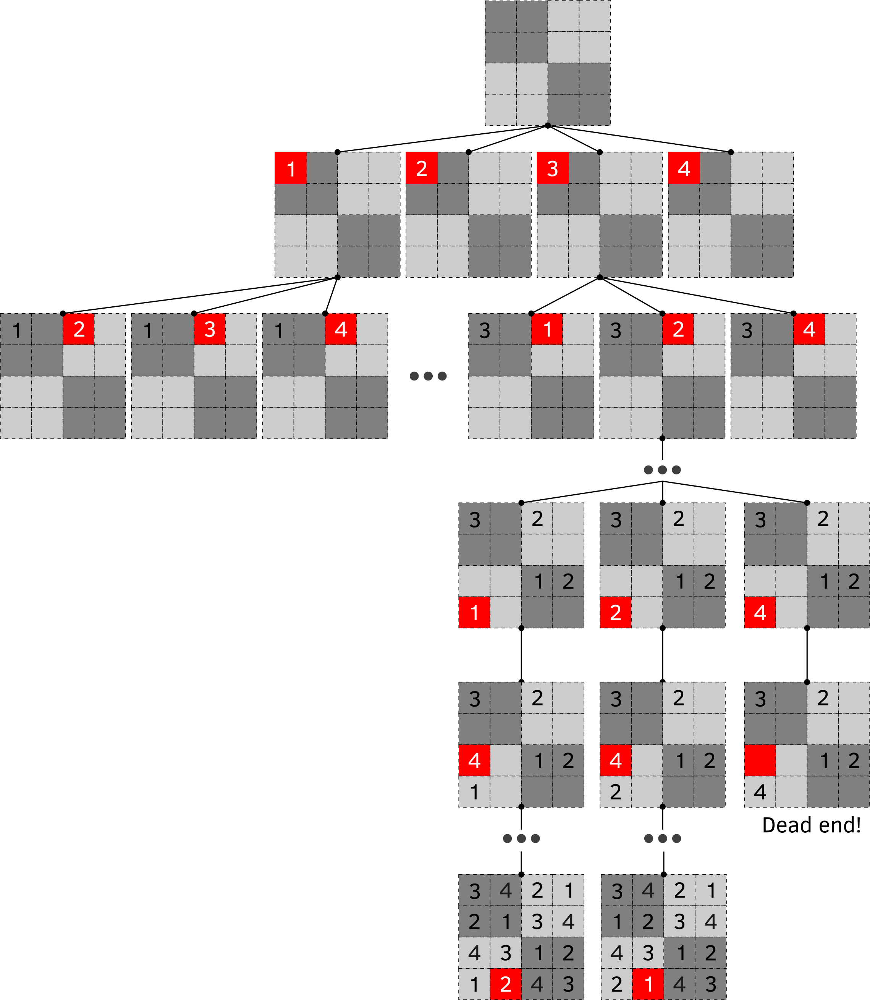
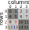
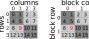

# Sudoku backtracking algorithm {#sudoku-backtracking}

```{python echo = FALSE}
import numpy as np
```

In this chapter we will work on Sudoku again using a more efficient backtracking algorithm. In contrast to fully stochastic [brute force](#sudoku-brute-force) algorithm that tries to "guess" the entire board in one go, backtracking algorithm makes an educated guess about one cell at at time. As in the previous chapters, we will build the program step by step, but the good news is you know very much everything you need to implement it: matrices, slicing, and recursive functions. We still will used it as opportunity to learn more about lists and NumPy. Grab the [exercise notebook]() and read on.

## Chapter concepts
* [Repetition of lists](#list-repetition)
* [Unpacking of tuples](#unpack-tuple) and lists
* [Seeding](#random-seed) random generator
* [Reshaping](#reshape) arrays
* [Exceptions](#exceptions)

## Backtracking algorithm
This algorithm is very intuitive if you think about it as an exploration of a tree. Each node is a cell and our three is 82 levels deep (starting with an empty grid and going through all 81 cells). Each node has _up to_ nine possible edges going out of it. Why _up to_ nine? We can use numbers 1 to 9 (hence nine edges at most) but unless cells is located in completely empty row, column, and block, some values will be already spoken for which limits valid edges. 

An example of such tree for $4\times4$ Sudoku is illustrated in the figure below. You start with an empty at the top and you have four possible ways to fill in the first cell (marked in red). However, as you move to a different cell (go one layer down), your choices are limited as both cells belong to the same row. Thus, if you picked $1$, you have three choices but $1$, if you picked $3$ you have three choices but $3$. Once you pick on of the available options you move to a next cell. However, you may eventually hit a dead end, as shown at the bottom right: All four numbers were already used, so there is no valid value for the cell and that path through the tree is invalid. The solution is to backtrack: go one level up, pick another number for the cell instead of $4$. Here, both $1$ and $2$ and _in both cases_ you may end up with a complete board. This is important as the tree defines _all possible paths_ and, therefore, _all possible_ $4\times4$ valid Sudoku matrices!

{width=100% style="display: block; margin: 0 auto"}
<br/>

If you are patient enough to systematically explore all paths in this tree, you will find all valid Sudoku matrices. However, we do not _all_, we want just _one_. At the same time, we want our program to generate a _different_ matrix on each run. If we fix our exploration path (always going through cells in the same order) and our choices (we always go through available numbers in ascending order), we will always end up at the same matrix. So our exploration strategy will include randomness. Initially, we will work with a smaller $4\times4$ matrices but once the algorithm works, it will be easy to tweak it to generate the proper $9\times9$ ones.

## Empty matrix (full of zeros)
The very first matrix in our tree is empty. For simplicity, we denote empty via $0$, so you need to generate a $4\times4$ matrix filled with zeros. Write the code for this using [NumPy](https://numpy.org/): There is a function that you learned about the last time which does exactly the job. Important detail, define size of the matrix ($4$) as a CONSTANT (let's call it `SUDOKU_SIZE`). This number defines both the matrix size and the range of numbers, so this will be the only change required to generate Sudoku of a different size.

::: {.practice}
Do exercise #1.
:::

## Empty matrix but via list repetitions {#list-repetition}
The NumPy solution does the job but there is also an alternative way of creating it via repetitions of lists. This does not make things easier here but it is a nice trick to know when for working with list. Namely, you can repeat a list $N$ times via `<list> * N`  where `* N` means "repeat N times". Here is an example of repeating three element array four times.
```{python}
[1, 2, 3] * 4
```

Given that you can repeat list of lists, generate a $4\times4$ list of lists containing all zeros (this can be converted to a $4\times4$ matrix via [np.array](https://numpy.org/doc/stable/reference/generated/numpy.array.html)). You need just one line for this, you are not allowed to repeat $0$ by hand (so just _one_ $0$ in your code!) and use `SUDOKU_SIZE` constant. 
```{python echo = FALSE}
SUDOKU_SIZE = 4
[[0] * SUDOKU_SIZE] * SUDOKU_SIZE
```

::: {.practice}
Do exercise #2.
:::

An important note on use of `*` for lists versus NumPy arrays. In the latter case, `*` means "multiply by", so even if things _look_ similar they will behave very differently!
```{python}
a_list = [1, 2, 3]
an_array = np.array(a_list)

# repetition for lists
a_list * 2

# multiplication for NumPy arrays
an_array * 2
```

## Cell row and column from index
There are different ways to define a random path through cells. In the matrix, each cell is identified by its row and column but, we can also think of cells having a unique index going from 0 till `SUDOKU_SIZE * SUDOKU_SIZE - 1` (why minus one?). Here is the illustration of what I mean. The index goes from top-left cell right and down, so if you know cell's row and column, you can compute its index. Conversely, if you cell's index you know in which row and column it is located, e.g., the highlighted cell with index $9$ is in row $2$ and column $1$. Same goes for the row and column of the block that the cell belongs to.

{width=25% style="display: block; margin: 0 auto"}
<br/>

You job is to write a function that takes a cell index and row width as parameters and returns a [tuple](https://docs.python.org/3/tutorial/datastructures.html#tuples-and-sequences) (an immutable list) with `(row, column)`.To convert an overall index to row and column you should use two special division operators: [floor division operator //](https://python-reference.readthedocs.io/en/latest/docs/operators/floor_division.html) and [modulos, divison remainder %](https://python-reference.readthedocs.io/en/latest/docs/operators/modulus.html) operators. The former returns only the integer part of the division, so that 4 // 3 is 1 (because 4/3 is 1.33333) and 1 // 4 is 0 (because 1/4 is 0.25). The latter returns the remaining integers, so that 4 % 3 is 1 and 1 % 4 is 0. These two operators are enough for you to compute row and column indexes. 
Write the function and test it by checking returned values. Reminder, you should get a tuple of two values (`return (row, col)`), so your output for index $9$ should look as follows:

```{python echo = FALSE}
def row_col_from_index(index, row_width):
  """Compute row and column index from the overall index.
  
  Parameters
  ----------
  index : int
  row_width : int
  
  Returns
  ----------
  tuple : (row, col) index
  """
  row = index // row_width
  col = index % row_width

  return (row, col)
```

```{python}
row_col_from_index(9, SUDOKU_SIZE)
```


::: {.program}
Put `row_col_from_index` into _utils.py_<br/>
Test it in _code01.py_
:::

## Cell block (row and column) from index
Our cell also belongs to a block that can be defined by their row and column indexes, as depicted in the figure below. 

{width=50% style="display: block; margin: 0 auto"}


You can compute block row and column index from, respectively, row and column you computed earlier. Think about which operator you need for this and you will also need block width which you can easily compute from the `row_width`: Think about how you can do this either using [Python](https://docs.python.org/3/library/math.html) or [NumPy](https://numpy.org/doc/stable/reference/routines.math.html), given that for $4\times4$ grid you have 2 blocks, for $9\times9$ --- 3, for $16\times16$ --- 4, etc. Note that block width _must_ be an integer, so make sure you [convert](https://docs.python.org/3/library/functions.html#int) the value. Extend your previous function (I called it `coords_from_index`), so it returns a tuple of four (row, col, block row, block col) as in the output below. Test it for different cell indexes using the figure above as the reference.

```{python echo = FALSE}
def coords_from_index(index, row_width):
  """Compute row and column index from the overall index.
  
  Parameters
  ----------
  index : int
  row_width : int
  
  Returns
  ----------
  tuple : (row, col) index
  """
  block_width = int(np.sqrt(row_width))
  
  row = index // row_width
  col = index % row_width
  
  block_row = row // block_width
  block_col = col // block_width

  return (row, col, block_row, block_col)
```

```{python}
coords_from_index(9, SUDOKU_SIZE)
```

::: {.program}
Put `coords_from_index` into _utils.py_<br/>
Test code in _code02.py_
:::

## Unpacking tuples
Our function returns a [tuple](https://docs.python.org/3/tutorial/datastructures.html#tuples-and-sequences) of `(row, col, block_row, block_col)`. Theoretically, we can use it via indexes, so that `row_col[0]` means row and `row_col[1]` mean column etc. but this is hard to read. There is a better solution via so called "unpacking". When you created a tuple, you "packed" four values into it, the "unpacking" reverses it^[Yes, I am aware of the irony of unpacking values to pack them back for the print.].

```{python}
row, col, block_row, block_col = coords_from_index(9, SUDOKU_SIZE)

print("Row: %d, column %d, block row %d, block column %d"%(row, col, block_row, block_col))
```

This trick works only if you have matching number of elements and variables, so only suitable when fixed returned tuples are fixed in size. Note that the same trick will work a list but this break semantics. It is okay for tuples because the are immutable and using them you indicate to the reader that their size is, at least conceptually, fixed. In contrast, lists are mutable, so their use indicates that they can have any length. Again, it makes no actual difference in the program for a tuple or list of the identical size, but this distinction serves to inform the reader about your intents and any help in reading code should be welcomed.
```{python, error = TRUE}
# too few values (or too many variables)
row, col, depth = row_col_from_index(9, SUDOKU_SIZE)

# too many values (or too few variables)
row, col, depth = coords_from_index(9, SUDOKU_SIZE)
```

## Randomizing path order
Now that you have the function, let us generate a random path and visualize it. For this:

* generate an empty (zeros) matrix
* generate a sequence of all valid cell indexes (you can use either Python or Numpy solution for that, your choice)
* shuffle the sequence
* loop over the sequence, for each index put the _visit order_ index into the cell (e.g., first cell you visited gets $1$, second $2$, ..., last $16$). [Hint!](#enumerate)
* print out the matrix as below

```{python echo = FALSE}
np.random.seed(42)

grid = np.zeros((SUDOKU_SIZE, SUDOKU_SIZE))
indexes = np.arange(SUDOKU_SIZE * SUDOKU_SIZE)
np.random.shuffle(indexes)
for ivisit, icell in enumerate(indexes, start=1):
  row, col, block_row, block_col = coords_from_index(icell, SUDOKU_SIZE)
  grid[row, col] = ivisit
  
print(grid)
```

::: {.program}
Test code in _code03.py_
:::

## Seeding random generator {#random-seed} 
The chances are that your matrix looks different from mine. This makes sense, we _wanted_ things to be random, so getting exactly the same cells' visit order is highly unlikely. However, sometimes you may need an oxymoron: Random numbers that are the same. I.e., you do want random number but you want _the same_ random number as someone else. This sounds odd but is frequently required if you use randomness and you want somebody else to be able to replicate your results exactly. For example, initial random weight of a artificial neural networks effectively determine its final state, so if you want to get _exactly_ the same NN as I do, we should use the same random weights (at do everything else in exactly the same way, of course). 

You can achieve this by [seeding](https://docs.python.org/3/library/random.html#random.seed) pseudo random number generator with an arbitrary number (there is, of course, the NumPy counterpart with the [same name](https://numpy.org/doc/stable/reference/random/generated/numpy.random.seed.html)). This makes a pseudo random number generator to start at a certain value which is determined by the seed (but is not equal to it), so if we both use the same seed, we will get exactly the same random sequence. How a sequence can be both random and the same? This is because sequences generated by a computer are "pseudo" random: there are no correlation between successive numbers it generates, so you cannot easily predict which number comes up next by looking at the sequence you already have. However, numbers are generated by an algorithm, so if you know the algorithm and its internal state (or you determine this state via a seed), you will get exactly the same sequence as I do and can predict what I do seemingly "at random". This "pseudo" random nature of computer-generated random numbers is not a deal breaker for us here and in a lot of other cases (sampling in Bayesian statistics, generating initial weights for neural networks, etc.), but is critical if knowing your "random" numbers allows me to exploit you. Cyber security is an obvious example of a domain where difference between being truly random and pseudo-random means a difference between being secure and being hacked. In this case, companies even use actual [physical systems with chaotic dynamics](https://www.atlasobscura.com/places/encryption-lava-lamps) to generate random numbers.


::: {.program}
Update _code03.py_ using seed `42`.
:::


## Knowing values that were already used
Once we know which cell we are working on, we need to know our options: What numbers are still available (if any). Think about how you would solve this before continuing^[You should image me staring you like Dora the Explorer while you doing this.].

The answer should be fairly obvious: [sets](#sets): just subtract a set of values already used from the set of all possible values and the difference are the available options. An empty set would mean in valid path. Generating a complete set is easy, as you known `SUDOKU_SIZE`. The set of already-used values consist of values used in the row, the column, and the block that cell belongs to. You already know how extract set of unique values for row and column / block (we need this when we validated the matrix in the previous chapter). Once you have these three arrays, you can look at [union](https://numpy.org/doc/stable/reference/generated/numpy.union1d.html) of their [unique](https://numpy.org/doc/stable/reference/generated/numpy.unique.html) values. Note that you have three arrays not two, so think about how you can do this. Implement the code and test it by defining $4\times4$ matrix by hand (you can use the one I created below).

```{python}
example_matrix = np.zeros((SUDOKU_SIZE, SUDOKU_SIZE))
example_matrix[1, 1] = 1
example_matrix[2, 2] = 2
example_matrix[3, 1] = 2
example_matrix[3, 0] = 4
example_matrix
```

Finding unique already used values for cell #9 using the matrix above should give you the following results (2 for the row, 1 and 2 for the column, 2 and 4 for the block):
```{python echo = FALSE}
# compute block width
block_width = int(np.sqrt(SUDOKU_SIZE))

# figure out coordinates
row, col, block_row, block_col = coords_from_index(9, SUDOKU_SIZE)

# get unique values
values_in_row = np.unique(example_matrix[row, :])
values_in_col = np.unique(example_matrix[:, col])
values_in_block = np.unique(example_matrix[(block_row * block_width):(block_row * block_width + block_width), (block_col * block_width):(block_col * block_width + block_width)])

# compute their union
already_used = np.union1d(np.union1d(values_in_row, values_in_col), values_in_block)
already_used
```

Now, the only thing left to do is generate all possible valid numbers, [subtract](https://numpy.org/doc/stable/reference/generated/numpy.setdiff1d.html) the already-used ones, and see what is left.

```{python}
np.setdiff1d(np.arange(SUDOKU_SIZE), already_used)
```

::: {.program}
Test in _code04.py_ .
:::


## Reshaping arrays
In our previous implementation, we first computed a 1D array of unique value and then computed their union. An alternative (if less efficient) way would be to first (concatenate)[https://numpy.org/doc/stable/reference/generated/numpy.concatenate.html] all three arrays and then find [unique values](https://numpy.org/doc/stable/reference/generated/numpy.unique.html). However, there is a catch that all your arrays are of a different [shape](https://numpy.org/doc/stable/reference/generated/numpy.ndarray.shape.html): row and column vectors are `(4, )` (one dimensional), whereas a square block has shape `(2, 2)`. You must [reshape](https://numpy.org/doc/stable/reference/generated/numpy.reshape.html) either both row/column vectors to a `(2, 2)` shape or only the block matrix to the `(4, )`. Do it both ways but make sure that use [shape](https://numpy.org/doc/stable/reference/generated/numpy.ndarray.shape.html) of the block matrix for reshaping row/column vectors instead of hard coded values. Similarly, use shape of the row / column vector to reshape the block matrix. Do it the third way by reshaping the block matrix into a 1D array using its own [size](https://numpy.org/doc/stable/reference/generated/numpy.ndarray.size.html). Finally, yet another way to turn any array/matrix/tensor into a 1D array is by [flattening](https://numpy.org/doc/stable/reference/generated/numpy.ndarray.flatten.html) it.

::: {.practice}
reshaping col/row based on block, block based on col/row, block based on its own size, via flatten.
Do exercise #3.
:::

Once you figured out how to reshape arrays, reshape block matrix to a 1D vector, concatenate all of them, find unique values, subtract from a complete set and you should get the same values as before.

::: {.program}
Test in _code05.py_ .
:::

## `get_available_values` function
Simply package code from `code04` (the more efficient one) into a function. Its inputs should be the matrix itself, the cell index, size of the Sudoku (now sneaky access to the global constants or variables!) and probably the size of the block. You can compute it on-the-fly but we will be calling this function _a lot_, so better compute it once. It should return an array of unique values that you computed. Write, document, test!

::: {.program}
Put `get_available_values` into _utils.py_<br/>
Test code in _code06.py_
:::

## Just one cell
We have all the pieces that we need to write the code but let us start slow by creating the code that puts a random value into just one random cell. You need to write a function (let us call it `add_one_cell`) that will extend the `get_available_values` function. In addition to finding the values that are available, it should [shuffle](https://numpy.org/doc/1.21/reference/random/generated/numpy.random.shuffle.html) them, and puts the first value into the cell. As arrays are mutable, we don't need to worry about return values. Test the function by running it several times (cell should be the same but values should be different) but remember, if you [seed](https://numpy.org/doc/1.21/reference/random/generated/numpy.random.seed.html) your random number generator with `42` you will get the same matrix as I do.

```{python echo = FALSE}
def add_one_cell(grid, icell, sudoku_size, block_size):
  """Add a random value to a cell using available numbers.
  Modifies matrix in place.
  
  Parameters
  ----------
  grid : numpy.array
    matrix sudoku_size x sudoku_size
  icell : int
    cell index
  sudoku_size : int
  block_size : int
  """
  row, col, block_row, block_col = coords_from_index(icell, sudoku_size)
  
  # figure out values that were already used
  values_in_row = np.unique(example_matrix[row, :])
  values_in_col = np.unique(example_matrix[:, col])
  values_in_block = np.unique(example_matrix[(block_row * block_width):(block_row * block_width + block_width), (block_col * block_width):(block_col * block_width + block_width)])
  already_used = np.union1d(np.union1d(values_in_row, values_in_col), values_in_block)

  # find available values
  available_values = np.setdiff1d(np.arange(sudoku_size), already_used)
  
  # shuffle
  np.random.shuffle(available_values)
  
  # use the first one
  grid[row, col] = available_values[0]


# compute block size
BLOCK_SIZE = int(np.sqrt(SUDOKU_SIZE))

# empty grid  
grid = np.zeros((SUDOKU_SIZE, SUDOKU_SIZE))

# fix randomness
np.random.seed(42)

# random walk through the matrix
indexes = np.arange(SUDOKU_SIZE * SUDOKU_SIZE)
np.random.shuffle(indexes)
 
# place a single cell
add_one_cell(grid, indexes[0], SUDOKU_SIZE, BLOCK_SIZE)

grid
```

::: {.program}
Put `add_one_cell` into _utils.py_<br/>
Test code in _code07.py_
:::

## Knowing where to go to next
Pass the remaining list of cell indexes

## Adding more cells
