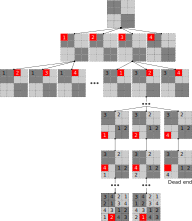

# Sudoku: Backtracking-Algorithmus {#sudoku-backtracking}

```{python echo = FALSE}
import numpy as np
```
In diesem Kapitel werden wir erneut am Sudoku arbeiten, diesmal jedoch einen effizienteren Backtracking-Algorithmus verwenden. Im Gegensatz zum völlig stochastischen [Brute-Force-Algorithmus](#sudoku-brute-force), der versucht, das gesamte Spielbrett auf einmal zu "erraten", macht der Backtracking-Algorithmus eine fundierte Vermutung über jeweils eine Zelle zur Zeit. Wie in den vorherigen Kapiteln werden wir das Programm Schritt für Schritt aufbauen, aber die gute Nachricht ist, dass du fast alles, was du zur Implementierung brauchst, bereits kennst: Matrizen, Slicing und rekursive Funktionen. Zusätzlich werden wir es als Gelegenheit nutzen, um mehr über Listen und NumPy zu lernen. Schnapp dir das [Übungs-Notebook](notebooks/sudoku-backtracking.ipynb) und lies weiter.

## Kapitelkonzepte
* [Wiederholung von Listen](#list-repetition)
* [Entpacken von Tupeln](#unpack-tuple) und Listen
* [Seeding](#random-seed) des Zufallsgenerators
* [Umformen](#reshape) von Arrays
* [Ausnahmen](#exceptions) Auslösen und Behandeln

## Backtracking-Algorithmus
Dieser Algorithmus ist sehr intuitiv, wenn man ihn sich als Erforschung eines Baumes vorstellt. Jeder Knoten ist eine Zelle, und unser Baum ist 82 Ebenen tief (beginnend mit einem leeren Gitter und durchgehend durch alle 81 Zellen). Jeder Knoten hat _bis zu_ neun mögliche Kanten, die von ihm ausgehen. Warum _bis zu_ neun? Wir können die Zahlen 1 bis 9 verwenden (also maximal neun Kanten), aber es sei denn, eine Zelle befindet sich in einer völlig leeren Reihe, Spalte und Block, werden einige Werte bereits vergeben sein, was die gültigen Kanten einschränkt. 

Ein Beispiel für einen solchen Baum für $4\times4$ Sudoku wird in der Abbildung unten illustriert. Du beginnst oben mit einem leeren Raster und du hast vier mögliche Wege, um die erste Zelle (in Rot markiert) auszufüllen. Wenn du jedoch zu einer anderen Zelle wechselst (eine Ebene tiefer gehst), sind deine Wahlmöglichkeiten eingeschränkt, da beide Zellen zur selben Reihe gehören. Das bedeutet, wenn du $1$ gewählt hast, hast du drei Möglichkeiten bis auf die $1$, und wenn du $3$ gewählt hast, hast du drei Möglichkeiten bis auf die $3$. Sobald du eine der verfügbaren Optionen gewählt hast, gehst du zur nächsten Zelle. Es kann jedoch vorkommen, dass du in eine Sackgasse gerätst, wie unten rechts gezeigt: Alle vier Zahlen wurden bereits verwendet, also gibt es keinen gültigen Wert für die Zelle und dieser Weg durch den Baum ist ungültig. Die Lösung ist, ein Stück zurückzugehen: Eine Ebene nach oben gehen, eine andere Zahl für die Zelle anstelle von $4$ wählen. Hier könntest du mit sowohl $1$ als auch $2$ ein vollständiges Brett enden. Dies ist wichtig, da der Baum _alle möglichen Wege_ und daher _alle möglichen_ $4\times4$ gültigen Sudoku-Matrizen definiert!

{width=100% style="display: block; margin: 0 auto"}
<br/>

Wenn du geduldig genug bist, alle Pfade in diesem Baum systematisch zu erkunden, wirst du alle gültigen Sudoku-Matrizen finden. Jedoch wollen wir nicht _alle_, sondern genau _eine_. Gleichzeitig möchten wir, dass unser Programm bei jedem Durchlauf eine _andere_ Matrix generiert. Wenn wir unseren Erkundungsweg festlegen (immer durch die Zellen in derselben Reihenfolge gehen) und unsere Wahlmöglichkeiten festlegen (wir gehen immer durch verfügbare Zahlen in aufsteigender Reihenfolge), werden wir immer mit der gleichen Matrix enden. Daher wird unsere Erkundungsstrategie Zufälligkeit beinhalten. Zunächst werden wir mit kleineren $4\times4$ Matrizen arbeiten, aber sobald der Algorithmus funktioniert, wird es einfach sein, ihn so anzupassen, dass er die richtigen $9\times9$ Matrizen erzeugt.

## Leere Matrix (voller Nullen)
Die allererste Matrix in unserem Baum ist leer. Zur Vereinfachung bezeichnen wir Leerstellen mit $0$, daher musst du eine $4\times4$ Matrix erzeugen, die mit Nullen gefüllt ist. Schreibe den Code dafür unter Verwendung von [NumPy](https://numpy.org/): Es gibt eine Funktion, über die du das letzte Mal gelernt hast, die genau diese Aufgabe erledigt. Ein wichtiges Detail, definiere die Größe der Matrix ($4$) als eine KONSTANTE (nennen wir sie `SUDOKU_SIZE`). Diese Zahl definiert sowohl die Größe der Matrix als auch den Bereich der Zahlen, sodass dies die einzige Änderung sein wird, die erforderlich ist, um Sudoku unterschiedlicher Größe zu erzeugen.

::: {.practice}
Mache Übung #1.
:::

## Empty matrix but via list repetitions {#list-repetition}
## Leere Matrix, aber durch List-Wiederholungen {#list-repetition}
Die NumPy-Lösung erfüllt ihren Zweck, es gibt jedoch auch eine alternative Methode zur Erstellung über Wiederholungen von Listen. Das vereinfacht die Dinge hier zwar nicht, aber es ist ein netter Trick, der hilfreich sein kann, wenn man mit Listen arbeitet. Nämlich, du kannst eine Liste $N$-mal wiederholen mit `<Liste> * N`, wobei `* N` bedeutet "N-mal wiederholen". Hier ist ein Beispiel für die viermalige Wiederholung eines Arrays mit drei Elementen.
```{python}
[1, 2, 3] * 4
```

Angesichts der Tatsache, dass du eine Liste von Listen wiederholen kannst, erzeuge eine $4\times4$ Liste von Listen, die alle Nullen enthält (diese kann in eine $4\times4$ Matrix mittels [np.array](https://numpy.org/doc/stable/reference/generated/numpy.array.html) umgewandelt werden). Dafür benötigst du nur eine Zeile Code, du darfst die $0$ nicht von Hand wiederholen (also nur _eine_ $0$ in deinem Code!) und verwende die Konstante `SUDOKU_SIZE`.
```{python echo = FALSE}
SUDOKU_SIZE = 4
[[0] * SUDOKU_SIZE] * SUDOKU_SIZE
```

::: {.practice}
Mache Übung #2.
:::

Ein wichtiger Hinweis zum Gebrauch von `*` für Listen im Vergleich zu NumPy-Arrays. Im letzteren Fall bedeutet `*` "multiplizieren mit", also selbst wenn die Dinge _ähnlich aussehen_, werden sie sich sehr unterschiedlich verhalten!
```{python}
a_list = [1, 2, 3]
an_array = np.array(a_list)

# Wiederholung für Listen
a_list * 2

# Multiplikation für NumPy-Arrays
an_array * 2
```

## Zellenreihe und -spalte aus Index
Es gibt verschiedene Möglichkeiten, einen zufälligen Weg durch die Zellen zu definieren. In der Matrix wird jede Zelle durch ihre Reihe und Spalte identifiziert, aber wir können auch davon ausgehen, dass die Zellen einen eindeutigen Index haben, der von 0 bis `SUDOKU_SIZE * SUDOKU_SIZE - 1` geht (warum minus eins?). Hier ist eine Illustration von dem, was ich meine. Der Index geht von der Zelle oben links nach rechts und unten, also wenn du die Zellenreihe und -spalte kennst, kannst du ihren Index berechnen. Umgekehrt, wenn du den Zellenindex kennst, kannst du berechnen, in welcher Reihe und Spalte sie sich befindet. Zum Beispiel befindet sich die hervorgehobene Zelle mit Index $9$ in Reihe $2$ und Spalte $1$. Das Gleiche gilt für die Reihe und Spalte des Blocks, zu dem die Zelle gehört.

{width=25% style="display: block; margin: 0 auto"}
<br/>

Deine Aufgabe ist es, eine Funktion zu schreiben, die einen Zellenindex und die Reihenbreite als Parameter nimmt und ein [Tupel](https://docs.python.org/3/tutorial/datastructures.html#tuples-and-sequences) (eine unveränderliche Liste) mit `(Reihe, Spalte)` zurückgibt. Um einen Gesamtindex in Reihe und Spalte umzuwandeln, solltest du zwei spezielle Division-Operatoren verwenden: den [Ganzzahl-Division-Operator //](https://python-reference.readthedocs.io/en/latest/docs/operators/floor_division.html) und den [Modulo, Rest-Division-Operator %](https://python-reference.readthedocs.io/en/latest/docs/operators/modulus.html). Der erste gibt nur den ganzzahligen Teil der Division zurück, sodass 4 // 3 gleich 1 ist (weil 4/3 gleich 1.33333 ist) und 1 // 4 gleich 0 ist (weil 1/4 gleich 0.25 ist). Der letztere gibt die verbleibenden Ganzzahlen zurück, so dass 4 % 3 gleich 1 und 1 % 4 gleich 0 ist. Diese beiden Operatoren reichen aus, um die Indizes für Reihe und Spalte zu berechnen.

Schreibe die Funktion und teste sie, indem du die zurückgegebenen Werte überprüfst. Zur Erinnerung, du solltest ein Tupel mit zwei Werten erhalten (`return (Reihe, Spalte)`), also sollte deine Ausgabe für den Index $9$ wie folgt aussehen:

```{python echo = FALSE}
def row_col_from_index(index, row_width):
  """Berechne Reihen- und Spaltenindex aus dem Gesamtindex.
  
  Parameters
  ----------
  index : int
  row_width : int
  
  Returns
  ----------
  tuple : (row, col) index
  """
  row = index // row_width
  col = index % row_width

  return (row, col)
```

```{python}
row_col_from_index(9, SUDOKU_SIZE)
```


::: {.program}
Füge `row_col_from_index` in _utils.py_ ein
Teste es in _code01.py_
:::

## Zellenblock (Reihe und Spalte) aus Index
Unsere Zelle gehört auch zu einem Block, der durch ihre Reihen- und Spaltenindizes definiert werden kann, wie in der folgenden Abbildung dargestellt. 

{width=50% style="display: block; margin: 0 auto"}


Du kannst den Block-Reihen- und Spaltenindex aus der Reihe und Spalte berechnen, die du zuvor ermittelt hast. Denke darüber nach, welchen Operator du dafür benötigst, und du wirst auch die Blockbreite benötigen, die du leicht aus der `Reihenbreite` berechnen kannst: Überlege dir, wie du dies entweder mit [Python](https://docs.python.org/3/library/math.html) oder [NumPy](https://numpy.org/doc/stable/reference/routines.math.html) tun kannst, wenn du bedenkst, dass du bei einem $4\times4$ Gitter 2 Blöcke, bei einem $9\times9$ --- 3, bei einem $16\times16$ --- 4 usw. hast. Beachte, dass die Blockbreite _zwingend_ eine ganze Zahl sein muss, also stelle sicher, dass du den Wert [umwandelst](https://docs.python.org/3/library/functions.html#int). Erweitere deine vorherige Funktion (ich habe sie `coords_from_index` genannt), sodass sie ein Vierer-Tupel (Reihe, Spalte, Blockreihe, Blockspalte) wie im untenstehenden Ausgabebeispiel zurückgibt. Teste sie für verschiedene Zellenindizes, wobei du die obige Abbildung als Referenz verwendest.

```{python echo = FALSE}
def coords_from_index(index, row_width):
  """Compute row and column index from the overall index.
  
  Parameters
  ----------
  index : int
  row_width : int
  
  Returns
  ----------
  tuple : (row, col, block_row, block_index) index
  """
  block_width = int(np.sqrt(row_width))
  
  row = index // row_width
  col = index % row_width
  
  block_row = row // block_width
  block_col = col // block_width

  return (row, col, block_row, block_col)
```

```{python}
coords_from_index(9, SUDOKU_SIZE)
```

::: {.program}
Füge `coords_from_index` in _utils.py_ ein
Teste den Code in _code02.py_
:::

## Tupel entpacken
Unsere Funktion gibt ein [Tupel](https://docs.python.org/3/tutorial/datastructures.html#tuples-and-sequences) der Form `(Reihe, Spalte, Blockreihe, Blockspalte)` zurück. Theoretisch könnten wir es über Indizes verwenden, sodass `row_col[0]` die Reihe und `row_col[1]` die Spalte usw. bedeutet, aber das ist schwer lesbar. Es gibt eine bessere Lösung durch sogenanntes "Entpacken" ("unpacking"). Wenn du ein Tupel erstellst, "verpackst" du vier Werte darin, das "Entpacken" kehrt diesen Vorgang um^[Ja, mir ist die Ironie bewusst, dass Werte ausgepackt werden, um sie wieder für das `print` zu verpacken.].

```{python}
row, col, block_row, block_col = coords_from_index(9, SUDOKU_SIZE)

print("Row: %d, column %d, block row %d, block column %d"%(row, col, block_row, block_col))
```

Dieser Trick funktioniert nur, wenn die Anzahl der Elemente und Variablen übereinstimmt, also nur geeignet, wenn zurückgegebene Tupel in ihrer Größe fest sind. Beachte, dass derselbe Trick auch bei einer Liste funktioniert, aber dies bricht die Semantik. Es ist okay für Tupel, weil sie unveränderlich sind und ihre Verwendung dem Leser anzeigt, dass ihre Größe zumindest konzeptionell festgelegt ist. Im Gegensatz dazu sind Listen veränderlich, sodass ihre Verwendung darauf hinweist, dass sie beliebig lang sein können. Nochmals, es macht keinen tatsächlichen Unterschied im Programm für ein Tupel oder eine Liste von identischer Größe, aber diese Unterscheidung dient dazu, den Leser über deine Absichten zu informieren, und jegliche Hilfe beim Lesen von Code sollte willkommen sein.

```{python, error = TRUE}
# zu wenige Werte (oder zu viele Variablen)
row, col, depth = row_col_from_index(9, SUDOKU_SIZE)

# zu viele Werte (oder zu wenige Variablen)
row, col, depth = coords_from_index(9, SUDOKU_SIZE)
```

## Reihenfolge des Pfades zufällig gestalten
Jetzt, wo du die Funktion hast, lass uns einen zufälligen Pfad generieren und ihn visualisieren. Dafür:

* erzeuge eine leere (Nullen) Matrix
* erzeuge eine Sequenz aller gültigen Zellenindizes (du kannst entweder die Python- oder die NumPy-Lösung dafür verwenden, je nachdem, was du bevorzugst)
* mische die Reihenfolge der Sequenz durch
* iteriere über die Sequenz und trage für jeden Index den _Besuchsreihenfolge_-Index in die Zelle ein (z.B. bekommt die erste besuchte Zelle $1$, die zweite $2$, ..., die letzte $16$). [Hinweis!](#enumerate)
* drucke die Matrix wie unten aus


```{python echo = FALSE}
np.random.seed(42)

grid = np.zeros((SUDOKU_SIZE, SUDOKU_SIZE))
indexes = np.arange(SUDOKU_SIZE * SUDOKU_SIZE)
np.random.shuffle(indexes)
for ivisit, icell in enumerate(indexes, start=1):
  row, col, block_row, block_col = coords_from_index(icell, SUDOKU_SIZE)
  grid[row, col] = ivisit
  
print(grid)
```

::: {.program}
Teste den Code in _code03.py_
:::

## Zufallsgenerator seeden {#random-seed}
Die Wahrscheinlichkeit ist hoch, dass deine Matrix anders aussieht als meine. Das macht Sinn, wir _wollten_, dass die Dinge zufällig sind, also ist es höchst unwahrscheinlich, genau dieselbe Reihenfolge des Zellenbesuchs zu erhalten. Manchmal benötigst du jedoch ein Paradoxon: Zufällige Zahlen, die gleich sind. D.h., du möchtest zwar zufällige Zahlen, aber du möchtest _dieselben_ zufälligen Zahlen wie jemand anders. Das klingt seltsam, wird aber häufig benötigt, wenn du Zufälligkeit verwenden und jemand anders in der Lage sein möchtest, deine Ergebnisse genau zu replizieren. Zum Beispiel bestimmen die anfänglich zufälligen Gewichte eines künstlichen neuronalen Netzwerks letztendlich dessen finalen Zustand. Wenn du also _genau_ dasselbe NN wie ich haben willst, sollten wir die gleichen zufälligen Gewichte verwenden (und natürlich alles andere auf genau die gleiche Weise tun).

Du kannst dies erreichen, indem du den Pseudo-Zufallszahlengenerator mit einer beliebigen Zahl [seedest](https://docs.python.org/3/library/random.html#random.seed) (es gibt natürlich auch das NumPy-Pendant mit dem [gleichen Namen](https://numpy.org/doc/stable/reference/random/generated/numpy.random.seed.html)). Dadurch startet ein Pseudo-Zufallszahlengenerator bei einem bestimmten Wert, der durch den Seed bestimmt wird (aber nicht gleich diesem ist), sodass wir, wenn wir beide den gleichen Seed verwenden, genau dieselbe zufällige Sequenz erhalten. Wie kann eine Sequenz sowohl zufällig als auch gleich sein? Dies liegt daran, dass von einem Computer erzeugte Sequenzen "pseudo"-zufällig sind: Es gibt keine Korrelation zwischen aufeinanderfolgenden Zahlen, die er generiert, sodass du nicht leicht vorhersagen kannst, welche Zahl als Nächstes kommt, wenn du dir die Sequenz ansiehst, die du bereits hast. Die Zahlen werden jedoch nach einem Algorithmus generiert, sodass du, wenn du den Algorithmus und seinen internen Zustand kennst (oder diesen Zustand über einen Seed bestimmst), genau die gleiche Sequenz erhältst wie ich und scheinbar "zufällig" vorhersagen kannst, was ich tue. Diese "pseudo"-zufällige Natur von Computern generierter Zufallszahlen ist für uns hier und in vielen anderen Fällen (Probenahme in der Bayes-Statistik, Generierung von Anfangsgewichten für neuronale Netzwerke usw.) kein Dealbreaker, ist aber kritisch, wenn das Wissen um deine "zufälligen" Zahlen mir erlaubt, dich auszunutzen. Cybersicherheit ist ein offensichtliches Beispiel für einen Bereich, in dem der Unterschied zwischen wirklich zufällig und pseudo-zufällig den Unterschied zwischen sicher und gehackt bedeutet. In diesem Fall nutzen Unternehmen sogar tatsächliche [physikalische Systeme mit chaotischer Dynamik](https://www.atlasobscura.com/places/encryption-lava-lamps), um Zufallszahlen zu generieren.


::: {.program}
Aktualisiere _code03.py_ unter Verwendung des Seeds `42`.
:::


Sobald wir wissen, an welcher Zelle wir arbeiten, müssen wir unsere Optionen kennen: Welche Zahlen sind noch verfügbar (falls überhaupt). Überlege, wie du das lösen würdest, bevor du weiterliest^[Du solltest dir vorstellen, wie ich dich wie Dora die Entdeckerin anstarre, während du dies tust.].

Die Antwort sollte ziemlich offensichtlich sein: [Sets](#sets): Ziehe einfach eine Menge von bereits verwendeten Werten von der Menge aller möglichen Werte ab, und der Unterschied sind die verfügbaren Optionen. Eine leere Menge würde einen ungültigen Pfad bedeuten. Das Generieren eines kompletten Sets ist einfach, da du die `SUDOKU_SIZE` kennst. Die Menge der bereits verwendeten Werte besteht aus Werten, die in der Reihe, der Spalte und dem Block verwendet werden, zu dem die Zelle gehört. Du weißt bereits, wie du eine Menge einzigartiger Werte für Reihe und Spalte/Block extrahieren kannst (das brauchen wir, wenn wir die Matrix im vorherigen Kapitel validiert haben). Sobald du diese drei Arrays hast, kannst du dir die [Vereinigung](https://numpy.org/doc/stable/reference/generated/numpy.union1d.html) ihrer [eindeutigen](https://numpy.org/doc/stable/reference/generated/numpy.unique.html) Werte ansehen. Beachte, dass du drei Arrays und keine zwei hast, also denke darüber nach, wie du das machen kannst. Implementiere den Code und teste ihn, indem du eine $4\times4$ Matrix per Hand definierst (du kannst die verwenden, die ich unten erstellt habe).

```{python}
example_matrix = np.zeros((SUDOKU_SIZE, SUDOKU_SIZE))
example_matrix[1, 1] = 1
example_matrix[2, 2] = 2
example_matrix[3, 1] = 2
example_matrix[3, 0] = 4
example_matrix
```

Das Finden einzigartiger bereits verwendeter Werte für Zelle #9 unter Verwendung der obigen Matrix sollte dir die folgenden Ergebnisse liefern (2 für die Reihe, 1 und 2 für die Spalte, 2 und 4 für den Block):
```{python echo = FALSE}
# compute block width
block_width = int(np.sqrt(SUDOKU_SIZE))

# figure out coordinates
row, col, block_row, block_col = coords_from_index(9, SUDOKU_SIZE)

# get unique values
values_in_row = np.unique(example_matrix[row, :])
values_in_col = np.unique(example_matrix[:, col])
values_in_block = np.unique(example_matrix[(block_row * block_width):(block_row * block_width + block_width), (block_col * block_width):(block_col * block_width + block_width)])

# compute their union
already_used = np.union1d(np.union1d(values_in_row, values_in_col), values_in_block)
already_used
```

Jetzt bleibt nur noch, alle möglichen gültigen Zahlen zu generieren, die bereits verwendeten [abzuziehen](https://numpy.org/doc/stable/reference/generated/numpy.setdiff1d.html) und zu sehen, was übrig bleibt.

```{python}
np.setdiff1d(np.arange(SUDOKU_SIZE + 1), already_used)
```

::: {.program}
Teste in _code04.py_ .
:::


## Arrays umformen
In unserer vorherigen Implementierung haben wir zunächst ein 1D-Array von einzigartigen Werten berechnet und dann deren Vereinigung bestimmt. Eine alternative (wenn auch weniger effiziente) Methode wäre, zuerst alle drei Arrays zu (verknüpfen)[https://numpy.org/doc/stable/reference/generated/numpy.concatenate.html] und dann die [eindeutigen Werte](https://numpy.org/doc/stable/reference/generated/numpy.unique.html) zu finden. Es gibt allerdings einen Haken, alle deine Arrays haben eine unterschiedliche [Form](https://numpy.org/doc/stable/reference/generated/numpy.ndarray.shape.html): Reihen- und Spaltenvektoren sind `(4, )` (eindimensional), während ein quadratischer Block die Form `(2, 2)` hat. Du musst entweder beide Reihen-/Spaltenvektoren in eine `(2, 2)` Form [umformen](https://numpy.org/doc/stable/reference/generated/numpy.reshape.html) oder nur die Blockmatrix auf `(4, )`. Mache es auf beide Arten, aber stelle sicher, dass du die [Form](https://numpy.org/doc/stable/reference/generated/numpy.ndarray.shape.html) der Blockmatrix zur Umformung der Reihen-/Spaltenvektoren anstelle von hartkodierten Werten verwendest. Ebenso verwende die Form des Reihen-/Spaltenvektors, um die Blockmatrix umzuformen. Mache es ein drittes Mal, indem du die Blockmatrix in ein 1D-Array umformst, indem du ihre eigene [Größe](https://numpy.org/doc/stable/reference/generated/numpy.ndarray.size.html) benutzt. Schließlich gibt es noch eine andere Möglichkeit, jedes Array/Matrix/Tensor in ein 1D-Array umzuwandeln, indem man es [abflacht](https://numpy.org/doc/stable/reference/generated/numpy.ndarray.flatten.html).

::: {.practice}
Mache Übung #3.
:::

Sobald du herausgefunden hast, wie du Arrays umformen kannst, forme die Blockmatrix in einen 1D-Vektor um, verknüpfe alle, finde eindeutige Werte, subtrahiere sie von einer vollständigen Menge und du solltest die gleichen Werte wie zuvor erhalten.

::: {.program}
Teste in _code05.py_ .
:::

## Funktion `get_available_values`
Verpacke einfach den Code aus `code04` (den effizienteren) in eine Funktion. Ihre Eingaben sollten die Matrix selbst, der Zellenindex, die Größe des Sudoku (kein heimlicher Zugriff auf globale Konstanten oder Variablen!) und wahrscheinlich die Größe des Blocks sein. Du könntest es on-the-fly berechnen, aber wir werden diese Funktion _sehr oft_ aufrufen, also ist es besser, es einmal zu berechnen. Sie sollte ein Array von einzigartigen Werten zurückgeben, die du berechnet hast. Schreibe, dokumentiere und teste!

::: {.program}
Füge `get_available_values` in _utils.py_ ein<br/>
Teste den Code in _code06.py_
:::

## Nur eine Zelle
Wir haben fast alle Teile, die wir brauchen, um das Programm zu schreiben. Lass uns langsam beginnen, indem wir den Code erstellen, der einen zufälligen Wert in nur eine zufällige Zelle setzt. Du musst eine Funktion schreiben (nennen wir sie `add_one_cell`), die eine erweiterte Version der `get_available_values` Funktion sein wird. Zusätzlich zum Finden der verfügbaren Werte sollte sie diese [mischen](https://numpy.org/doc/1.21/reference/random/generated/numpy.random.shuffle.html) und den ersten Wert (aus dem gemischten Array) in die Zelle einfügen. Da Arrays veränderbar sind, brauchen wir uns keine Gedanken über Rückgabewerte zu machen. Teste die Funktion, indem du sie mehrmals ausführst (die Zelle sollte dieselbe sein, aber die Werte sollten unterschiedlich sein), aber denke daran, wenn du deinen Zufallszahlengenerator mit `42` [seedest](https://numpy.org/doc/1.21/reference/random/generated/numpy.random.seed.html), wirst du die gleiche Matrix erhalten wie ich.

```{python echo = FALSE}
def add_one_cell(grid, icell, sudoku_size, block_size):
  """Add a random value to a cell using available numbers.
  Modifies matrix in place.
  
  Parameters
  ----------
  grid : numpy.array
    matrix sudoku_size x sudoku_size
  icell : int
    cell index
  sudoku_size : int
  block_size : int
  """
  row, col, block_row, block_col = coords_from_index(icell, sudoku_size)
  
  # figure out values that were already used
  values_in_row = np.unique(grid[row, :])
  values_in_col = np.unique(grid[:, col])
  values_in_block = np.unique(grid[(block_row * block_size):(block_row * block_size + block_size),
                                   (block_col * block_size):(block_col * block_size + block_size)])
  already_used = np.union1d(np.union1d(values_in_row, values_in_col), values_in_block)

  # find available values
  available_values = np.setdiff1d(np.arange(sudoku_size + 1), already_used)
  
  # shuffle
  np.random.shuffle(available_values)
  
  # use the first one
  grid[row, col] = available_values[0]


# compute block size
BLOCK_SIZE = int(np.sqrt(SUDOKU_SIZE))

# empty grid  
grid = np.zeros((SUDOKU_SIZE, SUDOKU_SIZE))

# fix randomness
np.random.seed(42)

# random walk through the matrix
indexes = np.arange(SUDOKU_SIZE * SUDOKU_SIZE)
np.random.shuffle(indexes)
 
# place a single cell
add_one_cell(grid, indexes[0], SUDOKU_SIZE, BLOCK_SIZE)

grid
```

::: {.program}
Füge `add_one_cell` in _utils.py_ ein<br/>
Teste den Code in _code07.py_
:::

## Ausnahmen {#exceptions}
Unser Programm wird den Baum erkunden, bis es die erforderliche Lösung findet, und dann sollte die Ausführung zum Hauptskript zurückkehren. Die Frage ist, wie können wir dieses "sobald die gültige Lösung gefunden wurde, Ausführung abbrechen und zur obersten Ebene zurückkehren" Verhalten implementieren? Im Spiel [Ratet das Tier](#guess-the-animal) hatten wir dieses Problem nicht, weil wir _einen_ Weg durch den Baum verfolgt haben, bis wir das Endknoten (Blatt) erreichten. Sobald die notwendigen Aktualisierungen am Blattknoten durchgeführt wurden, kehrte die Funktion einfach zur vorherigen Ebene zurück, die zur vorherigen Ebene zurückkehrte usw., da keine weiteren Maßnahmen erforderlich waren und die Tatsache, dass die Funktion ihre Aktion abgeschlossen hatte, bedeutete, dass wir den Baum vollständig durchforscht hatten. Im Falle von Sudoku bedeutet jedoch die Tatsache, dass die Funktion eine Ebene nach oben zurückkehren muss, entweder 1) dass sie die letzte Zelle erreicht und gefüllt hat oder 2) dass sie keine Möglichkeit hat, sie auf gültige Weise zu vervollständigen und die vorherige Ebene (Funktion) sich anpassen muss. Um dies zu handhaben, könnten wir das Verhalten der Funktion so implementieren, dass es von einem Rückgabewert abhängt (.z.B. null bedeutet "kann die Zelle nicht füllen", nicht null bedeutet "Erfolg"). Es gibt jedoch einen alternativen Ansatz, der zwei verschiedene Mechanismen verwendet, um diese beiden Situationen zu behandeln. Die Funktion wird _zurückkehren_ zur oberen Ebene, wenn sie die Zelle nicht füllen kann, aber sie wird den Mechanismus von Ausnahmen nutzen, um direkt zur obersten Ebene zurückzukehren, sobald die Matrix komplett ist. Dies macht unseren Code einfacher und verständlicher und gibt uns die Möglichkeit, über Ausnahmen zu lernen.

Manchmal, wenn du ein Programm ausführst, passieren schlechte Dinge --- Fehler. In einigen Fällen ist ein abstürzendes Programm einfach nur ärgerlich, aber in anderen Fällen kann es bedeuten, dass du verloren hast, welche Daten du gesammelt oder welche Berechnungen du in der Zwischenzeit durchgeführt hast. Denke nur an unser Spiel [Ratet das Tier](#guess-the-animal), das du lange gespielt hast und das abgestürzt ist, _ohne_ den aktualisierten Entscheidungsbaum zu speichern. Gut für uns, dass Python, wie andere Sprachen, spezielle Mechanismen hat, um [Ausnahmen](https://docs.python.org/3/tutorial/errors.html) zu behandeln, die während der Codeausführung auftreten. Immer wenn ein Fehler zur Laufzeit auftritt, wird eine Ausnahme [ausgelöst](https://docs.python.org/3/reference/simple_stmts.html#the-raise-statement): Es wird ein Objekt [einer speziellen Klasse](https://docs.python.org/3/library/exceptions.html#concrete-exceptions) erstellt, das Informationen enthält, die das Problem beschreiben. Zum Beispiel wird ein [ZeroDivisionError](https://docs.python.org/3/library/exceptions.html#ZeroDivisionError) ausgelöst, wenn du versuchst, durch Null zu teilen, z.B. `1 / 0` (du kannst dies in einem Jupyter-Notebook ausprobieren). Ein [KeyError](https://docs.python.org/3/library/exceptions.html#KeyError) wird ausgelöst, wenn du ein Wörterbuch mit einem falschen Schlüssel benutzt; der folgende Code wird ihn auslösen:
```{python, error=TRUE}
a_dict = {"a_key" : 1}
a_dict["b_key"]
```

Ebenso wird ein [IndexError](https://docs.python.org/3/library/exceptions.html#IndexError) ausgelöst, wenn du versuchst, einen ungültigen Index für eine Liste zu verwenden, ein [NameError](https://docs.python.org/3/library/exceptions.html#NameError), wenn du versuchst, auf eine Variable zuzugreifen, die nicht existiert, ein [AttributeError](https://docs.python.org/3/library/exceptions.html#AttributeError), wenn ein Objekt nicht über ein Attribut verfügt, das du zu verwenden versuchst, usw.

In Python verwendest du die Operatoren `try: ... except:...finally:`, um Ausnahmen vorherzusehen und zu behandeln:
```python
try:
    # einige Codezeilen, die einen Laufzeitfehler erzeugen könnten
except:  
    # Code, der ausgeführt wird, wenn etwas Schlechtes passiert
finally:
    # Code, der sowohl mit als auch ohne Ausnahme ausgeführt wird
    
Code, der NUR ausgeführt wird, wenn keine Ausnahmen auftraten oder wenn eine Ausnahme behandelt wurde
```

Im einfachsten Fall benötigst du nur die ersten beiden Operatoren: `try` und `except`. Schreibe im Jupyter-Notebook einen Code, der einen Division-durch-Null-Fehler erzeugt, der aber mit `try...except...` abgefangen wird. Gib im `except` einfach eine Nachricht aus, damit du weißt, dass sie ausgeführt wurde. Erstelle eine weitere Zelle, kopiere den Code und prüfe nun, dass der Code zur Ausnahmebehandlung _nicht_ ausgeführt wird, wenn der Fehler nicht generiert wird (d.h. teile durch eine von Null verschiedene Zahl).

::: {.practice}
Mache Übung #4.
:::

Die Verwendung von `except:` fängt _alle_ Ausnahmen ab. Das wird jedoch als schlechter Stil angesehen (zu allgemein) und ein Linter wird sich beschweren. Stattdessen kannst du spezifischer sein und Ausnahmen basierend auf ihrer Klasse behandeln.
```python
try:
    #  einige Codezeilen, die einen Laufzeitfehler erzeugen könnten
except KeyError as key_error:
# Code, der nur ausgeführt wird, wenn die KeyError-Ausnahme ausgelöst wurde, 
    # wobei die Ausnahmeinformationen im key_error-Objekt gespeichert werden
except ZeroDivisionError as zero_division_error:  
   # Code, der nur ausgeführt wird, wenn die ZeroDivisionError-Ausnahme ausgelöst wurde,
    # wobei die Ausnahmeinformationen im zero_division_error-Objekt gespeichert werden
except:
   # Code, der ausgeführt wird, wenn irgendeine ANDERE Ausnahme ausgelöst wird.
```

Implementiere die Behandlung für `KeyError` und `ZeroDivisionError`; sie sollten unterschiedliche Nachrichten ausgeben, um zu überprüfen, ob es funktioniert. Teste es, indem du mit deinem Code diese Laufzeitfehler erzeugst.

::: {.practice}
Mache Übung #5.
:::

Bisher hast du Ausnahmen erzeugt, indem du Laufzeitfehler im Code verursacht hast, aber du kannst diese Ausnahmen auch selbst auslösen, indem du den [raise](https://docs.python.org/3/reference/simple_stmts.html#the-raise-statement)-Operator verwendest. Statt beispielsweise durch Null zu dividieren, kannst du `raise ZeroDivisionError` benutzen. Verwende dies mit deinem vorherigen Code, anstelle einer tatsächlichen Division durch Null. Probiere andere Ausnahmen auszulösen und zu sehen, wie dein Code sie behandelt. Überprüfe auch, was passiert, wenn du die ersten beiden spezifischen Ausnahmebehandler hast, aber keinen allgemeinen `except:`, und löse einen [NameError](https://docs.python.org/3/library/exceptions.html#NameError) aus?


::: {.program}
Mache Übung #6.
:::

Bisher habe ich von Ausnahmen als einer Möglichkeit gesprochen, über Laufzeitfehler zu informieren. Sie können jedoch auf eine allgemeinere Weise verwendet werden, um den Ausführungsfluss zu steuern. Stelle dir zum Beispiel eine Situation mit geschachtelten Schleifen vor, ähnlich den "Spiel wiederholen - Runde mit Spiel wiederholen" Schleifen, die du zuvor implementiert hast. Bisher gab es keine Möglichkeit für einen Spieler, das Spiel vorzeitig zu beenden, aber was wäre, wenn wir ihnen diese Option geben würden?

```{python eval = FALSE}
# Spiel wiederholen
while want_to_play:
    ...
    
    # Runden des Spiels wiederholen
    while not game_over:
      ...
      
      → Benutzer möchte das Spiel hier abbrechen ←
```

Dies ist eine sehr ähnliche Situation wie verschachtelte rekursive Aufrufe für unseren Sudoku-Algorithmus. Hier reicht es nicht einfach aus, mit einem einfachen `break` aus der inneren Schleife auszusteigen oder `game_over = True` einzustellen, da du auch die äußere Schleife berücksichtigen musst. Du könntest eine zusätzliche Variable erstellen oder eine flexiblere `game_over`-Variable mit verschiedenen "Game Over"-Zuständen (Erfolg, Misserfolg, Benutzerabbruch usw.) und dann überprüfen, ob du den Benutzer fragen musst, ob er noch einmal spielen möchte. Sonst könntest du direkt nach einem "willst du noch mal spielen?" fragen, gleich nachdem er "aufhören" gesagt hat. Diese zusätzlichen Zustände und Überprüfungen machen den Code jedoch schwerer lesbar, besonders wenn du weitere Verschachtelungen hast, Funktionsaufrufe in Funktionsaufrufen usw. Ein alternativer Weg ist die Implementierung einer _benutzerdefinierten_ Ausnahme, die signalisiert, dass der Benutzer beschlossen hat, das Spiel zu beenden.

Du definierst eine benutzerdefinierte Ausnahme, indem du von einer Basis-Klasse [Exception](https://docs.python.org/3/library/exceptions.html#Exception) erbst. Da du noch nichts über objektorientierte Programmierung gelernt hast, klingt das jetzt vielleicht wie Kauderwelsch, aber hier ist der einzige Code, den du benötigst^[`pass`](https://docs.python.org/3/reference/simple_stmts.html#the-pass-statement) bedeutet "nichts tun" und wird in Fällen verwendet, in denen du aufgrund der Syntax eine Anweisung benötigst, aber nichts zu tun hast.]:
```{python eval = FALSE}
class QuitTheGame(Exception):
    pass
```

Als Übung implementiere den Code mit einer einfachen endlosen while-Schleife, in der du fragst, ob weitergefahren oder aufgehört werden soll (entscheide selbst, wie du die Eingabe behandeln willst). Sobald du dich schließlich dafür entscheidest, das Spiel zu beenden, wirf eine `QuitTheGame`-Ausnahme, die vom `try except`-Code, der um die Schleife gewickelt ist, behandelt werden soll. Verwende Code, um die `QuitTheGame`-Ausnahme _spezifisch_ zu behandeln und gib eine Nachricht aus, um zu zeigen, wie traurig du bist, dass der Spieler geht.

::: {.program}
Mache Übung #7.
:::

## Das Rätsel ist gelöst, sobald keine Zellen mehr zum Überprüfen vorhanden sind
Unsere Funktion `add_one_cell` hat nur eine Zelle hinzugefügt und konnte nicht weitermachen, selbst wenn sie wollte, da sie keinen Index der nächsten Zelle hatte. Lassen Sie uns diese Funktion erweitern und die neue Version `add_few_cells` nennen, sodass sie anstelle eines einzelnen Zellenindex eine Liste dieser nimmt (ich habe den Parameter in `remaining_cells` umbenannt). Wenn die Liste leer ist, sollte sie die Ausnahme `GridComplete` auslösen, die im Hauptskript behandelt wird (das Gitter wird ausgegeben). Wenn die Liste noch Elemente enthält, sollte die Funktion das _erste_ als Index der aktuellen Zelle verwenden. Nachdem sie die aktuelle Zelle mit dem ersten zufällig verfügbaren Wert gefüllt hat (Code, den Sie bereits implementiert haben), ruft sie sich selbst auf (Rekursion!) und übergibt die _verbleibende_ Liste (ohne das erste Element).

Erstelle `GridComplete` mit dem Code für die `QuitTheGame`-Ausnahme, aber denke über _wo_ du den Code platzieren sollst, da du beide in der Funktion, die sich in _utils.py_ befindet, und im Hauptskript verwendest. Überlege, in welcher Datei du sie definieren solltest und in welcher du sie importieren solltest (Hinweis: Das Vorhandensein von kreisförmigen Abhängigkeiten ist keine gute Idee). Du importierst eine Ausnahmeklasse ähnlich wie das Verwenden einer Funktion: `from <file-you-decided-on> import GridComplete`.

Es gibt noch keinen Backtracking-Mechanismus, daher wird unsere Funktion abstürzen (warum?), wenn wir ihr eine vollständige Liste von Zellen geben. Testen Sie sie also nur mit den ersten vier Zellen. Diese sind garantiert ausgefüllt (wiederum, warum?) und unser Code sollte eine Matrix wie unten ausgeben (Seed immer noch `42`). Unsere Matrix ist nicht vollständig, aber das ist einfach, um unsere Testmechanismen für den Abschluss zu überprüfen. Hier ist die Verwendung eines Debuggers zum Nachverfolgen der Aufrufebenen sehr hilfreich, um den Mechanismus der Rekursion zu verstehen.

```{python echo = FALSE}
SUDOKU_SIZE = 4

# compute block size
BLOCK_SIZE = int(np.sqrt(SUDOKU_SIZE))

class GridComplete(Exception):
    pass

def add_few_cells(grid, remaining_cells, sudoku_size, block_size):
  """Add a random value to a cell using available numbers.
  Modifies matrix in place.
  
  Parameters
  ----------
  grid : numpy.array
    matrix sudoku_size x sudoku_size
  remaining_cells : list
    list of cell indexes for remaining cells
  sudoku_size : int
  block_size : int
  """
  # complete grid?
  if len(remaining_cells) == 0:
    raise GridComplete
  
  row, col, block_row, block_col = coords_from_index(remaining_cells[0], sudoku_size)
  
  # figure out values that were already used
  values_in_row = np.unique(grid[row, :])
  values_in_col = np.unique(grid[:, col])
  values_in_block = np.unique(grid[(block_row * block_size):(block_row * block_size + block_size),
                                   (block_col * block_size):(block_col * block_size + block_size)])
  already_used = np.union1d(np.union1d(values_in_row, values_in_col), values_in_block)

  # find available values
  available_values = np.setdiff1d(np.arange(sudoku_size + 1), already_used)
  
  # shuffle
  np.random.shuffle(available_values)
  
  # use the first one
  grid[row, col] = available_values[0]
  
  add_few_cells(grid, remaining_cells[1:], sudoku_size, block_size)


# empty grid  
grid = np.zeros((SUDOKU_SIZE, SUDOKU_SIZE))

# fix randomness
np.random.seed(42)

# random walk through the matrix
indexes = np.arange(SUDOKU_SIZE * SUDOKU_SIZE)
np.random.shuffle(indexes)
 
try:
  # place a single cell
  add_few_cells(grid, indexes[:4], SUDOKU_SIZE, BLOCK_SIZE)
except GridComplete:
  pass

grid
```

::: {.program}
Füge `add_few_cells` in _utils.py_ ein.<br/>
Teste den Code in _code08.py_
:::

## Hinzufügen des Backtracking-Mechanismus
Das letzte Puzzleteil, das wir brauchen, ist der Backtracking-Mechanismus. Derzeit verwendet unsere Funktion nur den ersten Wert aus der zufällig sortierten Liste verfügbarer Werte. Dieser erste Wert kann jedoch nicht zu einem gültigen Raster führen, also muss die Funktion diese Werte durchlaufen und sich selbst aufrufen. Hier bedeutet es, wenn der innere Funktionsaufruf einen Rückgabewert liefert, dass der aktuelle Zellenwert in eine Sackgasse führt und wir den nächsten Wert ausprobieren müssen – daher die Schleife (denke daran, wenn der Pfad ein vollständiges Raster erzeugt, springt er direkt zur obersten Ebene, ohne jemals `return` zu verwenden). Wenn du jedoch die For-Schleife vollständig durchlaufen hast, bedeutet das, dass die innere Funktion jedes Mal einen Rückgabewert geliefert hat und es keinen möglichen Wert für die aktuelle Zelle gibt, der die Sackgasse auflösen kann, und du musst den Wert auf null zurücksetzen (zurück zum ursprünglichen leeren Zustand!), und zurück zur übergeordneten Ebene gehen, um zu versuchen, die vorherige Zelle zu korrigieren.

Rufe die Funktion `add_cell` auf und verwende sie anstelle von `add_few_cells`, sowohl im Hauptskript als auch in der Funktion selbst. Verwende zuerst nur die ersten vier Indizes als einen Realitätscheck: Die Ausgabe sollte genau die gleiche sein wie für den Code, der `add_few_cells` verwendet hat. Verwende dann alle Indizes und wenn du den Seed auf `42` einstellst, solltest du genau die gleiche Sudoku-Lösung erhalten.


```{python echo = FALSE}
SUDOKU_SIZE = 4

# compute block size
BLOCK_SIZE = int(np.sqrt(SUDOKU_SIZE))

class GridComplete(Exception):
    pass

def add_cell(grid, remaining_cells, sudoku_size, block_size):
  """Add a random value to a cell using available numbers.
  Modifies matrix in place.
  
  Parameters
  ----------
  grid : numpy.array
    matrix sudoku_size x sudoku_size
  remaining_cells : list
    list of cell indexes for remaining cells
  sudoku_size : int
  block_size : int
  """
  # complete grid?
  if len(remaining_cells) == 0:
    raise GridComplete
  
  row, col, block_row, block_col = coords_from_index(remaining_cells[0], sudoku_size)
  
  # figure out values that were already used
  values_in_row = np.unique(grid[row, :])
  values_in_col = np.unique(grid[:, col])
  values_in_block = np.unique(grid[(block_row * block_size):(block_row * block_size + block_size),
                                   (block_col * block_size):(block_col * block_size + block_size)])
  already_used = np.union1d(np.union1d(values_in_row, values_in_col), values_in_block)

  # find available values
  available_values = np.setdiff1d(np.arange(sudoku_size + 1), already_used)
  
  # shuffle
  np.random.shuffle(available_values)
  
  # go through values, hoping that one of the works
  for value in available_values:
    grid[row, col] = value
    add_cell(grid, remaining_cells[1:], sudoku_size, block_size)
    
  # nope, dead end
  grid[row, col] = 0
  return


# empty grid  
grid = np.zeros((SUDOKU_SIZE, SUDOKU_SIZE))

# fix randomness
np.random.seed(42)

# random walk through the matrix
indexes = np.arange(SUDOKU_SIZE * SUDOKU_SIZE)
np.random.shuffle(indexes)
 
try:
  # place a single cell
  add_cell(grid, indexes, SUDOKU_SIZE, BLOCK_SIZE)
except GridComplete:
  pass

grid.astype(int)
```

::: {.program}
Füge `add_cell` in _utils.py_ ein.<br/>
Teste den Code in _code09.py_.
:::

## Zusammenfassung
Nun hast du eine alternative, effizientere Version des Algorithmus, der ein Sudoku generieren kann. Beim nächsten Mal werden wir fortfahren, indem wir eine vollständige Sudoku-Lösung in ein Rätsel verwandeln und lernen, wie man es mithilfe von Dateiein- und -ausgabe für die Nachwelt speichert.
