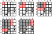

# Minesweeper {#minesweeper}
Du hast viel gelernt, also lass uns all dieses Wissen nutzen. Du wirst immer noch ein paar neue nützliche Funktionen auf dem Weg lernen. Schnapp dir das [Übungsnotebook](notebooks/minesweeper.ipynb), bevor wir anfangen.

## Kapitelkonzepte
* [Mehrmals drucken](#print-end) auf derselben Zeile
* [Verketten](#str.join) einer Liste von Zeichenketten zu einer einzigen Zeichenkette
* [Umwandeln von Zeichen](#chr-ord) in ihren Code und zurück
* Erstellen einer Matrix, [gefüllt](#np.fill) mit einem beliebigen Wert oder Zeichen

## Minesweeper
Heute werden wir eine vereinfachte textbasierte Version des Minesweeper-Spiels programmieren. In diesem Spiel musst du ein rechteckiges Feld räumen, dabei aber keine Mine treffen. Jedes Mal, wenn du eine Zelle öffnest, wird entweder eine Explosion ausgelöst, falls dort eine Mine war, oder dir wird die Anzahl der Minen in den umliegenden Zellen angezeigt. Das Spiel ist zu Ende, sobald du alle Felder, die keine Minen sind, geöffnet hast. Das klassische Spiel verwendet Grafiken und die Maus, aber wir werden es nur mit Text nachbilden. Daher wird der Spieler statt auf eine Zelle zu klicken ihre Koordinaten eingeben müssen, und zwar mittels Zeile (Buchstabe) und Spalte (Ziffer). Unten ist ein Beispiel dafür, wie ein 5×5-Spielfeld in der Ausgabe aussehen würde, wenn alle Felder noch ungeöffnet sind.

```{python echo=FALSE}
import numpy as np

FIELD_SIZE = 5
MINES_N = 5

def print_minefield(minefied):
  """Print minefield.
  
  Parameters
  ----------
  minefield : np.array
  """
  columns = '  ' + ''.join(np.arange(1, minefied.shape[0] + 1).astype(str))
  
  
  print(columns)
  print("  " + "".join(["-"] * (minefied.shape[0])))
  for irow in range(minefied.shape[0]):
    print(chr(ord("A") + irow) + "|", end="")
    for cell in field[irow, ]:
      if cell in ["*", " "]:
        print("•", end="")
      else:
        print(cell, end="")
    print()  


# create an empty field
field = np.full((FIELD_SIZE, FIELD_SIZE), ' ')

np.random.seed(42)

# place mines
for _ in range(MINES_N):
  # finding a vacant spot
  xy = np.random.randint(0, FIELD_SIZE, 2)
  while field[xy[0], xy[1]] == "*":
    xy = np.random.randint(0, FIELD_SIZE, 2)
  field[xy[0], xy[1]] = "*"

# print out an empty one
print_minefield(field)
``` 

Und so sollte es aussehen, wenn alle Zellen außer den Minen geöffnet sind.

```{python echo=FALSE}
def count_mines(minefield, xy):
  """Count mines in surrounding cells.
  
  Parameters
  ----------
  minefield : np.array
  xy : tuple
  
  Returns
  ----------
  int
  """
  # figuring out slice limits given the edge problem
  left = max(xy[1] - 1, 0)
  right = min(xy[1] + 2, minefield.shape[1])
  top = max(xy[0] - 1, 0)
  bottom = min(xy[0] + 2, minefield.shape[0])
  
  return np.sum(minefield[top:bottom, left:right] == "*")
  
for ix in range(FIELD_SIZE):
  for iy in range(FIELD_SIZE):
    if field[ix, iy] != "*":
      field[ix, iy] = count_mines(field, (ix, iy))
      
print_minefield(field)
```

Wie üblich werden wir das Spiel Schritt für Schritt aufbauen.
 
## Spaltenindizes mit einer for-Schleife drucken{#print-end}
Um dem Spieler visuell zu helfen, die Spalten zu identifizieren, müssen wir deren Indizes ausdrucken, wie in der oben gezeigten Ausgabe. Du _könntest_ einen String `"  12345"` von Hand definieren und diesen ausdrucken, aber wir möchten flexibler sein und diesen String basierend auf der Größe des Spielfelds, die in einer Konstanten `FIELD_SIZE` gespeichert ist, generieren. Es gibt mehrere Wege, dasselbe Ziel zu erreichen, und wir werden sie alle implementieren (denn es geht ja um Übung und darum, deine Fähigkeiten auf die Probe zu stellen, erinnerst du dich?)

Unser erster Ansatz ist konzeptionell der einfachste: Schleife einfach über die Zahlen bis `FIELD_SIZE` und drucke sie eine nach der anderen aus. Denke daran, dass [range](https://docs.python.org/3/library/functions.html#range) von `0` bis `stop - 1` geht, also überlege, wie du dies für die Ausgabe anpassen willst oder welche `start`- und `stop`-Parameter du verwenden solltest. Das einzige Problem, das wir haben, ist, dass jede Zahl in ihrer eigenen Zeile gedruckt wird. Dies ist jedoch leicht über den `end`-Parameter der [print](https://docs.python.org/3/library/functions.html#print)-Funktion zu beheben. Standardmäßig entspricht er `'\n'` (neue Zeile), aber du kannst ihn auf jede andere Zeichenkette umdefinieren, einschließlich einer leeren `''`. Verwende eine for-Schleife, um eine Ziffer nach der anderen in derselben Zeile zu drucken. Vergiss nicht, zwei zusätzliche Leerzeichen voranzustellen, um später den Zeilenindex zu berücksichtigen.

::: {.program}
Implementiere Code in Übung 1.
:::

## Alle Spaltenindizes zu einer einzigen Zeichenkette verbinden{#str.join}
Ein anderer Weg, dasselbe Ziel zu erreichen, besteht darin:

1. Eine Liste von Zahlen erstellen.
2. Jedes Element der Liste mit [List comprehensions](#list-comprehension) in einen String umwandeln.
3. Sie mit [join](https://docs.python.org/3/library/stdtypes.html#str.join) zu einem String zusammenfügen.

Der erste Schritt ist einfach: Du benutzt denselben [range](https://docs.python.org/3/library/functions.html#range), um die Folge von Zahlen zu erstellen. Der zweite Schritt ist auch einfach (zumindest hast du es schon einmal gemacht!): Verwende List Comprehension, um über die von range erzeugten Werte zu iterieren und sie nacheinander in einen [String](https://docs.python.org/3/library/functions.html#func-str) umzuwandeln. Vergiss nicht, die Zahlen anzupassen, wie du es in der vorherigen Version getan hast, bevor du sie in Strings umwandelst. Der letzte Teil ist neu, aber konzeptionell sehr einfach. [join](https://docs.python.org/3/library/stdtypes.html#str.join) ist eine _Methode_ eines Strings, die eine Liste von Strings (und nur Strings, deshalb brauchten wir List Comprehension zur Umwandlung) mit einem "ursprünglichen" String als Separator verbindet. Hier sind ein paar Beispiele, wie es funktioniert:

```{python}
a_list = ["cat", "dog", "duck"]
print(' - '.join(a_list))
print(''.join(a_list))
```

Implementiere diese Lösung für unseren Spaltenindex. Vergiss nicht, ihm zwei zusätzliche Leerzeichen voranzustellen. Verwende anstelle eines zusätzlichen Prints wie zuvor, um die beiden Strings mit `+` zu verbinden. Zum Beispiel:

```{python}
print('a cat and' + ' a dog')
```
```{python echo=FALSE, eval=FALSE}
numbers_as_strings = [str(number + 1) for number in  range(FIELD_SIZE)]
'  ' + ''.join(numbers_as_strings)
```


::: {.program}
Implementiere Code in Übung 2.
:::

## Ein numpy-Array von Strings zu einer einzigen Zeichenkette verbinden
Du kennst bereits [NumPy](https://numpy.org/), und natürlich hat es auch für solche Probleme eine Lösung parat. Hier werden wir

1. Ein geordnetes Array von Zahlen unter Verwendung von [arange](https://numpy.org/doc/stable/reference/generated/numpy.arange.html) erstellen.
2. Mit der Methode [astype](https://numpy.org/doc/stable/reference/generated/numpy.ndarray.astype.html) alles in ein Array umwandeln.
3. Werte [verbinden](https://docs.python.org/3/library/stdtypes.html#str.join), genau wie du es zuvor getan hast.

Wieder einmal ist der erste Schritt einfach, da du [arange](https://numpy.org/doc/stable/reference/generated/numpy.arange.html) bereits verwendet hast, denke nur über die `start`- und `stop`-Werte nach, um das Array von `1` bis `FIELD_SIZE`, das du benötigst, zu erhalten. Der zweite Schritt ist neu, aber konzeptionell einfach. Du kannst den Typ aller Elemente des Arrays ändern, indem du seine Methode [astype](https://numpy.org/doc/stable/reference/generated/numpy.ndarray.astype.html) aufrufst und einen neuen Typ angibst. Hier ist zum Beispiel, wie du ein Array von Ganzzahlen in ein Array von logischen Werten umwandelst (denke daran, `0` ist `False`, alles andere ist `True`):

```{python}
an_array_of_integers = np.array([0, 1, 0, 2, 3, 0])
an_array_of_integers.astype(bool)
```

Du musst denselben Code verwenden, aber für den Typ, den du benötigst: `str`. Der letzte Schritt ---- das Verbinden einzelner Elemente zu einer einzigen Zeichenkette und das Voranstellen von zwei zusätzlichen Leerzeichen ---- ist genau wie in der vorherigen Lösung.

::: {.program}
Implementiere Code in Übung 3.
:::

## Eine horizontale Linie zeichnen
Der nächste Teil der Ausgabe ist eine horizontale Linie, die `FIELD_SIZE` lang ist (plus zwei zusätzliche Leerzeichen vorne!). Das sollte einfach sein, verwende einfach [Listenreplikation](#list-repetition), um eine `FIELD_SIZE` lange Liste von `-`-Elementen zu erstellen, und verbinde sie auf dieselbe Art und Weise, wie du es für Ziffern getan hast.

::: {.program}
Implementiere Code in Übung 4.
:::

## Zeichen in Code umwandeln und zurück {#chr-ord}
Die Zeilen sind mit Buchstaben markiert, daher brauchen wir eine einfache Methode zur Umwandlung zwischen Buchstaben und Zahlen. Der einfachste Ansatz hierbei ist, Zeichen über die [ord](https://docs.python.org/3/library/functions.html#ord)-Funktion in ihren Code umzuwandeln und vom Code zurück zum Zeichen über die [chr](https://docs.python.org/3/library/functions.html#chr)-Funktion. Hier ist die Funktionsweise:

```{python}
# Code aus Symbol
a_symbol = 'G'
print(ord(a_symbol))


# Symbol aus Code
a_code = 72
print(chr(a_code))
```

Erstelle eine Liste von Buchstaben, beginnend mit `"A"`, die `FIELD_SIZE` Buchstaben lang ist. Denke daran, dass die Codes für Buchstaben aufeinanderfolgend sind, also ist der Code für `"B"` um eins größer als der Code für `"A"`, der Code für `"C"` ist um zwei größer als der Code für `"A"` usw. In der Übung drucke einfach diese Buchstaben jeweils einzeln in jeder separaten Zeile mit einer for-Schleife aus.

::: {.program}
Implementiere Code in Übung 5.
:::

## Koordinaten eingeben
Jetzt, da wir ein Koordinatensystem haben, lassen uns eine Eingabefunktion (`input_coords`) erstellen, die den Benutzer auffordert, die Koordinaten der nächsten Zelle, die sie öffnen möchten, einzugeben, bis sie eine _gültige_ Eingabe gemacht haben. Zum Beispiel sollte bei einem 5×5-Spielfeld `A3` oder `e5` eine gültige Eingabe sein, aber `f1`, `a6` oder `huh` wären ungültig. Die Funktion sollte `field_size` als Parameter akzeptieren und eine Liste von zwei _Zahlen_ zurückgeben, d.h., sie sollte sowohl die Spalte (ursprünglich Ziffer) als auch die Reihe (ursprünglich Buchstabe) in einen entsprechenden nullbasierten Zeilen- und Spaltenindex umwandeln. Also würde `A3` zu `(0, 2)` werden und `e5` wäre `(4, 4)`.

Du hast bereits Erfahrung darin, Funktionen zu schreiben, die den Benutzer so lange ärgern, bis sie eine gültige Eingabe machen, daher sollte dies ziemlich unkompliziert sein. Der Hauptunterschied ist, dass dieses Mal mehrere Dinge zu überprüfen sind:

1. Der String hat eine [Länge](https://docs.python.org/3/library/functions.html#len) von $2$ (ein Symbol für die Reihe, eines für die Spalte)
2. Das erste Zeichen des Strings ist ein Buchstabe im gültigen Bereich
3. Das zweite Zeichen des Strings ist eine Ziffer im gültigen Bereich.

Hier sind die Informationen, die du benötigst, um dies zu vervollständigen. Du kannst auf einzelne Zeichen des Strings genauso zugreifen, wie du es bei Listen tust:

```{python}
a_string = "cat"
a_string[2]
```

Um zu überprüfen, ob ein Buchstabe in einem gültigen Bereich ist, musst du 1) eine Liste gültiger Buchstaben erstellen und 2) überprüfen, dass das erste Symbol [in](#in-collection) dieser Liste ist. In der vorherigen Übung hast du diese gültigen Buchstaben einzeln ausgedruckt, also musst du sie hier alle mithilfe von [List-Comprehensions](#list-comprehension) in eine Liste setzen. Deine Liste wird entweder aus Groß- oder Kleinbuchstaben bestehen, also stelle sicher, dass du die Groß-/Kleinschreibung des Symbols über [upper](https://docs.python.org/3/library/stdtypes.html?highlight=upper#str.upper) oder [lower](https://docs.python.org/3/library/stdtypes.html?highlight=upper#str.lower) festlegst.

::: {.program}
Mache Übung 6.
:::

Um zu überprüfen, ob das zweite Symbol eine Ziffer im richtigen Bereich ist, kannst du entweder den gleichen Trick anwenden indem du 1) eine Liste von _Strings_ mit gültigen Ziffern erstellst und 2) überprüfst, ob das zweite Symbol darin enthalten ist. Stattdessen verwende jedoch die [isdigit](#isdigit)-Methode in Kombination mit [int](https://docs.python.org/3/library/functions.html#int), wie du es beim [Jagen des Wumpus](#hunt-the-wumpus) getan hast.

::: {.program}
Mache Übung 7.
:::

Jetzt, da du weißt, wie du alle Prüfungen durchführen kannst, kannst du die Funktion `input_coords` schreiben. Fordere den Spieler wie zuvor in einer [While-Schleife](#while-loop) auf, bis alle drei Prüfungen bestanden sind. Konvertiere dann jedes Symbol in einen Index. Das zweite Symbol ist einfach, da du es bereits in eine Ganzzahl umgewandelt hast, korrigiere es nur für den nullbasierten Index ($1$ sollte $0$ sein, $2$ sollte $1$ sein usw.). Das erste Symbol ist ein wenig kniffliger, aber du weißt bereits, wie du einen Buchstaben in eine Zahl umwandelst, indem du [ord](https://docs.python.org/3/library/functions.html#ord) verwendest, und das Einzige, woran du denken musst, ist, dass `"A"` $0$ ist (überlege, wie das nützlich ist).   

::: {.program}
Implementiere `input_coords` in _utils.py_ <br/>
Teste es in _code01.py_.
:::

## Ein leeres Minenfeld mit NumPy erstellen {#np.fill}
Unser Minenfeld wird ein 2D-[NumPy-Array](https://numpy.org/doc/stable/reference/generated/numpy.ndarray.html) sein, genau wie bei unserem [Sudoku](#sudoku-brute-force)-Rätsel. Der einzige Unterschied besteht darin, dass wir anstelle von Zahlen Zeichen (Strings) verwenden, um den Inhalt der Zelle anzugeben. Eine Zelle mit einer Mine darin wird als `"*"` gekennzeichnet. Eine Zelle _ohne_ Mine wird zunächst als `" "` (Leerzeichen) angegeben, aber sobald der Spieler sie öffnet, wird dies durch die Anzahl der Minen in ihrer Umgebung ersetzt (zum Beispiel `"1"` oder `"0"`). Wir kümmern uns später darum, leere Räume in Zahlen umzuwandeln, da unsere erste Aufgabe darin besteht, das Minenfeld selbst zu generieren.

Du beginnst mit einem leeren Feld der Größe `FIELD_SIZE` × `FIELD_SIZE`, also einem NumPy-Array von `" "` mit der Größe `(FIELD_SIZE, FIELD_SIZE)`. Wie üblich gibt es mehrere Wege, dies zu erstellen. Erstelle zunächst eine Liste von Listen über [Listenreplikation](#list-repetition) und konvertiere sie dann in ein [NumPy-Array](https://numpy.org/doc/stable/reference/generated/numpy.ndarray.html). Denke daran, dass du eine Liste von Zeichen erstellen kannst, indem du ein einzelnes Zeichen in eine Liste setzt und dann diese Liste `FIELD_SIZE`-mal wiederholst. Und dann kannst du _diese_ Liste noch einmal `FIELD_SIZE` wiederholen.  

::: {.program}
Implementiere Code in Übung 8.
:::

Alternativ kannst du dir das Leben leichter machen, indem du ein Array mit dem [full](https://numpy.org/doc/stable/reference/generated/numpy.full.html)-Befehl erzeugst, das mit diesem Symbol gefüllt ist.

::: {.program}
Implementiere Code in Übung 9.
:::

## Minen platzieren
Jetzt, da du ein leeres Feld hast, solltest du einige Minen darin platzieren! Definiere eine Konstante `MINES_NUMBER` und setze sie auf eine vernünftige Anzahl von Minen (denke daran, je mehr du hast, desto schwieriger ist das Spiel). Danach platziere `MINES_NUMBER` Minen an zufälligen Stellen. Dafür benötigst du wahrscheinlich eine [for](#for-loop)- und/oder [while](#while-loop)-Schleife:

1. Generiere ein Paar gültiger Zeilen- und Spaltenindizes.
2. Überprüfe, ob diese Zelle leer ist (keine Mine darin).
3. Platziere die Mine, wenn die Zelle leer ist, und gehe andernfalls zu Schritt 1 zurück.

Verbinde deinen Code mit dem aus Übung 9, um ein Minenfeld zu generieren.

::: {.program}
Implementiere Code in Übung 10.
:::

## Das Minenfeld ausdrucken
Du hast das Minenfeld und du weißt, wie man die Zeilen- und Spaltenindizes ausdruckt. Kombiniere alles in einer Funktion `print_minefield`, die das Minenfeldarray als einzigen Eingabewert nimmt und `"•"` ausdruckt, wenn das Feld leer, aber noch nicht geöffnet (`" "`) ist oder eine Mine enthält (`"*"`, denke daran, wenn der Spieler die Mine geöffnet hat, ist das Spiel vorbei). Die einzige andere Möglichkeit ist eine bereits geöffnete Zelle, und diese wird eine Ziffer mit der Anzahl der umgebenden Minen enthalten (wird in Kürze behandelt!). Du benötigst definitiv verschachtelte [For-Schleifen](#for-loop) und bedingte Anweisungen. Denke daran, dass die Ausgabe so aussehen sollte (alle Felder sind entweder leer oder haben uneröffnete Minen):

```{python echo=FALSE}
FIELD_SIZE = 5
MINES_N = 1

field = np.full((FIELD_SIZE, FIELD_SIZE), '•')

columns = '  ' + ''.join(np.arange(1, FIELD_SIZE + 1).astype(str))


print(columns)
print("  " + "".join(["-"] * (FIELD_SIZE)))
for irow in range(FIELD_SIZE):
  print(chr(ord("A") + irow) + "|", end="")
  for cell in field[irow, ]:
    if cell == "*":
      print(" ", end="")
    else:
      print(cell, end="")
  print()
``` 

::: {.program}
Implementiere `print_minefield` in _utils.py_ <br/>
Teste es in _code02.py_.
:::

## Die umliegenden Minen zählen {#minesweeper-count-mines}
Wir sind fast fertig, da wir ein Feld voller Minen haben, können wir es ausdrucken und wir können den Spieler fragen, welches Feld er öffnen möchte. Wenn der Spieler jedoch das Feld öffnet und es keine Mine ist, müssen wir die Anzahl der Minen in den umliegenden Zellen zählen. Dies kann von `$0$` (überhaupt keine Minen) bis zu `$8$` reichen (du hast ein Feld betreten, das komplett von Minen umgeben ist). 

{width=100% style="display: block; margin: 0 auto"}<br/>


Die Implementierung davon ist ziemlich unkompliziert (obwohl es einen Haken gibt):

1. Extrahiere eine 3×3-Matrix, die die Zelle umgibt.
2. Berechne ein logisches Array, das angibt, ob diese Zellen gleich `"*"` sind.
3. Berechne die Gesamtanzahl der Minen mit [numpy.sum](https://numpy.org/doc/stable/reference/generated/numpy.sum.html#numpy.sum).

Erinnerst du dich, dass ich dich vor dem Haken gewarnt habe? Nun, wenn unsere Zelle am _Rand_ des Feldes liegt, können wir keinen 3×3-Ausschnitt haben:

{width=100% style="display: block; margin: 0 auto"} <br/>

Es gibt zwei Möglichkeiten, das Problem zu lösen. Die erste Möglichkeit besteht darin, das Array mit `" "`-Symbolen zu erweitern und mit einem `(FIELD_SIZE + 2, FIELD_SIZE + 2)`-Array zu arbeiten. In diesem Fall musst du dir keine Gedanken über Randfälle machen, da sie immer benachbarte Zellen haben. Und du musst die Indizes nicht in nullbasierte Indizes umwandeln, da dein tatsächliches Minenfeld nun von `1` bis `FIELD_SIZE` verläuft und nicht von `0` bis `FIELD_SIZE - 1` wie bei nullbasierten Indizes. Jedoch werden wir aus didaktischen Gründen stattdessen eine kompliziertere Lösung implementieren, die die Grenzen des Ausschnittbereichs automatisch anpasst.

Du hast bereits einen rechteckigen Teil eines Numpy-Arrays ausgeschnitten, als du die Gültigkeit der [Sudoku-Blöcke](##sudoku-block) überprüft hast. Hier ist die Logik dieselbe, da du 1) die Startzeile, 2) die Endzeile, 3) die Startspalte und 4) die Endspalte berechnen musst. Bevor du diese Zahlen jedoch verwendest, musst du darauf achten, dass sowohl die Startzeile als auch die Startspalte nicht niedriger als $0$ sind und die Endzeile und Endspalte nicht höher als `FIELD_SIZE`. Du kannst bedingte If-Else-Aussagen verwenden, aber lass uns dies als Gelegenheit nutzen, um Grenzüberprüfungen über die Funktionen [min](https://docs.python.org/3/library/functions.html#min) und [max](https://docs.python.org/3/library/functions.html#max) zu erstellen. Hier ist die Logik: Ein Zellenspaltenindex (der, für den du Minen zählst) kann von $0$ bis $4$ variieren, was bedeutet, dass der Index für die Zellen links davon von $-1$ bis $3$ geht. Der niedrigste gültige Spaltenindex ist $0$, also überlege, wie du mithilfe von [min](https://docs.python.org/3/library/functions.html#min) oder [max](https://docs.python.org/3/library/functions.html#max) (welche Funktion benötigst du dafür?) eine korrekte Zahl aus 1) dem Index der Zelle links und 2) dem niedrigstmöglichen Index von $0$ wählen kannst.

::: {.program}
Implementiere Code in Übung 11.
:::

Die Logik für den rechten Rand ist ähnlich, aber weil das Slicing den Stop-Wert ausschließt, liegt der rechte Rand unseres rechteckigen Ausschnitts bei `Spalte + 2` (also geht von $2$ bis $6$), anstatt bei `Spalte + 1`. Der größte gültige Index ist jedoch `FIELD_SIZE`. Auch hier verwende entweder [min](https://docs.python.org/3/library/functions.html#min) oder [max](https://docs.python.org/3/library/functions.html#max) um die korrekte Grenze zu wählen.

::: {.program}
Implementiere Code in Übung 12.
:::

Die Logik für die Zeilengrenzen ist dieselbe. Sobald du die rechteckigen Grenzen hast, vergleiche alle Elemente mit `"*"` (Mine). Denk daran, dies ist ein vektorisiertes NumPy-Array, sodass du das gesamte Array mit `"*"` vergleichen kannst und NumPy wird es elementweise für dich durchführen. Zähle dann die Anzahl der Minen mit [numpy.sum](https://numpy.org/doc/stable/reference/generated/numpy.sum.html#numpy.sum).

Schreibe eine Funktion `count_mines`, die die Matrix und Koordinaten als zwei Parameter nimmt und die Anzahl der Minen als Ergebnis zurückgibt. Beachte, dass du die Konstante `FIELD_SIZE` nicht explizit übergeben musst, da du sie aus der [Form](https://numpy.org/doc/stable/reference/generated/numpy.shape.html) des Minenfelds selbst berechnen kannst. Wie üblich, dokumentiere sie (das gilt auch für alle oben genannten Funktionen!)! Hier ist ein Beispiel-Array, an dem du es testen kannst:
```{python eval=FALSE}
a_minefield = np.array(
  [[' ', ' ', ' ', ' ', ' '],
   [' ', ' ', ' ', ' ', ' '],
   [' ', ' ', '*', ' ', '*'],
   [' ', ' ', '*', ' ', '*'],
   [' ', '*', ' ', ' ', ' ']], dtype='<U1')
```

::: {.program}
Implementiere `count_mines` in _utils.py_ <br/>
Teste es in _code03.py_ mit einem fest codierten <br/>
Minenfeld und Koordinaten.
:::

## Alles zusammenfügen
Jetzt hast du alles, was du brauchst! Schreibe ein Programm, das ein Minenfeld generiert und dann den Spieler nach Koordinaten fragt. Wenn der Spieler die Koordinaten einer Mine eingibt, ist das Spiel vorbei. Andernfalls wird die Anzahl der umliegenden Minen berechnet und _in diese Zelle eingetragen_. Als Nächstes wird das aktualisierte Minenfeld ausgedruckt und der Spieler wird erneut nach Koordinaten gefragt.

Das Spiel ist vorbei, sobald der Spieler auf eine Mine tritt _oder_ alle leeren Felder öffnet. Im letzteren Fall werden alle leeren Felder von `" "` in eine Zahl umgewandelt, sodass keine `" "`-Symbole mehr im Array übrig bleiben. Mit anderen Worten, wenn du die Anzahl der `" "` im Minenfeld-Matrix zählst und es null ist, hat der Spieler gewonnen! Hier denke über deine While-Schleifen-Variable nach. Du kannst die logische verwenden, aber du kannst auch eine `game_state`-Variable implementieren, die zunächst auf `"playing"` gesetzt ist und das Spiel so lange fortgesetzt wird, wie der `game_state` `"playing"` ist. Wenn der Spieler explodiert, wird es zu `"exploded"` geändert und sobald der Spieler alle Felder geöffnet hat, sollte es zu `"victory"` wechseln. Dann _nach_ der Spielschleife, überprüfe den `game_state` und drucke eine entsprechende (glückliche oder traurige) Nachricht aus.

Teste den Code mit einem kleineren 2×2-Feld mit einer oder zwei Minen. Du kannst (heimlich) die rohe Minenfeld-Matrix ausdrucken, um dir selbst zu helfen zu gewinnen und alle Szenarien zu testen.

::: {.program}
Implementiere das Spiel in _code04.py_.
:::

## Ausbreitung durch den leeren Raum
Unser Spiel ist funktionsfähig, aber es ist mühsam, da wir die Koordinaten jeder einzelnen Zelle eingeben müssen, von der wir denken, dass sie keine Mine enthält. Das Originalspiel hat jedoch ein cooles Feature, das "triviale" Fälle für den Spieler öffnet. Wenn die Zelle, die du öffnest, _keine_ Minen um sich hat, breiten sich die leeren Felder automatisch bis an die Grenzen der Nicht-Null-Zählung aus. Hier ist ein Beispiel für dasselbe Minenfeld, das ich zuvor verwendet habe, und der Spieler entscheidet, die obere linke Ecke zu öffnen. Da dies Teil des leeren Feldes ist, öffnet der Computer alle seine Nachbarn und macht dasselbe für jeden Nachbarn mit einer Null-Zählung, bis ihm die Zellen zum Öffnen ausgehen. Wenn sich das Aufrufen einer Funktion zum Öffnen von Feldern für einen Nachbarn innerhalb der Funktion, die Felder für die Zelle öffnet, wie eine Rekursion anhört, dann ist es das auch! 


{width=100% style="display: block; margin: 0 auto"} <br/>

Der Algorithmus selbst ist sehr einfach, aber wir werden zuerst eine modifizierte Version unserer Funktion `count_mines` erstellen. Statt die Anzahl der Minen an das Hauptskript zurückzugeben, wird diese Zahl direkt in die Zelle eingetragen. Mit anderen Worten, es modifiziert die [veränderbare](#mutable-objects) Matrix direkt ohne etwas zurückzugeben (so brauchen wir auch im Hauptcode keine Zuweisung).

Nenne die Funktion `count_mines_and_fill` und lasse sie `count_mines` für die Hauptaufgabe aufrufen. Gleiche Eingaben, _keine_ Ausgabe, _keine_ Zuweisung im Hauptskript. Ansonsten ist der Code gleich und sollte auf dieselbe Weise funktionieren. Beachte, dass wir eigentlich die ursprüngliche Funktion `count_mines` aus der neuen Funktion aufrufen _könnten_, und für einen Moment würde es auch gut funktionieren. Aber `count_mines_and_fill` ist nur ein Vorläufer für `count_mines_and_spread`, die die Koordinaten des rechteckigen Ausschnitts kennen muss, daher benötigen wir die interne Berechnung, die von `count_mines` durchgeführt wird, und müssen diesen Code wiederverwenden.


::: {.program}
Implementiere `count_mines_and_fill` in _utils.py_ <br/>
Implementiere das Spiel in _code05.py_
:::

Nun zur Rekursion. Die Funktion `count_mines_and_spread` übernimmt den Code von `count_mines_and_fill` und erweitert ihn für den Fall, dass die Minenzahl null ist. Dann sollte die Funktion (verschachtelte Schleifen?) über alle benachbarten Zellen iterieren und sich selbst auf diesen aufrufen, um die Minen zu zählen, die Zählungen einzugeben und, falls auch die benachbarten Zählungen zu Null werden, die Ausbreitung sogar noch weiter voranzutreiben.

{width=100% style="display: block; margin: 0 auto"} <br/>

Beachte, dass die Funktion für dieselbe Zelle mehrmals aufgerufen werden könnte, und das könnte ein Problem sein. Schauen wir uns die obige Illustration an. Wir starten bei der Zelle oben links `(0, 0)`. Weil ihre Minenzahl Null ist, rufen wir dieselbe Funktion für alle ihre Nachbarn auf. Aber für `(1, 0)` ist die Minenzahl auch Null, was bedeutet, dass sie die Funktion für alle _seine_ Nachbarn aufruft, einschließlich natürlich `(0, 0)`! Da die Minenzählungen für `(0, 0)` Null sind, löst es einen weiteren Aufruf nach `(1, 0)` aus, welcher dann wieder auf `(0, 0)` aufruft ad infinitum. Um dies zu verhindern, müssen wir nur überprüfen, ob wir diese Zelle bereits bearbeitet haben, _bevor_ wir irgendetwas anderes tun. Mit anderen Worten, das Erste, was du tun musst, ist zu überprüfen, ob der Wert der Zelle `" "` ist (wir haben sie noch nicht bearbeitet). Wenn dies nicht der Fall ist (wir haben bereits Minen dafür gezählt), sollte die Funktion einfach nur zurückkehren (buchstäblich nur `return` ohne Ausgabe, da unsere Funktion keine Ausgabe liefert).

Und das sind die einzigen zusätzlichen Teile: 1) am Anfang überprüfen, ob die Zelle bereits bearbeitet wurde, 2) sich selbst auf alle Nachbarn aufrufen, wenn die Minenzahl der Zelle Null ist. Entweder verwende ein fest codiertes Minenfeld, das wir oben definiert haben, oder verwende ein größeres (5×5) Feld mit nur einer Mine, um die Ausbreitung zu sehen. Muss im Hauptskript etwas anderes als der Funktionsname geändert werden?

::: {.program}
Implementiere `count_mines_and_spread` in _utils.py_ <br/>
Implementiere das Spiel in _code06.py_
:::

## Zusammenfassung
Großartig, packe deinen Code in ein Archiv und reiche ihn ein!
