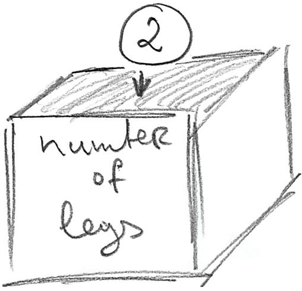

# Python Grundlagen {#python-grundlagen}
Hoffentlich hast du bereits einen [speziellen Ordner](#dateien-ordner) für dieses Buch erstellt. Lade das [Übungs-Notebook](notebooks/Basics.ipynb) herunter (Alt+Klick sollte es eher herunterladen als öffnen), lege es in den Ordner des Kapitels und öffne es, siehe die [relevanten Anweisungen](#jupyter-notebooks). Du musst zwischen den Erklärungen hier und den Übungen im Notizbuch hin und her wechseln, also halte sie beide offen.

## Konzepte des Kapitels

* [Variablen](#variablen).
* [Konstanten](#konstanten).
* Grundlegende [Werttypen](#werttypen).
* Dinge [ausdrucken](#ausdrucken).
* Werte [in Zeichenketten einfügen](#formatierung-von-zeichenketten).

## Variablen {#variablen}
Das erste grundlegende Konzept, mit dem wir uns vertraut machen müssen, ist die **Variable**. Variablen werden verwendet, um Informationen zu speichern, und du kannst sie dir als eine Kiste mit einem Namensschild vorstellen, in die du etwas hineinlegen kannst. Das Namensschild auf dieser Kiste ist der Name der Variable und ihr Wert ist das, was du darin speicherst. Zum Beispiel können wir eine Variable erstellen, die die Anzahl der Beine speichert, die ein Spielfigur hat. Wir beginnen mit einer für einen Menschen typischen Zahl.



In Python würdest du schreiben

```python
anzahl_der_beine = 2
```

Die obige **Zuweisungsanweisung** hat eine sehr einfache Struktur:

```python
<variablen-name> = <wert>
```
Der Variablenname (das Namensschild auf der Kiste) sollte aussagekräftig sein, er kann mit Buchstaben oder _ beginnen und kann Buchstaben, Zahlen und das Symbol _ enthalten, aber keine Leerzeichen, Tabs, Sonderzeichen usw. Python empfiehlt^[Naja, eigentlich [besteht](https://www.python.org/dev/peps/pep-0008/) es darauf.] dass du die **snake_case** Schreibweise (alles in Kleinbuchstaben, Unterstrich für Leerzeichen) verwendest, um deine Variablennamen zu formatieren. Der `<Wert>` auf der rechten Seite ist eine komplexere Geschichte, da er fest codiert sein kann (wie im obigen Beispiel), berechnet werden kann, indem andere Variablen oder dieselbe Variable, zurückgegeben von einer Funktion, usw. verwendet werden.

Die Verwendung von Variablen bedeutet, dass du dich auf die **Bedeutung** der entsprechenden Werte konzentrieren kannst, anstatt dir Sorgen darüber zu machen, was diese Werte sind. Beispielsweise kannst du das nächste Mal, wenn du etwas auf Grundlage der Anzahl der Beine eines Charakters berechnen musst (z.B., wie viele Paar Schuhe benötigt ein Charakter), dies auf Grundlage des aktuellen Wertes der Variablen `anzahl_der_beine` berechnen, anstatt anzunehmen, dass es `1` ist.

```python
# SCHLECHT: Warum 1? Ist es, weil der Character zwei Beine hat oder
# weil wir jedem Character ein Paar Schuhe geben, unabhängig von
# seiner tatsächlichen Anzahl von Beinen?
paar_schuhe = 1

# BESSER (aber was, wenn unser Charakter nur ein Bein hat?)
paar_schuhe = anzahl_der_beine / 2
```

Variablen geben dir auch Flexibilität. Ihre Werte können sich während des Programmablaufs ändern: Der Punktestand des Spielers steigt, die Anzahl der Leben nimmt ab, die Anzahl der Zauber, die er wirken kann, steigt oder fällt je nach ihrem Einsatz, usw. Dennoch kannst du immer den Wert in der Variablen verwenden, um die notwendigen Berechnungen durchzuführen. Hier ist zum Beispiel ein leicht erweitertes Beispiel für `anzahl_der_schuhe`.

```python
anzahl_der_beine = 2

# ...
# etwas passiert und unser Charakter wird in einen Tintenfisch verwandelt
anzahl_der_beine = 8
# ...

# der gleiche Code funktioniert immer noch und wir können immer noch die richtige Anzahl an Schuhpaaren berechnen
paar_schuhe = anzahl_der_beine / 2
```

Wie bereits erwähnt, kannst du eine Variable als eine beschriftete Kiste betrachten, in die du etwas hineinlegen kannst. Das bedeutet, dass du immer den alten Wert "wegwerfen" und etwas Neues hineinlegen kannst. Im Falle von Variablen geschieht der "Wegwerf"-Teil automatisch, da ein neuer Wert den alten überschreibt. Überprüfe selbst, welcher der endgültige Wert der Variable im unten stehenden Code ist?

```python
anzahl_der_beine = 2
anzahl_der_beine = 5
anzahl_der_beine = 1
anzahl_der_beine
```

::: {.rmdnote .practice}
Mache Übung #1.
:::

Beachte, dass eine Variable (eine "Kiste mit Namensschild") erst existiert, nachdem du ihr etwas zugewiesen hast. Der folgende Code erzeugt also einen `NameError`, die Python-art zu sagen, dass sie noch nie von der Variable `anzahl_der_haende` gehört hat.

```python
anzahl_der_beine = 2
anzahl_der_handschuhe = anzahl_der_haende / 2
```

Du kannst jedoch eine Variable erstellen, die keinen _spezifischen_ Wert hat, indem du ihr `None` zuweist. `None` wurde speziell für die Bedeutung _kein Wert_ oder _nichts_ zur Sprache hinzugefügt.

```python
anzahl_der_haende = None # Die Variable existiert jetzt, hat aber keinen speziellen Wert.
```

Wie du bereits gesehen hast, kannst du einen Wert _berechnen_, anstatt ihn anzugeben. Was wäre die Antwort hier?

```python
anzahl_der_beine = 2 * 2
anzahl_der_beine = 7 - 2
anzahl_der_beine
```

::: {.rmdnote .practice}
Mache Übung #2.
:::

## Zuweisungen sind keine Gleichungen!

**Sehr wichtig**: obwohl Zuweisungen _wie_ mathematische Gleichungen _aussehen_, sind sie **keine Gleichungen!** Sie folgen einer **sehr wichtigen** Regel, die Sie im Kopf behalten müssen, wenn Sie Zuweisungen verstehen: die rechte Seite eines Ausdrucks wird _zuerst_ ausgewertet, bis der Endwert berechnet ist. Erst dann wird dieser Endwert der auf der linken Seite angegebenen Variable zugewiesen (also in die Kiste gelegt). Das bedeutet, dass Sie die gleiche Variable auf _beiden_ Seiten verwenden können! Sehen wir uns diesen Code an:
```python
x = 2
y = 5
x = x + y - 4
```

Was passiert, wenn der Computer die letzte Zeile auswertet? Zunächst nimmt er die _aktuellen_ Werte aller Variablen (`2` für `x` und `5` für `y`) und setzt sie in den Ausdruck. Nach diesem internen Schritt sieht der Ausdruck so aus:
```python
x = 2 + 5 - 4
```

Dann berechnet er den Ausdruck auf der rechten Seite und speichert, **sobald die Berechnung abgeschlossen ist**, diesen neuen Wert in `x`
```python
x = 3
```

::: {.rmdnote .practice}
Machen Sie die Übung #3, um sicherzugehen, dass Sie dies verstanden haben.
:::

## Konstanten {#constants}
Obwohl die eigentliche Stärke von Variablen darin besteht, dass Sie ihren Wert ändern können, sollten Sie sie auch dann verwenden, wenn der Wert im gesamten Programm konstant bleibt. In Python gibt es keine echten Konstanten, sondern die Übereinkunft, dass ihre Namen vollständig `GROSSGESCHRIEBEN` sein sollten. Entsprechend wissen Sie, wenn Sie  `SOLCH_EINE_VARIABLE` sehen, dass Sie ihren Wert nicht ändern sollten. Technisch gesehen ist das nur eine Empfehlung, denn niemand kann Sie davon abhalten, den Wert einer `KONSTANTE` zu ändern. Aber ein großer Teil der Benutzerfreundlichkeit von Python resultiert aus solchen Übereinkünften (wie der `snake_case` Konvention oben). Wir werden später mehr von solchen Übereinkünften treffen, zum Beispiel beim Lernen über Objekte.

Unter Berücksichtigung all dessen, wenn die Anzahl der Beine im Spiel konstant bleibt, sollten Sie diese Konstanz betonen und schreiben
```python
ANZAHL_DER_BEINE = 2
```

Ich empfehle dringend die Verwendung von Konstanten und vermeide das Hardcoding von Werten. Erstens, wenn Sie mehrere identische Werte haben, die verschiedene Dinge bedeuten (2 Beine, 2 Augen, 2 Ohren, 2 Fahrzeuge pro Figur, etc.), wird Ihnen eine `2` im Code nicht verraten, was diese `2` bedeutet (die Beine? Die Ohren? Der Punktemultiplikator?). Sie können das natürlich herausfinden, basierend auf dem Code, der diese Nummer verwendet, aber Sie könnten sich diese zusätzliche Mühe ersparen und stattdessen eine ordnungsgemäß benannte Konstante verwenden. Dann lesen Sie einfach ihren Namen und die Bedeutung des Wertes wird offensichtlich, und es ist die Bedeutung und nicht der tatsächliche Wert, der Sie hauptsächlich interessiert. Zweitens, wenn Sie entscheiden, diesen Wert dauerhaft zu _ändern_ (sagen wir, unsere Hauptfigur ist jetzt ein Dreifuß), bedeutet die Verwendung einer Konstante, dass Sie sich nur an einer Stelle Sorgen machen müssen, der Rest des Codes bleibt unverändert. Wenn Sie diese Zahl hart codiert haben, erwartet Sie eine aufregende ^[nicht wirklich] und definitiv lange Suche und Ersetzung im gesamten Code.

::: {.rmdnote .practice}
Machen Sie die Übung #4.
:::

## Datentypen {#value-types}
Bisher haben wir nur ganzzahlige numerische Werte verwendet (1, 2, 5, 1000...). Obwohl Python [viele verschiedene Datentypen](https://docs.python.org/3/library/stdtypes.html) unterstützt, konzentrieren wir uns zunächst auf eine kleine Auswahl davon:

* Ganze Zahlen, die wir bereits verwendet haben, z.B. `-1`, `100000`, `42`.
* Fließkommazahlen, die jeden realen Wert annehmen können, z.B. `42.0`, `3.14159265359`, `2.71828`.
* Zeichenketten, die Text speichern können. Der Text ist zwischen entweder gepaarten Anführungszeichen `"einiger Text"` oder Apostrophen `'einiger Text'` eingeschlossen. Das bedeutet, dass Sie Anführungszeichen oder Apostrophe innerhalb der Zeichenkette verwenden können, solange sie von der Alternative umschlossen ist. Z.B., `"Schüleraufgaben"` (eingeschlossen in `"`, Apostroph `'` innen) oder `'"Alle Verallgemeinerungen sind falsch, auch diese." Mark Twain'` (Zitat von Apostrophen eingeschlossen). Es gibt noch viel mehr zu Zeichenketten und wir werden dieses Material im Laufe des Kurses behandeln.
* Logische / boolesche Werte, die entweder `True` oder `False` sind.

Bei der Verwendung einer Variable ist es wichtig, dass Sie wissen, welchen Datentyp sie speichert, und das liegt meist bei Ihnen. In einigen Fällen wird Python einen Fehler ausgeben, wenn Sie versuchen, eine Rechnung mit inkompatiblen Datentypen durchzuführen. In anderen Fällen wird Python Werte automatisch zwischen bestimmten Typen konvertieren, z.B. ist jeder Ganzzahlwert auch ein Realwert, so dass die Konvertierung von `1` zu `1.0` meist trivial und automatisch ist. In anderen Fällen müssen Sie jedoch möglicherweise eine explizite Konvertierung verwenden. Gehen Sie zur Übung #5 und versuchen Sie zu erraten, welcher Code laufen wird und welcher einen Fehler wegen inkompatiblen Typen werfen wird? 

```python
5 + 2.0
'5' + 2
'5' + '2'
'5' + True
5 + True
```

::: {.rmdnote .practice}
Mache Übung #5.
:::

Überrascht vom letzten? Das liegt daran, dass intern `True` auch `1` und `False` `0` ist!

Sie können explizit von einem Typ in einen anderen umwandeln, indem Sie spezielle Funktionen verwenden. Beispielsweise können Sie eine Zahl oder einen logischen Wert in einen String umwandeln, indem Sie einfach [str(\<value\>)](https://docs.python.org/3/library/functions.html#func-str) schreiben. Was wäre das Ergebnis in den untenstehenden Beispielen?

```python
str(10 / 2)
str(2.5 + True)
str(True)
```

::: {.rmdnote .practice}
Mache Übung #6.
:::

Ähnlich können Sie mit der Funktion [bool(\<value\>)](https://docs.python.org/3/library/functions.html#bool) in eine logische/boolesche Variable umwandeln. Die Regeln sind einfach, für numerische Werte ist `0` gleich `False`, jeder andere Nicht-Null-Wert wird in `True` umgewandelt. Für Zeichenketten wird eine leere Zeichenkette `''` als `False` bewertet und eine nicht leere Zeichenkette wird in `True` umgewandelt. Was wäre die Ausgabe in den untenstehenden Beispielen?


```python
bool(-10)
bool(0.0)

secret_message = ''
bool(secret_message)

bool('False')
```

::: {.rmdnote .practice}
Mache Übung #7.
:::

Die Umwandlung in Ganzzahlen oder Fließkommazahlen mit [int(\<value\>)](https://docs.python.org/3/library/functions.html#int) bzw. [float(\<value\>)](https://docs.python.org/3/library/functions.html#float) ist komplizierter. Der einfachste Fall ist von logisch auf Ganzzahl/Fließkommazahl, da `True` Ihnen `int(True)` ist `1` und `float(True)` ist `1.0` gibt und `False` gibt Ihnen `0`/`0.0`. Beim Umwandeln von Fließkommazahl auf Ganzzahl lässt Python einfach den Bruchteilteil fallen (es rundet nicht richtig!). Bei der Umwandlung einer Zeichenkette muss es sich um eine gültige Zahl des entsprechenden Typs handeln, sonst wird ein Fehler erzeugt. Sie können z. B. eine Zeichenkette wie `"123"` in eine Ganzzahl oder eine Fließkommazahl umwandeln, aber das funktioniert nicht für `"a123"`. Darüber hinaus können Sie `"123.4"` in eine Fließkommazahl umwandeln, aber nicht in eine Ganzzahl, da sie einen Bruchteil enthält. Angesichts all dessen, welche Zellen würden funktionieren und welche Ausgabe würden sie erzeugen?


```python
float(False)
int(-3.3)
float("67.8")
int("123+3")
```

::: {.rmdnote .practice}
Mache Übung #8.
:::

## Ausgabe drucken{#print}
Um den Wert auszudrucken, müssen Sie die Funktion [print()](https://docs.python.org/3/library/functions.html#print) verwenden (wir werden später allgemein über Funktionen sprechen). Im einfachsten Fall übergeben Sie den Wert und er wird ausgegeben.

```python
print(5)
#> 5
```

oder 

```python
print("fünf")
#> fünf
```

Natürlich wissen Sie bereits über die Variablen Bescheid, also statt den Wert direkt einzugeben, können Sie stattdessen eine Variable übergeben und ihr _Wert_ wird ausgegeben.

```python
anzahl_der_pfannkuchen = 10
print(anzahl_der_pfannkuchen)
#> 10
```

oder

```python
frühstück = "pfannkuchen"
print(frühstück)
#> pfannkuchen
```

Sie können auch mehr als einen Wert/Variablen an die Druckfunktion übergeben und alle Werte werden nacheinander gedruckt. Wenn wir dem Benutzer zum Beispiel sagen wollen, was ich zum Frühstück hatte, können wir das tun

```python
frühstück = "pfannkuchen"
anzahl_der_artikel = 10
print(frühstück, anzahl_der_artikel)
#> pfannkuchen 10
```

Was wird von dem untenstehenden Code gedruckt?

```python
abendessen = "steak"
zähler = 4
nachtisch = "muffins"

print(zähler, abendessen, zähler, nachtisch)
```

::: {.rmdnote .practice}
Mache Übung #9.
:::

Allerdings möchten Sie wahrscheinlich expliziter sein, wenn Sie die Informationen ausdrucken. Stellen Sie sich zum Beispiel vor, Sie haben diese drei Variablen:

```python
mahlzeit = "Frühstück"
gericht = "Pfannkuchen"
anzahl = 10
```
Sie könnten natürlich `print(mahlzeit, gericht, anzahl)` machen, aber es wäre schöner, "_Ich hatte **10 Pfannkuchen** zum **Frühstück**_" zu drucken, wobei die in Fettschrift gedruckten Elemente die eingefügten Variablenwerte wären. Dafür müssen wir die Formatierung von Zeichenketten verwenden. Bitte beachten Sie, dass die Formatierung von Zeichenketten nicht spezifisch für das Drucken ist, Sie können einen neuen Zeichenkettenwert über die Formatierung erstellen und ihn in einer Variable speichern, ohne ihn auszudrucken, oder ihn ausdrucken, ohne ihn zu speichern.

## Formatierung von Zeichenketten {#string-formatting}
Eine großartige Ressource zur Formatierung von Zeichenketten in Python ist [pyformat.info](https://pyformat.info/). Da sich Python ständig weiterentwickelt, gibt es nun mehr als eine Art, Zeichenketten zu formatieren. Im Folgenden werde ich das "alte" Format vorstellen, das auf der klassischen Formatierung von Zeichenketten basiert, die in der Funktion `sprintf` in C, Matlab, R und vielen anderen Programmiersprachen verwendet wird. Es ist etwas weniger flexibel als neuere, aber für einfache Aufgaben ist der Unterschied vernachlässigbar. Das Wissen über das alte Format ist nützlich wegen seiner Allgemeinheit. Wenn Sie Alternativen lernen möchten, lesen Sie unter dem oben angegebenen Link.

Der allgemeine Aufruf lautet `"ein String mit Formatierung"%(Tupel von Werten, die während der Formatierung verwendet werden)`. Sie werden später mehr über Tupel lernen. Gehen Sie im Moment davon aus, dass es sich einfach um eine durch Kommas getrennte Liste von Werten handelt, die in runden Klammern eingeschlossen sind: `(1, 2, 3)`.

In `"ein String mit Formatierung"`, geben Sie an, wo Sie den Wert mit dem Zeichen `%` einfügen möchten, das von einer _optionalen_ Formatierungsinformation und dem _erforderlichen_ Symbol, das den **Typ** des Wertes definiert, gefolgt wird. Die Typsymbole sind

* `s` für Zeichenkette
* `d` für eine Ganzzahl
* `f` für einen Fließkommawert
* `g` für einen "optimal" gedruckten Fließkommawert, so dass für große Werte die wissenschaftliche Notation verwendet wird (_z.B._, `10e5` statt `100000`).

Hier ist ein Beispiel, wie man einen String mit einer Ganzzahl formatiert:

```python
print("Ich hatte %d Pfannkuchen zum Frühstück"%(10))
#> Ich hatte 10 Pfannkuchen zum Frühstück
```

Sie sind nicht darauf beschränkt, einen einzigen Wert in einen String einzufügen. Sie können weitere Positionen über `%` angeben, müssen jedoch sicherstellen, dass Sie die richtige Anzahl von Werten in der richtigen Reihenfolge übergeben. Können Sie vor dem Ausführen herausfinden, welcher Aufruf tatsächlich funktioniert (und was die Ausgabe sein wird) und welcher einen Fehler verursacht?


```python
print('Ich hatte %d Pfannkuchen und entweder %d oder %d Steaks zum Abendessen'%(2))
print('Ich hatte %d Pfannkuchen und %d Steaks zum Abendessen'%(7, 10))
print('Ich hatte %d Pfannkuchen und %d Steaks zum Abendessen'%(1, 7, 10))
```
::: {.rmdnote .practice}
Machen Sie Übung #10.
:::

Wie oben erwähnt, haben Sie im Falle von echten Werten zwei Möglichkeiten: `%f` und `%g`. Letzterer verwendet die wissenschaftliche Notation (z.B. `1e10` für `10000000000`), um eine Darstellung kompakter zu machen.

::: {.rmdnote .practice}
Machen Sie Übung #11, um ein besseres Gefühl für den Unterschied zu bekommen.
:::

Es gibt noch viel mehr zur Formatierung und Sie können auf [pyformat.info](https://pyformat.info/) darüber lesen. Diese Grundlagen sind jedoch ausreichend, um in dem nächsten Kapitel mit der Programmierung unseres ersten Spiels zu beginnen.
