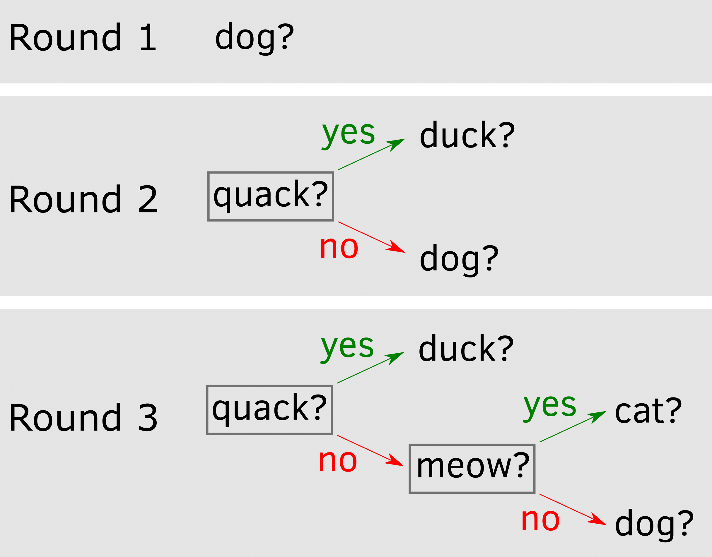
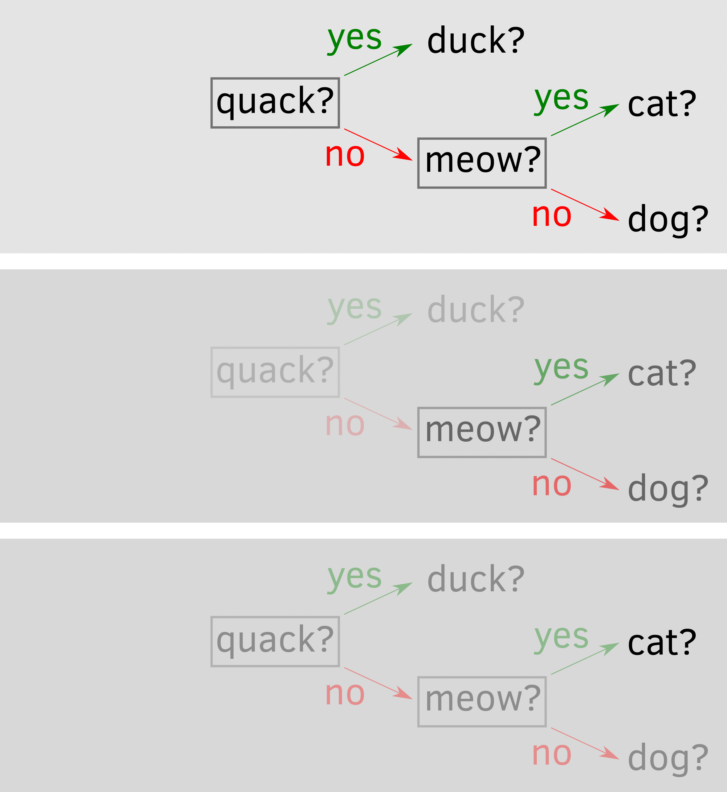
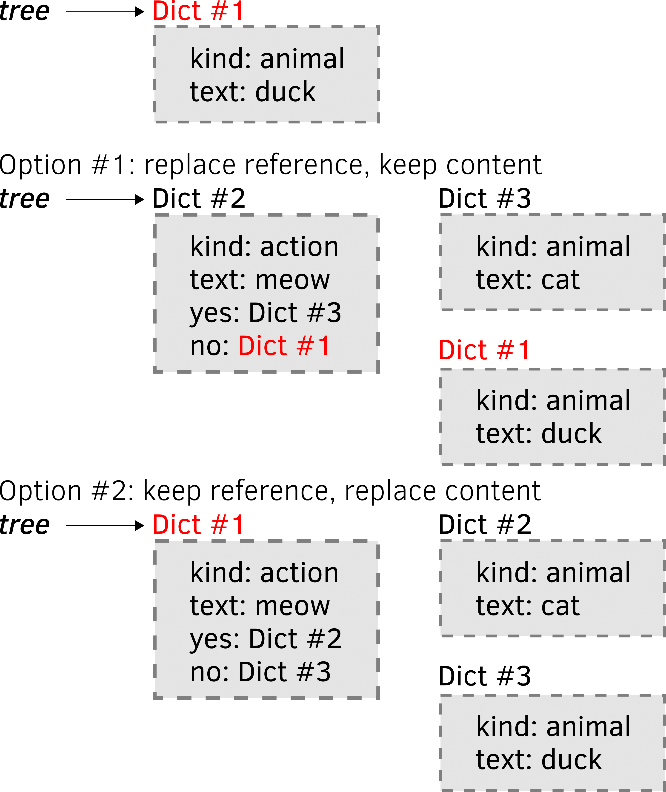

# Guess the animal {#guess-the-animal}

Today we will program a game in which computer tries to guess an animal that you thought of and learns from its mistake gradually building it vocabulary. Despite its simplisity, it will give us an opportunity to learn about dictionaries, critical differences between mutable and immutable objects, recursion, and file system. As per usual, grab the [exercise notebook]() before we start.

## Chapter concepts
* [Dictionaries](#dictionaries)
* [Recursion](#recursion)
* [Mutable](#mutable-objects) vs. [immutable](#variables-as-boxes-immutable-objects) objects
* Saving/reading objects via [pickle](#pickle) and [JSON](#json)
* Working with files via [os](#os-library) library


## Game structure
The way the game is played is very simple: On each turn computer asks you whether an animal has a certain property or if it is a specific animal. It starts knowing only about one animal, say, "dog". So, it asks you "Is the animal you are thinking of is a dog?". If it is, game is over and you can do it again. However, if it is not a dog then the computer asks "Who is it?", let say you answer "Duck" and then computer also asks you "What does duck do?" and you answer "quack". The important bit here is that computer uses this information the next time you play the game. It starts by asking "does the animal quack?", if yes, it guess "Duck", if not it falls back on the only animal it has left and guess "Dog". If it is not a dog, it asks you again "Who is it?", you say "Cat". "What does cat do?", "meow". Below you can see the decision tree that the computer can use on each round and how it adds the information it learned from it failures.

{width=100%}
 

## Dictionaries {#dictionaries}
In the decision tree, we have two kinds nodes: 1) the action decision node ("quack?") that has two edges (_yes_ and _no_) that lead to other nodes, and 2) the leaf animal nodes ("duck", "dog", "cat", etc.). Thus each node has a one or two subtrees that in turn include their own decision trees, etc. Thus, each node has following properties: 

* `kind`: node _kind_ either `"action"` or `"animal"`
* `text`: node _text_ which holds either an action or the name of the animal
* `yes` : subtree for answer "yes" (relevant only for _action_ nodes)
* `no` : subtree for answer "no" (also relevant only for _action_ nodes)

This calls for a container and we _could_ put each node with its subtrees into a list and use numerical indexes to access individual elements (e.g., `node[0]` would be the node kind, whereas `node[2]` would hold the yes-subtree) but indexes do not have meaning per se, so figuring out how `node[0]` is different from `node[2]` would be tricky. Python has a solution for cases like this: [dictionaries](https://docs.python.org/3/library/stdtypes.html#dict).

A dictionary is a container that stores information using _key : value_ pairs. This is similar to how you look up a meaning or a translation (value) of a word (key) in a real dictionary, hence the name. To create a dictionary, you use _curly_ brackets `{<key1> : <value1>}, {<key2> : <value2>, ...}` or create it via `dict(<key1>=<value1>, <key2>=<value2>, ...)`. Note that the second version is more restrictive as keys must follow rules for variable names, whereas in curly-brackets version keys can be arbitrary strings.
```python
book = {"Author" : "Walter Moers",
        "Title": "Die 13½ Leben des Käpt'n Blaubär"}
        
# or, equivalently
book = dict(Author="Walter Moers",
            Title="Die 13½ Leben des Käpt'n Blaubär")
```

Once you created a dictionary, you can access or modify each field using its key, e.g. `print(book["Author"])` or `book["Author"] = "Moers, W."`. You can also add new fields by assigning values to them, e.g., `book["Publication year"] = 1999`. In short, you can use a combination of `<dictionary-variable>[<key>]` just like you would use a normal variable. This is similar to using the `list[index]` combination, the only difference is that `index` must be an integer, whereas `key` can be any hashable^[Immutable values are [hashable](https://docs.python.org/3/glossary.html#term-hashable), whereas mutable ones, like dictionaries and lists, are not. This is because mutable objects can _change_ while the program is running and therefore are unusable as a key. I.e., it is hard to match by a key, if the key can be different by the time you need to access the dictionary.] value.

## Yes/no input
In our game, we will be asking yes/no question _a lot_, so let us start by programming a `input_yes_no` function that takes a prompt as a single argument and keeps asking for the response until it receives the valid one. It should return `True` if response was "yes" and `False` otherwise. For convenience, it should prepend the prompt with a message `'Type "y" for yes and "n" for no.", e.g., if prompt parameter was `"Is it a pony?" the actual input prompt should be `'Type "y" for yes and "n" for no. Is it a pony?'`. This should be easy for you by now as you implemented several similar functions during the game. Document(!), test it in exercise 7, and put the code in `utils.py`.

::: {.program}
Put `input_yes_no` into _utils.py_.<br/>Test it in exercise 1.
:::

## One-trick pony
Let us start at the beginning by creating a dictionary with a single animal that can be used to ask a question "Is it <animal>?". Create a dictionary following the structure layed out above and think about which field you need (hint, not all four) and what values they should have. In the future, we will modify this tree, so even though you hard code it, it is still a variable, not a constant, so use the appropriate naming style.

Next, you need a simple code that checks if the node `"kind"` is `"animal"`, it asks "Is it <animal>?" (which field you need to use for that?) using the `input_yes_no` function you implemented before. For the moment, congratulate yourself if the answer was "yes" (computer guess it correctly!) but perform no action otherwise.

::: {.program}
Put your code into _code01.py_.
:::

## Learning a new trick
In the final implementation, our decision tree will grow through trial-and-error but initially, let us hard code a small decision tree by hand. Create a dictionary of dictionaries for the _Round 2_ decision tree. It has just three nodes, the top one is an action tree with two subtrees, each subtree is an animal leaf node. Since subtrees a dictionaries, it means that you put a dictionary into a corresponding field, so `decision_tree['yes']` will yield `{"kind" : "animal", "text" : "duck"} and, therefore, `decision_tree['yes']['animal']` will be `"duck"`. Once you defined it, explore it by hand in a jupiter notebook, trying different field and different levels, as in the example I've shown above.

Now that we have two kinds of nodes, we need to update the query code, so that is asks  "Is it <animal>?" for _animal_ node (you have this code already) but "Does it <action>?" for the _action_ node. Implement it but take no action for the response to the action node question yet. Test that it works by changing node kind.

::: {.program}
Put your code into _code02.py_.
:::

## Recursion
Our trees have many nodes at different depths but when we need to act on a node (ask a relevant question), the only thing that matters is the node itself, not the tree it belongs to or where it is within this tree. E.g., look at the figure below for a full and trunkated decision trees. Once we are at the node "meow?", it makes no difference whether we arrived to it from some upper-level node or it was the top node itself, the question we ask and the decision we make is the same. Similarly, once we are at the node `"cat"`, it makes no difference to us whether we ended up where after a long exploration or it was the only node that we have.

{width=100%}

This means that we need just one function that will act on the node and that the _same_ function will be applied to a relevant subnode for the _action_ node. I.e., the function will call itself! This is called a recursion and a classic example^[Actually, it is somewhat misleading, as you do not need recursion for factorial, a for loop will suffice, but this a nice and simple toy example, so we'll walk with the crowd on this one.] to illustrate the concept is computation of a [factorial](https://en.wikipedia.org/wiki/Factorial):
$$!n = n \times (n - 1) \times (n - 2) \times ...\times3\times2\times1$$

It is easy to see a recursive nature of the computation here as the formula can be rewritten as
$$!n = n \times !(n - 1)$$

The only exception is when $n = 1$, so the complete formula is
$$\ !n = \begin{cases}
  1 & \text{if n = 1} \\
  n \times !(n - 1) & \text{if n > 1}
\end{cases}$$

Your task is to write a function (document!) that computes a factorial for a given positive integer using the formula above. As long as $n > 1$ it should use itself to compute a factorial of the remaining terms. Test the function to check that computation works correctly.

::: {.program}
Implement and test function in exercise 2.
:::

## Exploring the decision tree
Let us apply the same idea of a recursion to explore the decision tree while playing the game. For now, hardcode the decision tree shown in the figure below 

{width=100%}

Next, we need to convert the code from _code02.py_ that used a single node to a function. Extend it, so that if the node is an _action_ node, the function goes one level deeper by applying itself the corresponding "yes" or "no" subtree (that is determined by player's response). Call it `explore_tree`. It should have just a single parameter (the current node) and it does not need to return any value. Once implemented, call it starting with hardcoded tree and test by giving different answers. The tree is small, so you should be able to quickly try all paths. There should be positive "yay!", if at the end you agree that computer's guess about an animal was correct and no output, if you said "no".

::: {.program}
Implement function in _utils.py_<br/>
Use it in code _code03.py_.
:::

Our next step is to write the code that extends the tree but before that you need to learn about mutable objects and advantages and dangers that they bring.

## Variables as boxes (immutable objects)
In this game, you will use [dictionaries](#dictionaries). These are _mutable_, like [lists](#lists) in contrast to "normal" _immutable_ values (integers, floats, strings). You need to learn about this distinction as these two kinds of objects (values) behave very differently under some circumstances, which is both good (power!) and bad (weird unexpected behavior!) news.

You may remember the _variable-as-a-box_ metaphor that I used to introduce [variables](#variables). In short, a variable can be thought of as a "box" with a variable name written on it and a value being stored "inside". When you use this value or assign it to a different variable, you can assume that Python _makes a copy_ of it^[Not really, but this makes it easier to understand.] and puts that _copy_ into a different variable "box". When you _replace_ value of a variable, you take out the old value, destroy it (by throwing it into a nearest black hole, I assume), create a new one, and put it into the variable "box". When you _change_ a variable based on its current state, the same thing happens. You take out the value, create a new value (by adding to the original one or doing some other operation), destroy the old one, and put the new one back into the variable "box". The important point is that although a _variable_ can have different immutable values (we [changed](#random-mole) `imole` variable on every round), the immutable _value_ itself never changes. It gets _replaced_ with another immutable value but _never changes_^[A metaphor attempt: You can wear different shirts, so your _look_ (variable) changes but each individual shirt (potential values) remains the same (we ignore the wear and tear here) irrespective of whether your are wearing it (value is assigned to a variable) or not.].

The box metaphor explains why [scopes](#scopes-for-immutable-values) work the way they do. Each scope has its own set of boxes and whenever you pass information between scopes, e.g., from a global script to a function, a copy of a value (from a variable) is created and put into a new box (e.g., a parameter) inside the function. When a function returns a value, it is copied and put in one of the boxes in the global script (variable you assigned the returned value to), etc.

However, this is true only for _immutable_ objects (values) such as numbers, strings, logical values, etc. but also [tuples](https://docs.python.org/3/library/stdtypes.html?highlight=tuple#tuple) (see below for what these are). As you could have guessed from the name, this means that there are other _mutable_ objects and they behave very differently.

## Variables as post-it stickers (mutable objects){#mutable-objects}
Mutable objects are, for example, lists or dictionaries^[Coming up shortly!], i.e., things that can change. The key difference is that _immutable_ objects can be thought as fixed in their size. A number takes up that many bytes to store, same goes for a given string (although a different string would require more or fewer bytes). Still, they do not change, they are created and destroyed when unneeded but never truly updated.

_Mutable_ objects can be changed^[Building on the looks metaphor: You can change your look by using a different (immutable) shirt or by _changing_ your haircut. You hair is mutable, you do not wear a different one on different days to look different, you need to modify it to look different.]. For example, you can add elements to your list, or remove them, or shuffle them. Same goes for [dictionaries](https://docs.python.org/3/tutorial/datastructures.html?highlight=dictionary#dictionaries). Making such object _immutable_ would be computationally inefficient: Every time you add a value a (long) list is destroyed and recreated with just that one additional value. Which is why Python simply _updates_ the original object. For further computation efficiency, these objects are not copied when you assign them to a different variable or use as a parameter value but are _passed by reference_. This means that the variable is no longer a "box" you put values into but a "sticker" you put on an object (a list, a dictionary). And you can put as many stickers on an object as you want _and it still will be the same object_!

What on Earth do I mean? Keeping in mind that a variable is just a sticker (one of many) on a mutable object, try figuring out what will be the output below:

```python
x = [1, 2, 3]
y = x
y.append(4)
print(x)
```

::: {.rmdnote .practice}
Do exercise #3.
:::

Huh? That is precisely what I meant with "stickers on the same object". First, we create a list and put an `x` sticker on it. Then, we assign _the same list_ to `y`, in other words, we put a `y` sticker _on the same list_. Since both `x` and `y` are stickers on the _same_ object, they are, effectively, synonyms. In that specific situation, once you set `x = y`, it does not matter which variable name you use to change _the_ object, they are just two stickers hanging side-by-side on the _same_ list. Again, just a reminder, this is _not_ what would happen for _immutable_ values, like numbers, where things would behave the way you expect them to behave.

This variable-as-a-sticker, a.k.a. "passing value by reference", has very important implications for function calls, as it breaks your scope without ever giving you a warning. Look at the code below and try figuring out what the output will be.

```python 
def change_it(y):
    y.append(4)

x = [1, 2, 3]
change_it(x)
print(x)
```
::: {.rmdnote .practice}
Do exercise #4.
:::

How did we manage to modify a _global_ variable from inside the function? Didn't we change the _local_ parameter of the function? Yep, that is exactly the problem with passing by reference. Your function parameter is yet another sticker on the _same_ object, so even though it _looks_ like you do not need to worry about global variables (that's why you wrote the function and learned about scopes!), you still do. If you are perplexed by this, you are in a good company. This is one of the most unexpected and confusing bits in Python that routinely catches people^[Well, at least me!] by surprise. Let us do a few more exercises, before I show you how to solve the scope problem for mutable objects.

::: {.rmdnote .practice}
Do exercise #5.
:::

## Tuple: a frozen list {#tuple}
The wise people who created Python were acutely aware of the problem that the _variable-as-a-sticker_ creates. Which is why, they added an **immutable** version of a list, called a [tuple](https://docs.python.org/3/library/stdtypes.html?highlight=tuple#tuple). It is a "frozen" list of values, which you can loop over, access its items by index, or figure out how many items it has, but you _cannot modify it_. No appending, removing, replacing values, etc. For you this means that a variable with a frozen list is a box rather than a sticker and that it behaves just like any other "normal" **immutable** object. You can create a `tuple` by using round brackets.
```python
i_am_a_tuple = (1, 2, 3)
```
You can loop over it, e.g.,

```python
i_am_a_tuple = (1, 2, 3)
for number in i_am_a_tuple:
    print(number)
#> 1
#> 2
#> 3
```

but, as I said, appending will throw a mistake

```python
i_am_a_tuple = (1, 2, 3)

# throws AttributeError: 'tuple' object has no attribute 'append'
i_am_a_tuple.append(4)
#> 'tuple' object has no attribute 'append'
```

Same goes for trying to change it

```python
i_am_a_tuple = (1, 2, 3)

# throws TypeError: 'tuple' object does not support item assignment
i_am_a_tuple[1] = 1 
#> 'tuple' object does not support item assignment
```

This means that when you need to pass a list of values to a function and you want them to have no link to the original variable, you should instead pass _a tuple of values_ to the function. The function still has a list of values but the link to the original list object is now broken. You can turn a list into a tuple using `tuple()`. Keeping in mind that `tuple()` creates a frozen copy of the list, what will happen below?
```python
x = [1, 2, 3]
y = tuple(x)
x.append(4)
print(y)
```
::: {.rmdnote .practice}
Do exercise #6.
:::

As you probably figured out, when `y = tuple(x)`, Python creates **a copy** of the list values, freezes them (they are immutable now), and puts them into the "y" box. Hence, whatever you do to the original list, has no effect on the immutable "y".

Conversely, you "unfreeze" a tuple by turning it into a list via `list()`. Please note that it creates **a new list**, which has no relation to any other existing list, even if values are the same or were originally taken from any of them!

::: {.rmdnote .practice}
Do exercise #7.
:::

Remember I just said that `list()` creates a new list? This means that you can use it to create a copy of a list directly, without an intermediate tuple step. This way you can two _different_ lists with _identical_ values. You can also achieve the same results by slicing an entire list, e.g. `list(x)`, is the same as `x[:]`.

::: {.rmdnote .practice}
Do exercise #8.
:::

Here, `y = list(x)` created a new list (which was a carbon copy of the one with the "x" sticker on it) and the "y" sticker was put on that new list, while the "x" remained hanging on the original.

If you feel your head spinning then, unfortunately, I have to tell that it gets even worse. The following paragraph covers fairly advanced scenario but I want you to know about it, as things work extremely counterintuitively and I personally have been caught by this issue a few times and it always took me _forever_ to figure out the problem. Thus, I want you to be at least aware of it. What if you have a tuple (immutable!) that contains a list (mutable) inside? As I told you before, you cannot modify the item itself but that item is merely a reference to list (a sticker on a _mutable_ object!), so even though tuple is immutable, you can still fiddle with the list itself. Moreover, making a copy of a tuple will merely make a copy of a reference that still points to the same list! So, you could be thinking that since it is all tuples everything is immutatable and well-behaving and be caught out by that^[If this makes you want to scream, tell me and will do it together.]. Here is an example of such a mess:

```python
tuple_1 = tuple([1, ["A", "B"], 2])
tuple_2 = tuple_1

# This (correctly) does not work
tuple_1[0] = ["C", "D"]
#> 'tuple' object does not support item assignment

# But we can change first element of the list to "C" and second to "D"
# Reference to the list is frozen, but the list itself is mutable!
tuple_1[1][0] = "C"
tuple_2[1][1] = "D"

print(tuple_1)
#> (1, ['C', 'D'], 2)
print(tuple_2)
#> (1, ['C', 'D'], 2)
```

Confusing? You bet! If you feel overwhelmed by this whole immutable/mutable, tuple/list, copy/reference confusion, you are just being a normal human being. I understand the (computational) reasons for doing things this way, I am aware of this difference and how useful this can be but it still catches me by surprise from time to time! So, the word of advice, be careful and double-check your code using debugger whenever you are assigning list or dictionaries, passing them to functions, making copies, having lists inside lists, etc. Be aware that things may not work as you think they should!

## Extending the tree
Each node that we have in a tree is a [dictionary](https://docs.python.org/3/library/stdtypes.html#dict), which is mutable and that is makes easy if a bit confusing. The good thing is, we can modify tree from inside the function. As I showed you above, you are not passing a dictionary itself to the function, you a passing a _reference_ to it, so anything you do to any dictionary within the tree will be applied to the global tree itself. The confusing bit is that we need to keep in mind that we are always with a _reference_, so simple copy won't do us any good. We have two options illustrated in the figure below. The original tree has just one node represented by <span style="color=red;">Dict #1.</span>. When we extend the tree that node must move down and become a leaf of an action node that now becomes the starting point. The can create a new action node dictionary (_Dict #2_), a new animal node for the cat (_Dict #3_) and arrange them as in option #1. However, in this case, we need to make sure that reference in `tree` variable is updated, so that it now points to _Dict #2_. Alternatively, we can keep <span style="color=red;">Dict #1.</span> as the top node but completely replace its content turning it into an action node. The original information will be copied to a new _Dict #3_. Let us try both of these approaches, starting with 

{width=100%}


## Extending the tree via returning new reference
Let us proceed in small steps, as per usual. First, write code that takes an _animal_ node (set `tree` variable by hand) and creates a three node tree as in option #1 above. You need to create two additional dictionaries and link them via `"yes"` and `"no"` fields. First, hardcode both new animal and new action. Once your code works, replace hardcoded values with `input` calls asking user "Who is it?" and "What does <animal> do?".

::: {.rmdnote .practice}
Test code in exercise #9.
:::

This gives us the code we need for the `explore_and_extend_tree_via_return`^[A mouthful, I know.] function that extends^[Pun intended.] the `explore_tree` function you implemented earlier. Think about where the new code goes to. 

A more important modification is that the function must now return a reference to the tree (dictionary that has the tree). It is either the _original_ tree or, if you exteded it, the _new_ tree. Also, that means for action nodes either `"yes"` or `"no"` dictionaries must be assigned a reference that a recursive call to `explore_and_extend_tree_via_return` returned. E.g., if nothing happened, the same reference to the original dictionary will be assigned. However, if we created a _new_ tree, the references to that _new_ tree must now be stored in the `"yes"` or `"no"` field. If we do not do this, the field will still point to the original node with our modifications being invisible. Same goes for the top level, as this means not only passing our global `tree` to the function but also assigning the returned reference back to it. Update the function (double check which function you are calling recursively, it should be `explore_and_extend_tree_via_return` not the original `explore_tree`!) and test it by starting with a single animal node tree and calling it in an endless loop (we will use emergency stop via debugger as an exit strategy for now). I would suggest printing out the dictionary after each call (to see how it grows), as well as putting a break point inside or after the function to explore the process, see the calling stack and parameter values for each level.

::: {.program}
Implement function in _utils.py_<br/>
Use it in code _code04.py_.
:::

## Extending the tree via modifying the dictionary in-place
The second option (see illustration above) is simpler (we do not need to return anything) but more opaque (we modify things behind the scenes and these modifications are not obvious because there is no return). First, write the code that creates two new animal nodes and replaces the content of the original node with new action (as before, first hardcode the new animal and new action, later repace it with `input` calls as in previous function). You can check that the `tree` references the same object by checking its [id](https://docs.python.org/3/library/functions.html#id). It should remain the same even though the content is different (the `id` for the top node should change in the exercise #9, go back to the code and check). 

Important catch, remember, `tree` is a _reference_, so writing `no_animal = tree` to store original information in a new node will do you no good, as it will mean that both `tree` and `no_animal` will refer to the same dictionary. Do `no_animal = tree` and then print out the [id](https://docs.python.org/3/library/functions.html#id) for both (the same) and write `tree is no_animal` (`is` checks whether two objects are identical, i.e., same objects, so it will  be `True`). Oddly enough, once you write `tree["no"] = no_animal` after that it will reference _itself_ (`tree is tree["no"]` will be `True`)! 


```python
# assignment copies reference but object is the same
dict1 = {"a": 1}
dict2 = dict1
print(id(dict1), id(dict2), dict1 is dict2)
#> 2159891769600 2159891769600 True

# object references itself!
dict1["a"] = dict1
print(id(dict1), id(dict1["a"]), dict1 is dict1["a"])
#> 2159891769600 2159891769600 True
```

There are two ways to solve this problem. You can create a new dictionary assigning _field_ values one by one. Since field values are immutable strings, this will create a _different_ object with same _content_. 


```python
dict1 = {"a": 1}
dict2 = {"a" : dict1["a"]}

# same content!
print(dict1 == dict2)
#> True

# different objects
print(id(dict1), id(dict2), dict1 is dict2)
#> 2159891936256 2159891936960 False
```

Alternatively, you can create a either a shallow [copy](https://docs.python.org/3/library/copy.html#copy.copy) or [deep copy](https://docs.python.org/3/library/copy.html#copy.deepcopy) of an object using [copy](https://docs.python.org/3/library/copy.html) library. The former --- [copy](https://docs.python.org/3/library/copy.html#copy.copy) --- makes a "shallow" copy by copying the context "as is". In this case, a reference to another object is copied as is and still points to the same object. The [deepcopy](https://docs.python.org/3/library/copy.html#copy.deepcopy) goes, well, deeper and creates copy for object that the original references. The latter is more computationally expensive (you make copies of _everything_!) but is guaranteed to create a copy with no hidden ties to the original. So, when in doubt, go for the [deepcopy](https://docs.python.org/3/library/copy.html#copy.deepcopy). In our case, there is no difference as our original dictionary has just two immutable string, so both [copy](https://docs.python.org/3/library/copy.html) and [deepcopy](https://docs.python.org/3/library/copy.html#copy.deepcopy) would do the same.

In our code, use the latter option via [copy](https://docs.python.org/3/library/copy.html) library.


::: {.rmdnote .practice}
Test code in exercise #10.
:::

Now that the code is working, you can use it in a new function called `explore_and_modify_tree` which builds upon the `explore_tree` function. Again, use the new code when you are in the _animal_ node and the guess was wrong (answer was "no"). Test it the same way in an endless loop, as you did for `explore_and_extend_tree_via_return`.

::: {.program}
Implement function in _utils.py_<br/>
Use it in code _code05.py_.
:::

## Can I go home now?
Our program works nicely but the current idea is to play, literally, forever. We should be friendlier than that, so after each round ask the player whether they want to play again and continue only if the answer was "yes" (remember, you already have a function to ask "yes" / "no" questions, use it!).

::: {.program}
Update loop in code _code06.py_.
:::

## Saving tree for future use via pickle {#pickle}
Our game works, our decision tree grows with every round but the problem is that we start from scratch every time with start the program. This is wasteful and no fun, so we should save our tree at the end of each game and load it again whenever the program starts again. One option is to use [pickle](https://docs.python.org/3/library/pickle.html) library that allows you to [dump](https://docs.python.org/3/library/pickle.html#pickle.dump) and [load](https://docs.python.org/3/library/pickle.html#pickle.load) Python objects. Here's how it works (use the unfamiliar `with open("dict1.p", "wb") as pickle_file:` as):


```python
import pickle

dict1 = {"a": 1}
print(dict1)
#> {'a': 1}

# dumping dictionary to a file
with open("dict1.p", "wb") as pickle_file:
  pickle.dump(dict1, pickle_file)

# loading a dictionary from a file
with open("dict1.p", "rb") as pickle_file:
  dict2 = pickle.load(pickle_file)
print(dict2)
#> {'a': 1}
```

In our program, we need to [load](https://docs.python.org/3/library/pickle.html#pickle.load) the tree from a file (I called it `animal_tree.p`) at the beginning and [dump](https://docs.python.org/3/library/pickle.html#pickle.dump) either at the end (once the player does not want to play anymore) or after each round (this means that the latest version of the tree would be saved _even_ if the player exits via emergency interrupt).
 
Note that we need an _initial_ tree, created even before the first run of the program. Create that tree (single animal node) and [dump](https://docs.python.org/3/library/pickle.html#pickle.dump) into the file in a separate script or a Jupyter cell.

::: {.program}
Implement program in _code07.py_.
:::

## Saving tree for future use via JSON {#json}
Pickle is a Python-specific serialization format, so you won't be able to use this tree elsewhere (you cannot give to your friend who uses R or C). Plus, it is a _binary_ (so, not human readble) and **not a secure** format (see big red warning at the top of [official documentation](https://docs.python.org/3/library/pickle.html)), so you should never trust a pickle file unless it is your own. 

An alternative way are [JSON](https://en.wikipedia.org/wiki/JSON) files that are widely used in interactive Web (JSON stands for JavaScript Object Notation), are human readable (it is a text file you can open in any editor), and are supported by any other software (any language your friend uses will have a JSON library to work with your file).

Using JSON is very similar to using pickle:

```python
import json

dict1 = {"a": 1}
print(dict1)
#> {'a': 1}

# dumping dictionary to a file
with open("dict1.json", "w") as json_file:
  json.dump(dict1, json_file)

# loading a dictionary from a file
with open("dict1.json", "r") as json_file:
  dict2 = json.load(json_file)
print(dict2)
#> {'a': 1}
```
::: {.program}
Implement program in _code08.py_.
:::
