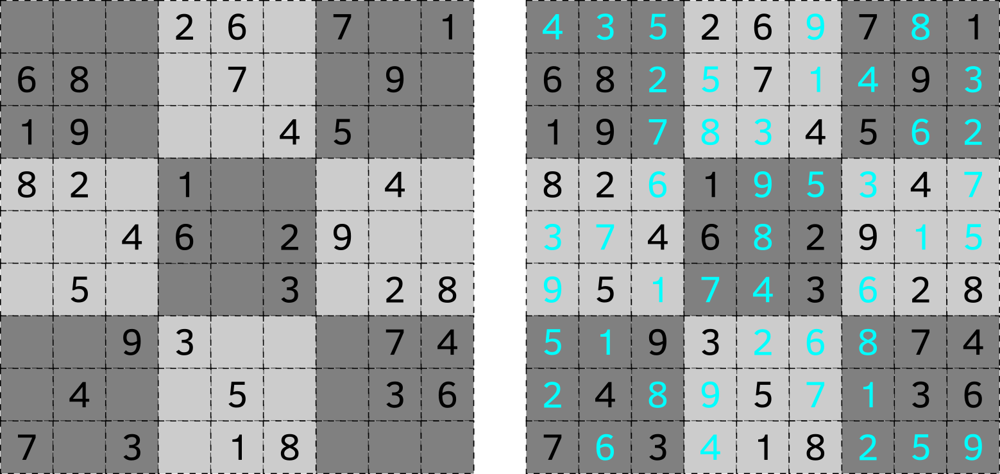
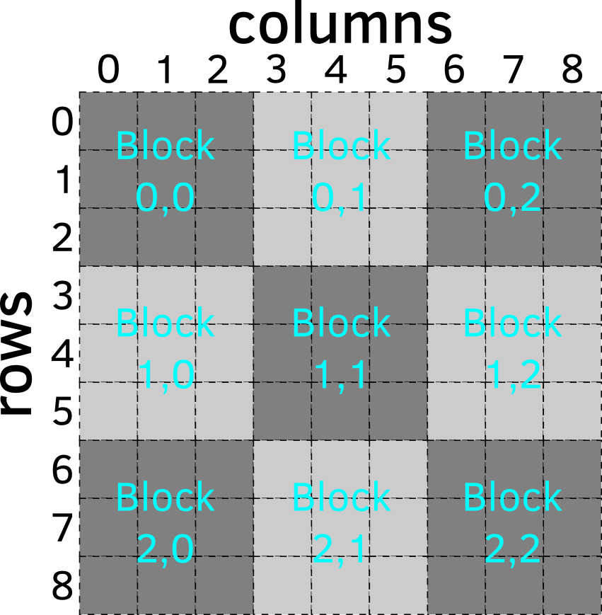

# Sudoku: Brute-Force-Algorithmus {#sudoku-brute-force}

In diesem Kapitel werden wir ein Programm schreiben, das ein [Sudoku-Rätsel](https://de.wikipedia.org/wiki/Sudoku) generiert. In einem typischen Sudoku-Rätsel musst du ein $9\times9$ Gitter mit den Zahlen 1 bis 9 so vervollständigen, dass sich die Zahlen in jeder Reihe, jeder Spalte und jedem $3\times3$ Quadratblock nicht wiederholen. Wenn du das Spiel spielst, hast du ein unvollständiges Puzzle und je mehr Lücken es hat, desto schwieriger tendiert das Rätsel zu sein. Aber bevor du das Spiel spielen kannst, muss jemand (das bist du heute) 1) ein komplettes Rätsel generieren (woran wir uns heute konzentrieren werden), 2) einige Zahlen entfernen, während sichergestellt wird, dass die Lösung des Rätsels eindeutig bleibt. Heute werden wir uns auf die erste Aufgabe konzentrieren: Das Generieren eines vollständigen Bretts.

{width=100% style="display: block; margin: 0 auto"}

<br/>
Das Rätsel basiert auf einem 2D-Gitter und prinzipiell könntest du [Listen](#lists) von Zeilen (die selbst Listen sind) verwenden, um dieses Gitter zu erstellen. Das wäre ähnlich der Liste von Listen, die Informationen über verbundene Höhlen im Spiel [Hunt the Wumpus](#hunt-the-wumpus) enthielten. Allerdings macht eine geschachtelte Listenstruktur das Arbeiten mit Spalten und Blöcken schwierig, da ihre Elemente verschiedenen Listen angehören und du anstelle von einfacherem Listen-Slicing (was nur für Zeilen funktioniert) Schleifen verwenden musst.

Stattdessen werden wir es als Gelegenheit nutzen, um etwas über die [NumPy](https://numpy.org/) Bibliothek zu lernen, die eines der Schlüsselpakete für wissenschaftliches Rechnen in Python ist und die Grundlage für viele Bibliotheken zur Datenanalyse bildet. Beachte, dass das untenstehende Material keinesfalls vollständig ist. Es kratzt, wenn überhaupt, nur an der Oberfläche von NumPy. Wenn du NumPy für deine Projekte benötigst, empfehle ich dringend, einen Blick in den offiziellen [Getting Started für absolute Anfänger](https://numpy.org/doc/stable/user/absolute_beginners.html) Leitfaden und das offizielle [Benutzerhandbuch](https://numpy.org/doc/stable/user/index.html) zu werfen.

Nimm dir das [Übungs-Notebook](notebooks/sudoku-brute-force.ipynb) und lass uns loslegen.

## NumPy importieren
NumPy ist keine Standardbibliothek von Python, daher musst du sie eventuell [installieren](https://numpy.org/install/). Wie bei allen Bibliotheken, musst du NumPy importieren, bevor du es in deinem Skript verwenden kannst. Dies ist jedoch einer der seltenen Fälle, bei denen das Umbenennen der Bibliothek beim Importieren der Standard und der empfohlene Weg ist:

```python
import numpy as np
```

## 1D-NumPy-Arrays versus Python-Listen
Die Schlüsseldatenstruktur, die NumPy einführt, ist ein NumPy-Array, das beliebig viele Dimensionen haben kann. Ein eindimensionales Array, typischerweise "Vektor" genannt, ist am direktsten mit einer Python-[Liste](#lists) verwandt, hat aber sowohl einige Einschränkungen als auch zusätzliche Funktionalität. Im Gegensatz zu Python-Listen, die alles enthalten können, einschließlich anderer Listen, müssen alle Elemente eines Arrays vom gleichen Typ sein. Der Vorteil dieser Einschränkung besteht darin, dass, da alle Elemente vom gleichen Typ sind, du eine Funktion auf alle Elemente anwenden kannst. Beachte, dass dies keine Garantie dafür bietet, dass es bei intrinsisch heterogenen Python-Listen funktioniert, was der Grund ist, warum du Operationen auf jedes Element einzeln ausführen musst.

Du kannst aus einer Liste ein NumPy-Array über die [array](https://numpy.org/doc/stable/reference/generated/numpy.array.html)-Funktion erstellen:

```python
import numpy as np

# Eine Python-Liste von Zahlen
a_list = [1, 5, 7]
print(a_list)
#> [1, 5, 7]

# Ein aus der Liste erstelltes NumPy-Array
an_array = np.array(a_list)
print(an_array)
#> [1 5 7]
```

Beachte, dass aufgrund der Einschränkung "alle Werte müssen vom gleichen Typ sein", wenn die ursprüngliche Python-Liste Daten verschiedener Typen enthielt, alle Werte in den flexibelsten Typ umgewandelt werden. Zum Beispiel wird eine Mischung aus logischen Werten und Ganzzahlen dir Ganzzahlen geben, eine Mischung aus Ganzzahlen und Fließkommazahlen wird dir Fließkommazahlen geben, eine Mischung aus irgendetwas mit Zeichenketten wird dir Zeichenketten geben usw.


```python
# Logische Werte und Ganzzahlen -> alle Ganzzahlen
print(np.array([True, 2, 3, False]))
#> [1 2 3 0]

# Ganzzahlen und Fließkommazahlen -> alle Fließkommazahlen
print(np.array([1.0, 2, 3, 0.0]))
#> [1. 2. 3. 0.]

# Logische Werte, Ganzzahlen, Fließkommazahlen und Zeichenketten -> alle Zeichenketten
print(np.array([False, 1, 2.0, "a"]))
#> ['False' '1' '2.0' 'a']
```

Der Typ eines Arrays wird bei der Erstellung festgelegt, und wenn du einen Wert eines anderen Typs einfügst, wird dieser entweder in diesen Typ umgewandelt oder, falls eine Umwandlung nicht möglich ist, wird NumPy einen Fehler ausgeben.

```python
# Array von Booleschen Werten
array_of_bool = np.array([True, False, True])

# Ein Fließkommawert wird automatisch in einen logischen Wert umgewandelt.
# es ergibt 'True', weil nur 0.0 'False' ist
array_of_bool[1] = 2.0
print(array_of_bool)
#> [ True  True  True]

# Ein beliebiger Zeichenkettenwert, der nicht automatisch in eine Ganzzahl umgewandelt werden kann
array_of_int = np.array([1, 2, 3])
array_of_int[1] = "A text"
#> invalid literal for int() with base 10: 'A text'
```

::: {.practice}
Mache Übung #1.
:::

Im Allgemeinen kannst du mit einem 1D-NumPy-Array das Gleiche tun wie mit einer Liste. Zum Beispiel funktioniert das Slicing auf die gleiche Weise, du kannst genauso über Elemente eines Arrays iterieren usw.

```python
a_list = [1, 5, 7]
an_array = np.array(a_list)

# Slicing (Teilauswahl)
print(a_list[:2])
#> [1, 5]
print(an_array[1:])
#> [5 7]

# for-Schleife
for value in an_array:
  print(value)
#> 1
#> 5
#> 7
```

Allerdings wird bestimmte Funktionalität anders implementiert, wie das [Anhängen](https://numpy.org/doc/stable/reference/generated/numpy.append.html#numpy-append) im folgenden Beispiel. Andere Funktionalitäten, wie ein [Entfernen](https://docs.python.org/3/tutorial/datastructures.html#more-on-lists) (pop), fehlen, können aber durch Slicing emuliert werden.


```python
# Werte anhängen
an_array = np.append(an_array, 4)
print(an_array)
#> [1 5 7 4]
```

Der wichtigste praktische Unterschied zwischen Listen und NumPy-Arrays liegt darin, dass Letztere homogen sind und Operationen an ihnen vektorisiert werden. Das bedeutet, dass du eine Funktion auf das gesamte Array auf einmal anwenden kannst, was es sowohl einfacher in der Handhabung macht als auch schneller, da die meisten Operationen an Arrays stark optimiert sind. Hier ist ein Beispiel dafür, wie du den gleichen Wert mit jedem Element eines Arrays multiplizierst und dann diesen Wert zu jedem Element hinzufügst, etwas, das bei einer normalen Liste eine for-Schleife erfordert.

```python
a_list = [1, 2, 3]
an_array = np.array(a_list)
2 * an_array + 1
#> array([3, 5, 7])
```

Du kannst auch elementweise Operationen auf zwei (oder mehr) Arrays gleichzeitig ausführen. Zum Beispiel, hier ist ein Beispiel für elementweises Addieren von zwei Arrays.

```python
array1 = np.array([1, 2, 4])
array2 = np.array([-1, -3, 5])
array1 + array2
#> array([ 0, -1,  9])
```

Beachte, dass dies nur funktioniert, wenn die [Formen](https://numpy.org/doc/stable/reference/generated/numpy.shape.html) (shapes) der Arrays gleich sind. Im Falle von 1D-Arrays (auch Vektoren genannt), bedeutet das, dass ihre Länge gleich sein muss.

```python
array1 = np.array([1, 2, 4])
array2 = np.array([-1, -3, 5, 7])
array1 + array2
#> operands could not be broadcast together with shapes (3,)
#> (4,)
```

Gleichzeitig kannst du immer Vektoren mit einem einzelnen Element verwenden, die "Skalare" genannt werden, und dieser einzelne Wert wird für jedes Element im anderen Vektor verwendet.

```python
a_vector = np.array([1, 2, -4])
a_scalar = np.array([-1])
a_vector * a_scalar
#> array([-1, -2,  4])
```

::: {.practice}
Mache Übung #2.
:::

Vektorisierung bedeutet auch, dass du aggregierende Funktionen -- [Mittelwert](https://numpy.org/doc/stable/reference/generated/numpy.mean.html) (mean), [Median](https://numpy.org/doc/stable/reference/generated/numpy.median.html), [Minimum](https://numpy.org/doc/stable/reference/generated/numpy.min.html) (min) usw. -- auf das Array anwenden kannst, anstatt diese von Hand zu berechnen.

::: {.practice}
Mache Übung #3.
:::


## 2D-NumPy-Arrays, auch Matrizen genannt
Die wahre Stärke von NumPy entfaltet sich, sobald dein Array zwei oder mehr Dimensionen hat. 2D-Arrays werden als Matrizen bezeichnet, während Arrays mit drei oder mehr Dimensionen als Tensoren bekannt sind. Erstere spielen eine Schlüsselrolle in der klassischen linearen Algebra in Python, während letztere für künstliche neuronale Netzwerke erforderlich sind (deshalb auch "Tensor" in [TensorFlow](https://www.tensorflow.org/)).

Wie bei Vektoren (1D-Arrays) im Vergleich zu Python-Listen, ergibt sich der Vorteil aus Einschränkungen. Matrizen sind rechteckig, d.h., sie bestehen aus mehreren Reihen, aber jede Reihe hat die gleiche Anzahl von Elementen. Im Gegensatz dazu _kannst_ du eine rechteckige Matrix als Liste von Listen erstellen (auch hier war unser `CONNECTED_CAVES` eine $20\times3$ rechteckige Matrix), aber dies ist nicht garantiert. Darüber hinaus bedeutet die Homogenität der Matrix (alle Werte müssen vom gleichen Typ sein), dass du einen rechteckigen Teil der Matrix extrahieren kannst und es garantiert eine weitere Matrix des gleichen Typs ist. Und Slicing macht das Arbeiten mit 2D-Arrays viel einfacher. Zum Beispiel, hier ist der Code, um eine Spalte aus einer Liste von Listen im Vergleich zu einer NumPy-Matrix zu extrahieren.


```python
matrix_as_list = [[1, 2, 3],
                  [4, 5, 6],
                  [7, 8, 9]]
matrix_as_array = np.array(matrix_as_list)

icolumn = 1 # der Spaltenindex, den wir extrahieren möchten

# Extrahieren einer Spalte mittels List Comprehension
column_as_list = [row[icolumn] for row in matrix_as_list]
print(column_as_list)
#> [2, 5, 8]

# Extrahieren einer Spalte aus einer Matrix
print(matrix_as_array[:, 1])
#> [2 5 8]
```

Das Extrahieren von Zeilen, Spalten und quadratischen Blöcken aus einer Matrix wird entscheidend sein, um den Code für Sudoku zu schreiben, also lass uns üben!

::: {.practice}
Mache Übung #4.
:::

## Arrays einer bestimmten Form erstellen
Es gibt verschiedene Möglichkeiten, NumPy-Arrays zu erstellen. Oben haben wir Listen oder Listen von Listen verwendet, um sie zu erstellen. Aber manchmal musst du ein Array einer bestimmten [Form](https://numpy.org/doc/stable/reference/generated/numpy.shape.html) anlegen, das mit [Nullen](https://numpy.org/doc/stable/reference/generated/numpy.zeros.html) oder [Einsen](https://numpy.org/doc/stable/reference/generated/numpy.ones.html) gefüllt ist. Der Schlüsselparameter in diesen Funktionen ist die _Form_ des Arrays: eine Liste mit den Dimensionen des Arrays. Für ein 1D-Array kann dies entweder `<Anzahl der Elemente>` oder `(<Anzahl der Elemente>, )` sein. Für ein 2D-Array bedeutet dies `(<Anzahl der Zeilen>, <Anzahl der Spalten>)`.


```python
zeros_matrix_3_by_2 = np.zeros((3, 2))
print(zeros_matrix_3_by_2)
#> [[0. 0.]
#>  [0. 0.]
#>  [0. 0.]]
```

::: {.practice}
Mache Übung #5.
:::

## Zufällige Arrays einer bestimmten Größe erstellen
NumPy hat ein Modul zur Generierung von Zufallszahlen --- [numpy.random](https://numpy.org/doc/stable/reference/random/index.html#module-numpy.random) --- das konzeptuell ähnlich zur Python-standardmäßigen [random](https://docs.python.org/3/library/random.html) Bibliothek ist, aber es ermöglicht dir die Erstellung von Arrays von Werten anstatt eines einzigen Wertes. Aus Bequemlichkeit sind die Namen gleich geblieben. Zum Beispiel hat die Funktion [random.randint](https://docs.python.org/3/library/random.html#random.randint), die eine einzige zufällige Ganzzahl generiert, einen Zwillingsbruder [numpy.random.randint](https://numpy.org/doc/stable/reference/random/generated/numpy.random.randint.html), der dieselben Parameter akzeptiert und standardmäßig ebenfalls einen einzigen Wert generiert. Du kannst jedoch das ganze Vektor-/Matrix-/Tensor-Array von Zufallszahlen auf einen Schlag generieren, indem du seine `Größe` angibst. Verwirrenderweise wird der Parameter `size` genannt, obwohl er sich auf die "Ausgabeform" bezieht (nicht sicher, warum sie es nicht "Form" genannt haben).

::: {.practice}
Mache Übung #6.
:::

## Erstellen von Arrays mit Sequenzen
Ähnlich wie man eine Folge von Ganzzahlen mit [range](https://docs.python.org/3/library/functions.html#func-range) erstellen kann, kann man einen Vektor von Ganzzahlen mit [arange](https://numpy.org/doc/stable/reference/generated/numpy.arange.html)^[Der Name ist verwirrend, aber anscheinend steht dies als Abkürzung für "array range"] erstellen und dies ist gleichwertig mit `np.array(range(...))`:


```python
print(np.arange(5))
#> [0 1 2 3 4]
print(np.array(range(5)))
#> [0 1 2 3 4]
```

NumPy hat auch eine praktische Funktion namens [linspace](https://numpy.org/doc/stable/reference/generated/numpy.linspace.html), mit der du eine Sequenz von _Fließkommazahlen_ mit einer beliebigen Fließkommazahl-Schrittweite erzeugen kannst.

::: {.practice}
Mache Übung #7.
:::

## Arrays zu einer Matrix stapeln {#stack}
Die Funktion [arange](https://numpy.org/doc/stable/reference/generated/numpy.arange.html) wird für uns nützlich sein, um eine Sequenz von Ganzzahlen von 1 bis 9 (oder 1 bis 4, wenn wir an einer kleineren Version von Sudoku arbeiten) zu erzeugen. Beachte jedoch, dass du in beiden Fällen nur einen Vektor, aber nicht die Matrix erzeugen kannst, die wir brauchen! Die Lösung in diesem Fall ist, einzelne Vektoren zu [stapeln](https://numpy.org/doc/stable/reference/generated/numpy.stack.html) (stack). Beim Stapeln spielen die [Formen](https://numpy.org/doc/stable/reference/generated/numpy.ndarray.shape.html) (shapes) der einzelnen Vektoren eine wichtige Rolle, da sie kompatibel sein müssen. Dies ist ein Schlüsselpunkt im Unterschied zu Python-Listen, die nur eine [Länge](https://docs.python.org/3/library/functions.html#len) haben.

Für wirklich eindimensionale Arrays ist es einfach. Dies sind Arrays, die aus Listen oder über Funktionen wie [zeros](https://numpy.org/doc/stable/reference/generated/numpy.zeros.html) oder [linspace](https://numpy.org/doc/stable/reference/generated/numpy.linspace.html) erstellt wurden. Wenn du dir ihre [Form](https://numpy.org/doc/stable/reference/generated/numpy.ndarray.shape.html) ansiehst, wirst du nur eine Dimension sehen.


```python
print(np.array([10, 20, 30]).shape)
#> (3,)
print(np.zeros(5).shape)
#> (5,)
```

Diese Vektoren haben keine "Orientierung" (wenn du dich mit linearer Algebra auskennst, würdest du entweder Spalten- oder Zeilenvektoren erwarten), daher kannst du beim Kombinieren dieser Arrays zu einer Matrix sie als Zeilen verwenden (stapeln entlang `axis=0`, das ist der Standard, siehe auch [vstack](https://numpy.org/doc/stable/reference/generated/numpy.vstack.html)) oder als Spalten (stapeln entlang `axis=1`, siehe auch [hstack](https://numpy.org/doc/stable/reference/generated/numpy.hstack.html)).

```python
one_d_vector = np.arange(5)

# Vertikal stapeln: Vektoren werden als Zeilen verwendet
print(np.stack([one_d_vector, one_d_vector]))
#> [[0 1 2 3 4]
#>  [0 1 2 3 4]]
print(np.stack([one_d_vector, one_d_vector]).shape)
#> (2, 5)

# Horizontal stapeln: Vektoren werden als Spalten verwendet
print(np.stack([one_d_vector, one_d_vector], axis=1))
#> [[0 0]
#>  [1 1]
#>  [2 2]
#>  [3 3]
#>  [4 4]]
print(np.stack([one_d_vector, one_d_vector], axis=1).shape)
#> (5, 2)
```

Übe das Stapeln. Das Ergebnis für eine durch Zeilen gestapelte Matrix sieht so aus:

```
#> array([[1, 2, 3, 4],
#>        [1, 2, 3, 4],
#>        [1, 2, 3, 4],
#>        [1, 2, 3, 4]])
```

und für eine durch Spalten gestapelte Matrix sieht es so aus:

```
#> array([[1, 1, 1, 1],
#>        [2, 2, 2, 2],
#>        [3, 3, 3, 3],
#>        [4, 4, 4, 4]])
```

::: {.practice}
Mache Übung #8.
:::

## Zeilen- und Spaltenvektoren versus 1D-Arrays (#row-col-vectors)
Wie oben erwähnt, sind 1D-Arrays wirklich eindimensional, da ihre Form `(N, )` ist (beachte die leere Stelle nach dem Komma). Jedoch benötigst du oft denselben Vektor in einer 2D-Form entweder als Zeilenvektor `(1, N)` oder als Spaltenvektor `(N, 1)`. Der Unterschied zwischen einem 1D-Array und einem 2D-Zeilen-/Spaltenvektor ist, dass Letztere eine "Orientierung" haben^[Dies ist besonders wichtig für die lineare Algebra.] und trotz der gleichen Anzahl von Elementen unterschiedlich gestapelte Arrays erzeugen werden.

Du kannst ein 1D-Array `(N, )` in einen Zeilenvektor `(1, N)` umwandeln, indem du es in eine weitere Liste packst: `np.array([<original Liste oder 1D-Array>])`. Wie du unten sehen kannst, obwohl die [Formen](https://numpy.org/doc/stable/reference/generated/numpy.ndarray.shape.html) der beiden Arrays unterschiedlich sind, ist ihre [Größe](https://numpy.org/doc/stable/reference/generated/numpy.ndarray.size.html) (Gesamtanzahl der Elemente) gleich.


```python
# Ein 1D-Array
oned_array = np.array([1, 2, 3])
(oned_array.shape, oned_array.size)
#> ((3,), 3)

# Ein 2D-Array, jedoch mit der gleichen Anzahl von Elementen und der gleichen größten Dimension
row_vector = np.array([[1, 2, 3]])
(row_vector.shape, row_vector.size)
#> ((1, 3), 3)
```

Es gibt zwei Möglichkeiten, einen Spaltenvektor mit der Form `(N, 1)` zu erstellen. Erstens kannst du ihn als Liste von Listen mit einem Wert pro Zeile (innere Liste) angeben. Alternativ kannst du einen Zeilenvektor erstellen und dann [transponieren](https://numpy.org/doc/stable/reference/generated/numpy.transpose.html).


```python
# Spaltenvektor aus Liste von Listen
np.array([[1], [2], [3]])
#> array([[1],
#>        [2],
#>        [3]])

# Spaltenvektor durch Transposition eines Zeilenvektors
np.transpose(np.array([[1, 2, 3]]))
#> array([[1],
#>        [2],
#>        [3]])
```

Wie oben erwähnt, macht die "Orientierung" von Vektoren einen Unterschied beim Stapeln. Erkunde diese Unterschiede in der Übung 9.

::: {.practice}
Mache Übung #9.
:::

## Wiederholen und Kacheln
In der oben genannten Übung hast du vier Zeilen- oder Spaltenvektoren gestapelt, aber sie waren alle identisch. NumPy kann solche wiederholten Sequenzen über die Funktionen [repeat](https://numpy.org/doc/stable/reference/generated/numpy.repeat.html) und [tile](https://numpy.org/doc/stable/reference/generated/numpy.tile.html) generieren. Beide wiederholen die angeforderten Werte eine bestimmte Anzahl von Malen, aber es gibt ein paar wichtige Unterschiede. Erstens wiederholt [repeat](https://numpy.org/doc/stable/reference/generated/numpy.repeat.html) jeden Wert N Mal, bevor es zum nächsten Wert übergeht, während [tile](https://numpy.org/doc/stable/reference/generated/numpy.tile.html) die gesamte Sequenz in Reihenfolge N Mal wiederholt.


```python
print(np.repeat(np.arange(5), 2))
#> [0 0 1 1 2 2 3 3 4 4]
print(np.tile(np.arange(5), 2))
#> [0 1 2 3 4 0 1 2 3 4]
```

Der zweite Unterschied besteht darin, wie du die Wiederholung beim Erstellen von 2D-Matrizen spezifizierst. Im Falle von [repeat](https://numpy.org/doc/stable/reference/generated/numpy.repeat.html) gibst du an, entlang welcher `Achse` (axis) du die Sequenz wiederholst (gleich wie der `Achse`-Parameter beim [Stapeln](#stack)). 

::: {.practice}
Mache Übung #10.
:::

Für [tile](https://numpy.org/doc/stable/reference/generated/numpy.tile.html) gibt man die Wiederholungen (`reps`-Parameter) an, und man kann die Wiederholungen _pro Achse_ spezifizieren. 


```python
# Ein Array zweimal zeilenweise und dreimal spaltenweise kacheln (tile)
np.tile(np.array([1, 2, 3]), (2, 3))
#> array([[1, 2, 3, 1, 2, 3, 1, 2, 3],
#>        [1, 2, 3, 1, 2, 3, 1, 2, 3]])
```

::: {.practice}
Mache Übung #11.
:::

## Sudoku-Erzeugung mittels Brute-Force: Ordnung und Chaos
Unser Ansatz zur Erzeugung von Sudoku wird konzeptionell einfach, aber sehr ineffizient sein: Wir werden eine geordnete Matrix erstellen (nach Zeile oder Spalte; keine gültige Ausgangslösung), diese mischen (zeilen- oder spaltenweise), und dann prüfen, ob wir zufällig eine gültige Sudoku-Matrix erhalten haben. Wenn nicht, weiter mischen, bis wir eine haben.

Du weißt bereits, wie man eine geordnete Matrix erstellt, die vier oder neun Zeilen und Spalten hat. Um sie zu randomisieren, verwende [np.random.shuffle](https://numpy.org/doc/stable/reference/random/generated/numpy.random.shuffle.html), das ein Array oder einen _Teil eines_ Arrays _am Ort_ mischt. Der letzte Teil bedeutet, dass die Funktion keinen Wert zurückgibt und das von dir gelieferte Array (es wird per Referenz übergeben, erinnere dich an [veränderliche Objekte und Funktionen](#mutable-objects)).


```python
#Das gesamte Array mischen
an_array = np.arange(5)
np.random.shuffle(an_array)
print(an_array)
#> [1 4 0 2 3]

# Einen Teil eines Arrays mischen
an_array = np.arange(5)
np.random.shuffle(an_array[:3])
print(an_array)
#> [1 0 2 3 4]
```

Schreibe den Code, der eine $4\times4$-Matrix erstellt (definiere die Größe der Matrix über die Konstante `SUDOKU_SIZE`), die nach Zeilen geordnet ist 
(also jede Zeile geht von 1 bis `SUDOKU_SIZE`, aber jede Spalte hat die gleiche Zahl darin), und schreibe den Code, der genau eine Zeile mischt (lege ihren Index in der Variablen `irow` fest). Ändere den Wert von `irow`, um zu testen, ob dein Code funktioniert. Beispielsweise könnte dein Output für eine zufällig gemischte Zeile #2 so aussehen.


```
#> array([[1, 2, 3, 4],
#>        [2, 4, 1, 3],
#>        [1, 2, 3, 4],
#>        [1, 2, 3, 4]])
```

::: {.program}
Schreibe Code für das Erstellen einer Matrix<br/>
und das Mischen einer Zeile in Übung #12.
:::

Sobald der Code für das Mischen einer einzelnen Zeile funktioniert, modifiziere ihn so, dass alle Zeilen einzeln gemischt werden (du kannst das gesamte Matrix mischen, aber dann werden die Zeilen höchstwahrscheinlich ungültig sein). Sobald der Misch-Code funktioniert, verwandle ihn in eine Funktion `shuffle_by_row`. Wie bei [np.random.shuffle](https://numpy.org/doc/stable/reference/random/generated/numpy.random.shuffle.html) muss sie nichts zurückgeben, da das Mischen direkt im übergebenen Array erfolgt. Schreibe den Code, der eine nach Zeilen geordnete Matrix der Größe `SUDOKU_SIZE` generiert, diese zeilenweise mischt und ausgibt. Du musst definitiv die [Form](https://numpy.org/doc/stable/reference/generated/numpy.ndarray.shape.html) der Matrix kennen und über den [Bereich](https://docs.python.org/3/library/functions.html#func-range) der Zeilen iterieren.

::: {.program}
Füge `shuffle_by_row` in _utils.py_ ein<br/>
Schreibe das Programm in _code01.py_
:::

Wir sind hier, um zu lernen, also um deine Fähigkeiten zu festigen, programmiere dieselbe Routine sowohl durch das Stapeln als auch durch das Mischen der Matrix _spaltenweise_ (erstelle hierfür eine separate Funktion `shuffle_by_column`).

::: {.program}
Füge `shuffle_by_column` in _utils.py_ ein<br/>
Schreibe das Programm in _code02.py_
:::

## Beispiele für Validierungen
Im folgenden Abschnitt wirst du Funktionen schreiben, die die Gültigkeit von Zeilen, Spalten und Blöcken überprüfen. Dafür benötigen wir Beispiele, die für alle oder einige Überprüfungen gültig sind. Verwende die Zelle unten, um später die Überprüfung durchzuführen.

```python
all_valid = np.array([[4, 1, 3, 2],
                      [3, 2, 4, 1],
                      [2, 4, 1, 3],
                      [1, 3, 2, 4]])

invalid_row = np.array([[4, 1, 3, 1],
                        [3, 2, 4, 2],
                        [2, 4, 1, 3],
                        [1, 3, 2, 4]])

invalid_column = np.array([[4, 1, 3, 2],
                           [3, 2, 1, 4],
                           [2, 4, 1, 3],
                           [1, 3, 2, 4]])

invalid_block_and_column = np.array([[4, 3, 1, 2],
                                     [3, 2, 4, 1],
                                     [2, 4, 1, 3],
                                     [1, 2, 3, 4]])

invalid_block_and_row = np.array([[4, 1, 3, 2],
                                  [3, 4, 4, 1],
                                  [2, 2, 1, 3],
                                  [1, 3, 2, 4]])

all_invalid = np.array([[4, 1, 3, 2],
                        [3, 4, 1, 4],
                        [2, 2, 1, 3],
                        [1, 3, 2, 4]])
```

## Ist diese Zeile überhaupt gültig?
Damit eine Matrix ein Sudoku ist, muss sie der Regel "nur eindeutige Zahlen in jeder Zeile, jeder Spalte und jedem Block" folgen. Lass uns einen Code implementieren, um die Zeilen zu überprüfen (ihn in eine Spaltenüberprüfung umzusetzen, wird trivial sein).

Damit eine Zeile gültig ist, muss sie `SUDOKU_SIZE` verschiedene, d.h. [einzigartige](https://numpy.org/doc/stable/reference/generated/numpy.unique.html) Zahlen enthalten. Verwende die Funktion [unique](https://numpy.org/doc/stable/reference/generated/numpy.unique.html), um einen Vergleich für die Zeile `irow` zu schreiben (setze sie von Hand auf einen gültigen Index), dass sie tatsächlich `SUDOKU_SIZE` einzigartige Zahlen hat, d.h. die [Größe](https://numpy.org/doc/stable/reference/generated/numpy.ndarray.size.html) des Arrays einzigartiger Zahlen ist gleich `SUDOKU_SIZE`. Gib jedoch nicht die Konstante `SUDOKU_SIZE` an die Funktion weiter, sondern leite die Anzahl der erforderlichen einzigartigen Elemente aus der [Form](https://numpy.org/doc/stable/reference/generated/numpy.shape.html) der Matrix selbst ab.

Verwende Beispielmatrizen (siehe oben), um zu überprüfen, ob es korrekt funktioniert.

::: {.program}
Schreibe und teste die Überprüfung einer einzelnen Zeile<br/>
in Übung #12.
:::

Sobald der Code für eine einzelne Zeile funktioniert, können wir eine [List Comprehension](#list-comprehension) verwenden, um eine Liste von Gültigkeitswerten zu generieren, einen für jede Zeile. Eine Matrix ist gültig (zumindest was die Zeilen angeht), nur wenn _alle_ Zeilen gültig sind. Praktischerweise hat NumPy eine Funktion [all](https://numpy.org/doc/stable/reference/generated/numpy.all.html), die testet, ob _alle_ Elemente des Arrays oder der Liste `True` sind. Verpacke diesen Code in die Funktion `validate_rows`, überlege dir ihre Eingaben und Ausgaben, dokumentiere sie.

::: {.program}
Füge `validate_rows` in _utils.py_ ein<br/>
Erweitere das Programm aus _code01.py_ in _code03.py_<br/>
Teste den Code mit Beispielmatrizen.
:::

Mache nun dasselbe für Spalten und verwende beide Überprüfungen, um zu sehen, ob die Matrix ein gültiges Sudoku ist (Zeilen sollten in Ordnung sein, aber Spalten sollten den Test nicht bestehen).
::: {.program}
Füge `validate_columns` in _utils.py_ ein<br/>
Erweitere das Programm aus _code03.py_ in _code04.py_<br/>
Teste den Code mit Beispielmatrizen.
:::

## Blöcke
Blöcke zu bearbeiten ist etwas kniffliger, da wir keine einfache einzelne Achse zum Schneiden (Slicing) verwenden können. Wir können jedoch jeden Block so betrachten, als hätte er einen Zeilen- und einen Spaltenindex, die beide von 0 bis 2 für ein $9\times9$ Sudoku gehen, weil wir $3\times3$ Blöcke haben, oder von 0 bis 1 für ein $4\times4$ Sudoku, wo wir $2\times2$ Blöcke haben.

{width=50% style="display: block; margin: 0 auto"}

<br/><br/>
Schreibe den Code, der [Slicing](https://numpy.org/doc/stable/user/basics.indexing.html#slicing-and-striding) verwendet, um einen einzelnen Block zu extrahieren, der durch `i_block_row` und `i_block_col` definiert ist. Berechne die Matrixzeile für die obere linke Ecke des Blocks und nimm dann einen vertikalen Ausschnitt bezüglich dieser. Das Gleiche gilt für den horizontalen Ausschnitt in Bezug auf die linke obere Blockspalte in der Matrix. Um das Debuggen zu erleichtern, erzeuge eine $9\times9$ Matrix aus ganzen Zahlen, gestapelt entweder nach Zeilen oder Spalten, damit leichter zu sehen ist, ob dein Code funktioniert. Teste ihn für alle Kombinationen von `i_block_row` und `i_block_col`. Du musst auch die Blockgröße berechnen oder definieren. Tue letzteres, da es sehr einfach ist, aus der Matrixform zu berechnen. In einem quadratischen Sudoku ist die Blockgröße eine [Quadratwurzel](https://docs.python.org/3/library/math.html#math.sqrt) der Brettgröße (Bretter der Größe $4\times4$ haben Blöcke der Größe $2\times2$, Bretter der Größe $9\times9$ haben Blöcke der Größe $3\times3$ usw.). Deine Größe sollte jedoch eine ganze Zahl sein, also musst du dich selbst um die [Typumwandlung](https://docs.python.org/3/library/functions.html#int) kümmern.

So sollte die Ausgabe aussehen, wenn `i_block_row = 1` und `i_block_col = 0` sind, wenn du die Matrix zeilenweise stapelst.

```
#> array([[1, 2, 3],
#>        [1, 2, 3],
#>        [1, 2, 3]])
```

und wenn sie spaltenweise gestapelt ist

```
#> array([[4, 4, 4],
#>        [5, 5, 5],
#>        [6, 6, 6]])
```

::: {.program}
Schreibe und teste den Code für die Extraktion eines einzelnen Blocks<br/>
in Übung #13.
:::

Sobald du den Code hast, um Blockwerte zu extrahieren, ist die Logik zur Überprüfung der Gültigkeit sehr ähnlich wie bei der Überprüfung von Zeilen und Spalten. Beachte, dass du [unique](https://numpy.org/doc/stable/reference/generated/numpy.unique.html) direkt auf das extrahierte 2D-Array anwenden kannst oder optional kannst du es zuerst mit [flatten](https://numpy.org/doc/stable/reference/generated/numpy.ndarray.flatten.html) in ein 1D-Array umwandeln. Sobald du eine Liste von neun logischen Werten (einer pro Block) hast, kannst du überprüfen, ob diese [alle](https://numpy.org/doc/stable/reference/generated/numpy.all.html) `True` sind. Der Hauptunterschied hier ist, dass du verschachtelte Schleifen benötigst, um über das 2D-Netz der Blöcke zu iterieren. Meine Lösung besteht darin, eine leere Liste für die Validierungswerte zu erstellen und dann über die Blockzeile und Blockspalte zu iterieren, [indem ich](https://docs.python.org/3/tutorial/datastructures.html#more-on-lists) Werte der Liste hinzufüge.


::: {.program}
Füge `validate_blocks` in _utils.py_ ein<br/>
Teste alle drei Validierungsfunktionen mithilfe von<br/>
Beispielmatrizen in _code05.py_</br>
:::

## Brute-Force in Aktion
Wir haben alle Bausteine, um den Versuch zu starten, Sudoku mittels Brute-Force zu generieren. Fasse die drei Validierungsfunktionen, die du erstellt hast, in einer einzelnen Funktion `validate_matrix` zusammen, die nur dann `True` zurückgibt, wenn alle Zeilen, alle Spalten und alle Blöcke gültig sind. Dann generiere eine geordnete Matrix zeilenweise und mische in einer Schleife (ich würde eine for-Schleife nutzen und sie auf zum Beispiel 1000 Iterationen beschränken) diese Matrix zeilenweise und prüfe, ob sie gültig ist. Wenn sie es ist, brich aus der Schleife aus und drucke das Sudoku aus. Schreibe eine traurige Nachricht (ohne Ausdruck einer Matrix), sobald du die Versuche aufgebraucht hast (aber ansonsten keine traurige Nachricht!). Alternativ kannst du die Matrix auch spaltenweise ordnen und dann ebenso spaltenweise mischen (warum funktioniert es nicht, sie zeilenweise zu ordnen und spaltenweise zu mischen?). Setze die Matrixgröße auf 4, aber beachte, dass unser Code mit jeder korrekten Matrixgröße funktionieren wird ($9\times9$, $16\times16$ usw.).

::: {.program}
Füge `validate_matrix` in _utils.py_ ein<br/>
Schreibe das Programm in _code06.py_
:::

## Zusammenfassung
Ausgezeichnet, wir haben ein funktionierendes Programm, das (sehr selten) eine vollständige Sudoku-Matrix erzeugt. Zippe und reiche ein, und nächstes Mal werden wir eine andere, effizientere Implementierung des Algorithmus schreiben.

